# ZeroTrust.sh — AI Codebase Security Scanner

## Idea Summary

ZeroTrust.sh is a local, privacy-first CLI security scanner and patch engine designed to audit codebases modified by AI coding agents. It accepts a codebase directory path as input, performs deep security analysis entirely on-device, and outputs an interactive HTML vulnerability report with patch suggestions.

## Core Problem

AI coding agents (Cursor, Cline, Aider, Copilot Workspace) generate functional code at high speed but frequently introduce security vulnerabilities — including package hallucinations (slopsquatting), indirect prompt injection risks, and degraded security controls. Traditional cloud SAST tools (Snyk, SonarQube, CodeRabbit) require uploading source code externally, are too slow for real-time agent loops, and were never designed to detect AI-specific threat vectors.

## Key Features

- **Local & Offline Execution**: Source code never leaves the developer's machine.
- **Directory Input**: Source code provided as a local directory path — no VCS dependency required.
- **AI-Specific Threat Detection**: Detects hallucinated packages, security control bypasses, prompt injection in code comments, AI coding agent "cheat" patterns (hardcoded bypasses, TODO-then-skip, disabled assertions, security-node disappearance across scans), and — uniquely — prompt injection via AI agent config files (MCP server configs, `.cursor/rules`, `AGENTS.md`, `CLAUDE.md`, `GEMINI.md`, `copilot-instructions.md`) via three-tier static analysis (Unicode obfuscation scan · keyword match · sandboxed LLM meta-audit). No competing tool scans this surface.
- **Model Integrity Verification**: At startup, verifies the local GGUF model against a cosign/Sigstore Rekor signed hash registry (keyed by model ID). Tiered response: WARN for unrecognised models, BLOCK only for confirmed hash mismatch on a known model. Gates LLM calls only — CPG build and pattern matching proceed regardless. Mitigates GGUF backdoor supply chain attacks (ICML 2025).
- **Security Regression Detection**: Differential Indexer tracks auth/validate/check AST nodes across scans via CPG diff. Removal of a security-relevant node in a changed file triggers Path B escalation — detecting cases where an AI coding agent silently removes a security control while satisfying functional tests.
- **Dual-Path Analysis Engine**: Path A (fast pattern detection) runs in parallel with Path B (semantic/logic detection) — neither path gates the other.
- **Three-Tier Cost Funnel (Path B)**: Deterministic Heuristic Targeting → local CPU classifier (UniXcoder; F1=94.73% on BigVul C/C++ — **not a valid claim for target languages**, see A-18 blocking dependency) → bounded LLM reasoning. ~95% of files and ~75–85% of surfaces never reach the LLM (design targets pending CVEFixes benchmark). LLM budget is stretched further via CFG-based chunking before any surface is dropped.
- **Logic Vulnerability Detection**: Path B's Call Chain Context Assembler traces caller→surface→callee (depth 3) before the LLM scan, enabling detection of IDOR, missing auth guards, and business logic flaws that span multiple functions — the class of vulnerability all single-function SAST tools miss.
- **SSVC-Aligned Confidence Scoring**: Five-tier output (BLOCK/HIGH/MEDIUM/LOW/SUPPRESSED) mapped to SSVC dimensions (Exploitation, Automatable, Technical Impact) — compatible with security team triage workflows.
- **HTML Report Output**: Generates an interactive, self-contained HTML vulnerability dashboard.
- **Patch Suggestions**: Outputs unified Git diff patches for each confirmed vulnerability.
- **Proof-of-Exploitability Documentation** *(Approach 3)*: Produces PoE reports with a technical trace for developers and an executive summary for managers. Degrades gracefully to static-evidence-only output when sandbox execution fails.

## Architecture: Cascading Intelligence Pipeline

ZeroTrust.sh uses two parallel detection paths against every codebase input, preceded by an integrity-checked ingestion layer. Neither path gates the other — they produce independent findings merged into a unified SSVC-aligned report.

**INGEST** — Model Integrity Verifier (cosign/Sigstore Rekor signed registry, tiered WARN/BLOCK) and Differential Indexer run in parallel at startup. MIV gates LLM calls only — CPG build and pattern matching proceed regardless. DI passes only changed files into the pipeline (+ one-hop CPG caller/callee expansion). ~80–95% cost reduction on Semgrep/classifier/LLM calls on repeat scans. **CPG incremental mode (Approach 2+):** first scan builds CPG for the active module scope (see Module Segmentation below); repeat scans serialize the CPG to `~/.zerotrust/{project_id}.cpg`, then load and apply a **depth-5 BFS patch** from each changed function — ensuring all inter-procedural DFG edges reachable by taint analysis are fresh. Depth 5 is a taint-correctness bound calibrated by Li et al. (ICSE 2024, avg 2.8 hops, 75% within depth-3) and Effendi et al. (SOAP/PLDI 2025, Joern core team, k=5 optimal, k=6 = exponential runtime). This is distinct from the Call Chain Context Assembler's depth-3, which is a token-budget constraint. Hub-module fallback: if any changed function has ≥50 callers, incremental patch is abandoned and full rebuild runs. Converting CPG cost from O(total LOC) to O(depth-5 neighbourhood of changed LOC) on repeat scans. State persisted in SQLite (`~/.zerotrust/scans.db`). Directory input only. **Module Segmentation:** default scan builds complete CPG for working modules (git diff) + depth-2 module neighbors; Tree-sitter pre-flags dangerous sinks in all modules and adds them to scope regardless of depth. OpenGrep + ast-grep always scan all files — only Joern CPG and Path B are scope-limited. Scan modes: Default (working+depth-2 neighbors) · `--thorough` (depth-3+sink-flagged) · `--full` (entire codebase). Report always states which modules were scanned.

**Path A — Pattern Detection (fast, deterministic)**
OpenGrep + ast-grep (language-partitioned; OpenGrep owns its strong languages, ast-grep fills gaps) and Joern CPG Engine taint analysis (Apache 2.0, whole-program inter-file, HTTP API for Go integration) run in parallel. Joern is pre-started at CLI launch to eliminate JVM cold-start latency. Rule scope covers source code patterns, AI coding agent cheat-detection patterns, and — uniquely — three-tier static analysis of AI agent instruction files (Unicode obfuscation + keyword match + MCP schema validation in Approach 1; embedding similarity + sandboxed LLM meta-audit added in Approach 2). An LLM Verifier filters false positives using CoD + SCoT reasoning with XGrammar-2-enforced JSON output and adaptive self-consistency escalation on uncertain verdicts. High-confidence rules bypass the verifier directly to Dedup.

**Path B — Semantic/Logic Detection (three-tier cost funnel)**
Heuristic Targeting queries the Joern CPG for language-agnostic surface selection across external-input and auth-boundary nodes (AI config files handled by Path A), targeting typically ~95% file elimination as a design goal pending CVEFixes benchmark. CVE enrichment via Trivy (online default — source code never leaves the machine; offline mode available for air-gapped environments) auto-flags known-CVE surfaces. Zero-trust resource ID taint tracking (P-API/C-API model, grounded in BolaRay CCS 2024) flags IDOR/BOLA candidates before the classifier; all IDOR candidates always escalate to the LLM. UniXcoder-Base-Nine (~125M, CPU) gates surfaces as a classifier — A-18 is a blocking dependency: BigVul F1 is not a valid claim for Python/Java/JS/Go; CVEFixes fine-tuning and per-language benchmark required before publishing accuracy figures; classifier operates in high-recall mode until complete. For uncertain surfaces, the Call Chain Context Assembler traces callee-first (depth 3, configurable), then the Semantic Function Summarizer (Phi-3-mini/Qwen2.5-3B, CPU) converts call chain context into a **single-pass union JSON schema** covering all three vulnerability classes simultaneously (`taint_flow`, `auth_guard`, `logic_flaw`) via XGrammar-2 TagDispatch — replacing the prior three-pass design and reducing Summarizer cost ~3×. Surfaces are batched (up to 5 per prompt). All schemas include `authorization_check_location` to distinguish real auth gaps from framework-level controls (LLMxCPG USENIX 2025, VULSOLVER arXiv 2025‡). Approach 3 replaces the 3B general model with a 0.5–1B task-specialized model fine-tuned on CVEFixes CPG→JSON pairs. The Token Budget Controller ranks surfaces by `cvss + (1-confidence) + reachability_from_entry`; exhausted-budget surfaces emit SUPPRESSED findings rather than being dropped silently. The LLM Semantic Scan uses a bounded ReAct loop (max 3 steps mapped to progressive constraint checks per VULSOLVER; semantic exit conditions; backbone capability check with single-pass fallback for sub-threshold models) with XGrammar-2-enforced output. A per-scan Scan Security Context Store (graph-based CPG-neighbor retrieval, callee-first ordering) accumulates inferences for cross-surface vulnerability detection (VULSOLVER + LLMxCPG; RepoAudit ICML 2025 cited for memoization cache only).

> Full detailed spec: `docs/architecture/cascading_intelligence.mmd`
> Simplified overview diagram: `docs/architecture/overview.mmd`
> Prose architecture reference: `docs/architecture/detail.md`

```mermaid
graph TD
    Input[/"<b><i>Codebase Input</i></b>\nDirectory"/]

    subgraph INGEST["INGESTION · parallel startup"]
        direction LR
        MIV["<b><i><u>Model Integrity Verifier</u></i></b>\ncosign + Sigstore Rekor · signed hash registry per model ID\nTiered: WARN (unrecognised model) · BLOCK (known ID · hash mismatch)\nGates LLM invocations only — CPG build and pattern matching proceed regardless"]
        DI["<b><i><u>Differential Indexer</u></i></b>\nDirectory input · SQLite state cache · one-hop file-selection expansion\nChanged files only · ~80–95% cost reduction\nFirst scan: CPG full build · Repeat: depth-3 BFS patch · hub-module fallback → full rebuild"]
    end

    subgraph PA["PATH A — Pattern Detection"]
        direction TB
        PA_SG["<b><i><u>OpenGrep + ast-grep · Pattern Detection</u></i></b>\nStructural patterns · cheat-detection rules · three-tier instruction file analysis\n(Unicode scan · keyword match · MCP schema validation)"]
        PA_CQ["<b><i><u>Joern CPG Engine · Taint Analysis</u></i></b>\nUniversal CPG · whole-program inter-file taint · CPG shared with Path B\nHTTP API for Go · pre-started at launch · runs alongside OpenGrep + ast-grep in parallel"]
        PA_LV["<b><i><u>LLM Verifier</u></i></b>\nCoD + SCoT reasoning · XGrammar-2 output · adaptive SC on uncertain\nHigh-confidence rule bypass · finding normalisation adapter"]
        PA_CQ --> PA_LV
    end

    subgraph PB["PATH B — Semantic Detection · Three-Tier Cost Funnel"]
        direction TB
        PB_HT["<b><i><u>Heuristic Targeting</u></i></b>\nQueries Joern CPG — language-agnostic surface selection\nExternal-input nodes · auth-boundary nodes · agent config file nodes"]
        PB_CG["<b><i><u>Call Graph + CVE Enrichment + Resource ID Dataflow</u></i></b>\nCall graph from Joern CPG · CVE enrichment via Trivy (Apache 2.0 · OSV + NVD + GitHub Advisory)\nZero-trust resource ID tracking: all external IDs untrustworthy until authorization confirmed\n(BOLAZ formal model · 35 new CVEs discovered)"]
        PB_CC["<b><i><u>Code Vulnerability Classifier</u></i></b>\nUniXcoder-Base-Nine · runs locally on CPU · zero API cost\nSupported: Python · Java · JS/TS · Go · Ruby · PHP\nUnsupported (Rust · Kotlin · Swift · C#) → routed directly to LLM\nHigh-confidence verdicts skip LLM entirely"]
        PB_CCCA["<b><i><u>Call Chain Context Assembler</u></i></b>\nTraces call chain to depth 3 from Joern CPG\nAssembles multi-function context for auth and logic flaw detection"]
        PB_SFS["<b><i><u>Semantic Function Summarizer</u></i></b>\nLLM-based (IRIS/ICLR 2025): small fast model receives function code + CPG-derived metadata\n(taint source nodes · sanitizer nodes · sink nodes · call graph position)\nCPG fields injected as ground-truth · LLM fills semantic interpretation only\nSingle-pass union schema (TagDispatch): {taint_flow · auth_guard · logic_flaw} in one inference call\nBatch inference: up to 5 surfaces per prompt · ~3× cost reduction vs prior 3-pass design\nApproach 3: replace 3B model with 0.5–1B task-specialized model fine-tuned on CVEFixes\nLLM never sees raw code in main reasoning scan — only these structured summaries"]
        PB_TB["<b><i><u>Token Budget Controller</u></i></b>\nIntelligent surface selection preferred over compression\nSecurity-critical lines preserved uncompressed · enforces hard token cap"]
        PB_LS["<b><i><u>LLM Semantic Scan · Bounded ReAct Loop</u></i></b>\nReads semantic summaries — never raw code · never sees Path A results\nReAct loop (max 3 steps) · progressive constraint modeling · grammar-constrained output\nApproach 3: becomes 3-agent ensemble — Reconnaissance → Exploitation → Verification"]
        PB_HT --> PB_CG
        PB_CG --> PB_CC
        PB_CC -->|"Uncertain cases only\n~15–25% of surfaces"| PB_CCCA
        PB_CCCA --> PB_SFS
        PB_SFS --> PB_TB
        PB_TB --> PB_LS
        PB_HT -.->|"When call graph data is unavailable"| PB_CC
    end

    Input --> MIV
    Input --> DI
    DI --> PA_SG
    DI --> PA_CQ
    DI --> PB_HT

    SCS["<b><i><u>Scan Security Context Store</u></i></b>\nPer-scan memory of inferences accumulated across all analyzed surfaces\nEnables cross-surface vulnerability detection (RepoAudit 2025)"]

    PA_SG --> PA_LV
    PA_LV --> Dedup
    PB_LS --> Dedup
    PB_CC -->|"High-confidence findings\nno LLM required"| Dedup
    PB_LS -->|"writes inferences"| SCS
    SCS -.->|"provides accumulated context"| PB_LS

    Dedup["<b><i><u>Dedup + Confidence Scoring · SSVC-Aligned</u></i></b>\n6 inputs: Path A bypass · LLM Verifier · CVE auto-flag · UniXcoder direct · LLM Scan · budget-exhausted\nCascaded dedup: CWE hash+file+line → code fingerprint → embedding (MiniLM) → AST edit distance (last resort)\nUncertain verdicts → SUPPRESSED reason:uncertain · never silent drop\nSSVC sourcing: Exploitation (CISA KEV · EPSS · NVD) · Automatable (CWE table) · Technical Impact (CVSS · CWE map)\nBLOCK ≥0.92 · HIGH 0.75–0.91 · MEDIUM 0.60–0.74 · LOW 0.30–0.59 · SUPPRESSED <0.30\nCross-path boost: +15pp additive · capped at 1.0\nAuto-suppression: test file patterns + framework-safe per language · reason field always set · never silent"]

    subgraph PoELayer["Proof-of-Exploit Layer · Approach 3 only"]
        direction LR
        PoE_EC["<b><i><u>PoE Eligibility Classifier</u></i></b>\nBLOCK+HIGH only · CWE class filter\nIneligible → poe_status:not_attempted"]
        RTA["<b><i><u>Red Team Agent</u></i></b>\nReads poe_context · class-specific exploit inputs\nMax 3 attempts · poe_status enum (7 values)"]
        DS["<b><i><u>Docker Sandbox</u></i></b>\nseccomp · --network none · gVisor recommended\nNever blocks report · graceful degradation"]
        PoEDoc["<b><i><u>Two-layer PoE Output</u></i></b>\nDev trace (poe_confidence float)\nExec summary (constrained template · business_impact_tier enum)"]
        PoE_EC --> RTA --> DS --> PoEDoc
    end

    Dedup -->|"Approach 3 only"| PoE_EC
    Dedup --> FinalReport
    PoEDoc --> FinalReport
    DS -.->|"Sandbox failed\nStatic evidence only"| FinalReport

    FinalReport["<b><i><u>HTML Report + Patch Suggestions</u></i></b>\nSelf-contained HTML · SSVC-inspired scoring\nPatch validation (go-gitdiff) · scope labels · PatchEval reliability\nXSS mitigations · suppression sidecar (.zerotrust-suppressions.yaml)"]
```



A finding confirmed by both paths is treated as high-confidence signal. A vulnerability missed by Path A remains visible to Path B.

### Phased Implementation

| Phase | Builds | Path A | Path B |
|---|---|---|---|
| **Approach 1** — OpenGrep PoC | Custom OpenGrep YAML rules (LLM injection, bypass comments, hardcoded AI keys, cheat-detection patterns), AI agent instruction file scanner (Unicode obfuscation + keyword match + MCP schema validation), fake Spring Boot test codebase, CLI detection demo | OpenGrep rules (Python + Java) + MCP/agent config file rules | Not yet |
| **Approach 2** — Hybrid AST + Local LLM | Go core engine, Model Integrity Verifier, Differential Indexer, LLM Verifier (XGrammar-2 output), Token Budget Controller (CFG-based chunking + surface prioritization), HTML report, patch suggestions | OpenGrep + ast-grep + Joern CPG Engine | Introduced: UniXcoder classifier gate + CPG-based heuristic targeting + LLM independently scans endpoints and auth surfaces; bounded ReAct loop |
| **Approach 3** — Agentic Scanner | LangGraph multi-agent orchestration, Semantic Function Summarizer, Scan Security Context Store, Docker sandbox with static-evidence fallback, two-layer PoE documentation | OpenGrep + ast-grep + Joern CPG Engine + Fraunhofer-AISEC/cpg (Rust · Kotlin · Swift) | Fully realized: BOLAZ zero-trust resource ID tracking, call graph traversal, Trivy CVE enrichment, SSVC-inspired scoring, 3-agent ensemble LLM scan (Reconnaissance → Exploitation → Verification), sandbox exploit execution |

## Tech Stack (Target)

> **Language decision locked (ADR-001, 2026-06-11):** Go + Python. Rust deferred.

| Layer | Language | Notes |
|---|---|---|
| CLI, orchestration, parallel path dispatch | **Go** | Single binary; goroutines map to Path A / B |
| Trivy CVE enrichment, Docker API (PoE) | **Go** | Native Go libraries |
| SSVC scoring, dedup, HTML report, patch gen | **Go** | `html/template` + `embed` |
| UniXcoder classifier (PyTorch), XGrammar-2 | **Python** | No Go port exists |
| LangGraph 3-agent ensemble (Approach 3) | **Python** | Python-only framework |
| Token Budget Controller (CFG-based chunking), Semantic Function Summarizer | **Python** | HuggingFace ecosystem (Phi-3-mini / Qwen2.5-3B for summarizer) |

- **Go module**: `github.com/hoangharry-tm/zerotrust`
- **Integration boundary**: Go spawns a long-lived Python worker (`worker/main.py`); communication via stdin/stdout newline-delimited JSON (Approach 3: local gRPC)
- **Parser**: Tree-sitter (Go CGo bindings for Approaches 1–2; Python bindings in the ML worker)
- **LLM Runtime**: Ollama HTTP API (Go orchestrator calls `localhost:11434`; llama-cpp-python in Python worker for in-process inference)
- **Templates**: `html/template` + `embed` (Go)
- **Distribution**: Single Go binary (Approaches 1–2) + bundled Python venv; Docker image (Approach 3)
- **Full rationale**: `admin/product_analysis/specs/architecture/adr/ADR-001-language-stack.md`

## Codebase

**Go module**: `github.com/hoangharry-tm/zerotrust` · **Python worker**: `worker/` · **Build**: `make build` · **Test**: `make test` · **Demo**: `make demo`

```
cmd/zerotrust/          CLI entry point (cobra)
pkg/
  cpg/                  Shared CPG Graph interface — both paths read from one graph
  ollama/               Ollama HTTP client wrapper
  sqlite/               SQLite state cache (modernc.org/sqlite, pure-Go)
internal/
  finding/              Finding struct + Channel — locked interface between all pipeline stages
  ingestion/
    miv/                Model Integrity Verifier (cosign + Sigstore Rekor)
    diffindex/          Differential Indexer (SQLite content-hash diff)
  pattern/              Path A — Pattern Detection
    opengrep/           OpenGrep subprocess wrapper
    astgrep/            ast-grep subprocess wrapper
    joern/              Joern CPG HTTP client (implements pkg/cpg.Graph)
    instrscan/          AI agent instruction file scanner (Approach 1 deliverable)
    verifier/           LLM Verifier (CoD + SCoT + XGrammar-2)
  semantic/             Path B — Semantic Detection
    targeting/          Heuristic Targeting (CPG surface selection)
    enrichment/         Call Graph + Trivy CVE enrichment + Resource ID dataflow
    classifier/         UniXcoder IPC bridge (Go side)
    assembler/          Call Chain Context Assembler (depth-3, callee-first)
    summarizer/         Semantic Function Summarizer IPC bridge
    budget/             Token Budget Controller
    llmscan/            LLM Semantic Scan (bounded ReAct loop)
  dedup/                Dedup + SSVC-inspired confidence scoring
  report/               HTML report generator + patch suggestions
  worker/               Python worker manager (spawn, NDJSON IPC, restart)
worker/                 Python ML worker process
  main.py               NDJSON dispatcher over stdin/stdout
  handlers/             llm_verify · classify · summarize · llm_scan
  models/               UniXcoder wrapper · XGrammar-2 enforcer
  schemas/verdict.py    Pydantic wire schemas for all worker response types
rules/
  python/               PY-001–010 OpenGrep rules
  java/                 JV-001–009 OpenGrep rules
  generic/              AI agent instruction file rules
  astgrep/              ast-grep rules for language gaps (Dart, Swift, Rust)
testdata/
  spring-boot-app/      Fake Spring Boot REST API (Approach 1 test codebase)
  rules-tests/bad|ok/   Must-fire / must-not-fire rule test cases
  synthetic/            Multi-language synthetic vulnerabilities (Approach 2+)
docker/sandbox/         Approach 3 PoE sandbox — seccomp profile + Dockerfile stub
```

## Market Position

- **Competitors**: Semgrep OSS (local, rule-only, no LLM), Snyk Code (cloud LLM SAST), CodeRabbit (cloud PR review), GitHub Copilot Autofix (cloud, GitHub-native), IRIS (research, cloud-only hybrid SAST+LLM)
- **Unique position**: Only tool combining local execution + AI-agent-specific threats + MCP/instruction-file injection detection + three-tier cost funnel + SSVC-aligned output. No competitor scans MCP configs or agent instruction files.
- **Remaining gaps vs. competitors**: Fix patch quality (Snyk uses fix-pair trained model; ours is zero-shot), IDE plugin (none planned for V1), A-18 unvalidated (UniXcoder F1 measured on BigVul C/C++, not AI-generated code — must benchmark before publishing accuracy claims)
- **Strategy**: Open-source core (community crowdsourced Semgrep rules including AI-specific rules), optional enterprise cloud compliance dashboard

## Execution Plan

- **Implementation plan (layer-by-layer, Aug 6 deadline)**: `docs/planning/implementation-plan.md` — G1 complete + L0–L4 execution layers with named buffers, Joern spike milestone, and pre-committed drop sequence
- **Research papers (87 papers, 17 areas)**: `docs/research-papers.md`

## Status

- [x] Idea validated
- [x] Market research complete
- [x] Technical architecture selected (Cascading Intelligence Pipeline — fully specified, all layers)
- [x] Repository initialized — Go module + Python worker scaffolded (2026-06-15); `go build ./...` clean
- [x] **Approach 1 in progress** — M1 Complete; M2/M3 rules in progress; M1.4 instruction file scanning added; deadline 2026-06-20
- [ ] Core engine implementation (Approach 2 starts 2026-06-23)
- [ ] Rule engine and YAML ruleset
- [ ] Local LLM integration
- [ ] HTML report generator
- [ ] Public release

## GitHub

Repository: <https://github.com/hoangharry-tm/ZeroTrust.sh>
