# ZeroTrust.sh — AI Codebase Security Scanner

## Idea Summary

ZeroTrust.sh is a local, privacy-first CLI security scanner and patch engine designed to audit codebases modified by AI coding agents. It accepts a codebase directory path or ZIP archive as input, performs deep security analysis entirely on-device, and outputs an interactive HTML vulnerability report with patch suggestions.

## Core Problem

AI coding agents (Cursor, Cline, Aider, Copilot Workspace) generate functional code at high speed but frequently introduce security vulnerabilities — including package hallucinations (slopsquatting), indirect prompt injection risks, and degraded security controls. Traditional cloud SAST tools (Snyk, SonarQube, CodeRabbit) require uploading source code externally, are too slow for real-time agent loops, and were never designed to detect AI-specific threat vectors.

## Key Features

- **Local & Offline Execution**: Source code never leaves the developer's machine.
- **ZIP or Directory Input**: Flexible ingestion layer — no VCS dependency.
- **AI-Specific Threat Detection**: Detects hallucinated packages, security control bypasses, prompt injection in code comments, and — uniquely — prompt injection via AI agent config files (MCP server configs, `.cursor/rules`, `AGENTS.md`, `CLAUDE.md`, `GEMINI.md`, `copilot-instructions.md`). No competing tool scans this surface.
- **Model Integrity Verification**: At startup, SHA256-verifies the local GGUF model against a pinned release manifest. Blocks scan if the model has been tampered with post-download. Mitigates GGUF backdoor supply chain attacks (ICML 2025).
- **Dual-Path Analysis Engine**: Path A (fast pattern detection) runs in parallel with Path B (semantic/logic detection) — neither path gates the other.
- **Three-Tier Cost Funnel (Path B)**: Deterministic Heuristic Targeting → local CPU classifier (UniXcoder, F1=94.73%) → bounded LLM reasoning. ~95% of files and ~75–85% of surfaces never reach the LLM. LLM budget is stretched 3–6x further via LLMLingua-2 prompt compression before any surface is dropped.
- **Logic Vulnerability Detection**: Path B's Call Chain Context Assembler traces caller→surface→callee (depth 3) before the LLM scan, enabling detection of IDOR, missing auth guards, and business logic flaws that span multiple functions — the class of vulnerability all single-function SAST tools miss.
- **SSVC-Aligned Confidence Scoring**: Five-tier output (BLOCK/HIGH/MEDIUM/LOW/SUPPRESSED) mapped to SSVC dimensions (Exploitation, Automatable, Technical Impact) — compatible with security team triage workflows.
- **HTML Report Output**: Generates an interactive, self-contained HTML vulnerability dashboard.
- **Patch Suggestions**: Outputs unified Git diff patches for each confirmed vulnerability.
- **Proof-of-Exploitability Documentation** *(Approach 3)*: Produces PoE reports with a technical trace for developers and an executive summary for managers. Degrades gracefully to static-evidence-only output when sandbox execution fails.

## Architecture: Cascading Intelligence Pipeline

ZeroTrust.sh uses two parallel detection paths against every codebase input, preceded by an integrity-checked ingestion layer. Neither path gates the other — they produce independent findings merged into a unified SSVC-aligned report.

**INGEST** — Model Integrity Verifier confirms the local GGUF model is untampered before any analysis begins. Differential Indexer then passes only changed files into the pipeline (~80–95% cost reduction on repeat scans).

**Path A — Pattern Detection (fast, deterministic)**
Semgrep + ast-grep pattern detection + Joern CPG Engine taint analysis run in parallel. Joern builds a Universal Code Property Graph (CPG) shared with Path B. Rule scope covers code patterns, AI-specific threats, and — uniquely — AI agent config files (MCP server configs, instruction files). An LLM Verifier filters false positives using grammar-constrained output (no malformed JSON possible).

**Path B — Semantic/Logic Detection (three-tier cost funnel)**
Heuristic Targeting queries the Joern CPG for language-agnostic surface selection, identifying the ~5% of files worth deep analysis — no per-language rules required. A local CPU classifier (UniXcoder) gates ~75–85% of surfaces without any LLM call. For uncertain surfaces, the Call Chain Context Assembler traces caller→surface→callee, then the Semantic Function Summarizer converts that context into function-level semantic abstractions — the LLM never sees raw code, only what each function does with untrusted data (IRIS/ICLR 2025 design). The Token Budget Controller preserves security-critical lines uncompressed and uses intelligent surface selection over aggressive compression (Paper #38/2026). The LLM Semantic Scan uses a bounded ReAct reasoning loop with progressive constraint modeling and reads from a per-scan Scan Security Context Store that accumulates inferences across all analyzed surfaces — enabling detection of cross-surface vulnerabilities that per-function analysis misses (RepoAudit/2025).

> Full detailed spec: `docs/project_architecture_cascading_intelligence.mmd`

```mermaid
graph TD
    Input[/"<b><i>Codebase Input</i></b>\nDirectory or ZIP"/]

    subgraph INGEST["INGESTION"]
        direction LR
        MIV["<b><i><u>Model Integrity Verifier</u></i></b>\nSHA256-verifies GGUF model at startup\nBlocks scan if model has been tampered with"]
        DI["<b><i><u>Differential Indexer</u></i></b>\nOnly changed files enter the pipeline\n~80–95% cost reduction on repeat scans"]
        MIV --> DI
    end

    subgraph PA["PATH A — Pattern Detection"]
        direction TB
        PA_SG["<b><i><u>Semgrep + ast-grep · Pattern Detection</u></i></b>\nCode patterns + AI-specific rules · fast structural matching\nExtended: MCP configs · agent instruction files\n(.cursor/rules · AGENTS.md · CLAUDE.md · GEMINI.md)"]
        PA_CQ["<b><i><u>Joern CPG Engine · Taint Analysis</u></i></b>\nUniversal CPG · taint source → sanitizer → sink · CPG shared with Path B\nRuns alongside Semgrep + ast-grep in parallel"]
        PA_LV["<b><i><u>LLM Verifier</u></i></b>\nFilters false positives using AI\nGrammar-constrained output — no malformed JSON"]
        PA_CQ --> PA_LV
    end

    subgraph PB["PATH B — Semantic Detection · Three-Tier Cost Funnel"]
        direction TB
        PB_HT["<b><i><u>Heuristic Targeting</u></i></b>\nQueries Joern CPG — language-agnostic surface selection\nExternal-input nodes · auth-boundary nodes · agent config file nodes"]
        PB_CG["<b><i><u>Call Graph + CVE Enrichment + Resource ID Dataflow</u></i></b>\nCall graph from Joern CPG · CVE enrichment via Trivy (Apache 2.0 · OSV + NVD + GitHub Advisory)\nZero-trust resource ID tracking: all external IDs untrustworthy until authorization confirmed\n(BOLAZ formal model · 35 new CVEs discovered)"]
        PB_CC["<b><i><u>Code Vulnerability Classifier</u></i></b>\nUniXcoder-Base-Nine · runs locally on CPU · zero API cost\nSupported: Python · Java · JS/TS · Go · Ruby · PHP\nUnsupported (Rust · Kotlin · Swift · C#) → routed directly to LLM\nHigh-confidence verdicts skip LLM entirely"]
        PB_CCCA["<b><i><u>Call Chain Context Assembler</u></i></b>\nTraces call chain to depth 3 from Joern CPG\nAssembles multi-function context for auth and logic flaw detection"]
        PB_SFS["<b><i><u>Semantic Function Summarizer</u></i></b>\nConverts call chain context into semantic abstractions per function\nLLM never sees raw code — only what each function does with untrusted data\nAligns with IRIS ICLR 2025 design · reduces token footprint"]
        PB_TB["<b><i><u>Token Budget Controller</u></i></b>\nIntelligent surface selection preferred over compression\nSecurity-critical lines preserved uncompressed · enforces hard token cap"]
        PB_LS["<b><i><u>LLM Semantic Scan · Bounded ReAct Loop</u></i></b>\nReads semantic summaries — never raw code · never sees Path A results\nReAct loop (max 3 steps) · progressive constraint modeling · grammar-constrained output\nApproach 3: becomes 3-agent ensemble — Reconnaissance → Exploitation → Verification"]
        PB_HT --> PB_CG
        PB_CG --> PB_CC
        PB_CC -->|"Uncertain cases only\n~15–25% of surfaces"| PB_CCCA
        PB_CCCA --> PB_SFS
        PB_SFS --> PB_TB
        PB_TB --> PB_LS
        PB_HT -.->|"When call graph data is unavailable"| PB_CC
    end

    Input --> MIV
    DI --> PA_SG
    DI --> PA_CQ
    DI --> PB_HT

    SCS["<b><i><u>Scan Security Context Store</u></i></b>\nPer-scan memory of inferences accumulated across all analyzed surfaces\nEnables cross-surface vulnerability detection (RepoAudit 2025)"]

    PA_SG --> PA_LV
    PA_LV --> Dedup
    PB_LS --> Dedup
    PB_CC -->|"High-confidence findings\nno LLM required"| Dedup
    PB_LS -->|"writes inferences"| SCS
    SCS -.->|"provides accumulated context"| PB_LS

    Dedup["<b><i><u>Dedup + Confidence Scoring · SSVC-Aligned</u></i></b>\nBoth paths flagged the same issue → score boosted +15%\nBLOCK · HIGH · MEDIUM · LOW · SUPPRESSED\nSSVC dimensions: Exploitation · Automatable · Technical Impact"]

    subgraph PoELayer["Proof-of-Exploit Layer"]
        direction LR
        RTA["<b><i><u>Red Team Agent</u></i></b>\nOrchestrates the exploit verification workflow"]
        DS["<b><i><u>Docker Sandbox</u></i></b>\nAttempts to trigger each finding to confirm exploitability"]
        PoEDoc["<b><i><u>Two-layer PoE Output</u></i></b>\nTechnical trace for developers\nExecutive summary for managers"]
        RTA --> DS --> PoEDoc
    end

    Dedup -->|"Approach 3 only"| RTA
    Dedup --> FinalReport
    PoEDoc --> FinalReport
    DS -.->|"Sandbox failed\nStatic evidence only"| FinalReport

    FinalReport["<b><i><u>HTML Report + Patch Suggestions</u></i></b>\nAll approaches produce this report\nApproach 3 also includes proof-of-exploit evidence"]
```

A finding confirmed by both paths is treated as high-confidence signal. A vulnerability missed by Path A remains visible to Path B.

### Phased Implementation

| Phase | Builds | Path A | Path B |
|---|---|---|---|
| **Approach 1** — Semgrep PoC | Custom Semgrep YAML rules (LLM injection, bypass comments, hardcoded AI keys), fake Spring Boot test codebase, CLI detection demo | Semgrep rules (Python + Java) + MCP/agent config file rules | Not yet |
| **Approach 2** — Hybrid AST + Local LLM | Go core engine, Model Integrity Verifier, Differential Indexer, LLM Verifier (XGrammar output), Token Budget Controller (LLMLingua-2), HTML report, patch suggestions | Semgrep + ast-grep + Joern CPG Engine | Introduced: UniXcoder classifier gate + CPG-based heuristic targeting + LLM independently scans endpoints and auth surfaces; bounded ReAct loop |
| **Approach 3** — Agentic Scanner | LangGraph multi-agent orchestration, Semantic Function Summarizer, Scan Security Context Store, Docker sandbox with static-evidence fallback, two-layer PoE documentation | Semgrep + ast-grep + Joern CPG Engine + Fraunhofer-AISEC/cpg (Rust · Kotlin · Swift) | Fully realized: BOLAZ zero-trust resource ID tracking, call graph traversal, Trivy CVE enrichment, SSVC-aligned scoring, 3-agent ensemble LLM scan (Reconnaissance → Exploitation → Verification), sandbox exploit execution |

## Tech Stack (Target)

- **Core Engine**: Rust or Go
- **Parser**: Tree-sitter
- **LLM Runtime**: Ollama / llama.cpp with quantized GGUF models
- **Templates**: Tera (Rust) or Jinja2 (Python)
- **Distribution**: Single standalone binary

## Market Position

- **Competitors**: Semgrep OSS (local, rule-only, no LLM), Snyk Code (cloud LLM SAST), CodeRabbit (cloud PR review), GitHub Copilot Autofix (cloud, GitHub-native), IRIS (research, cloud-only hybrid SAST+LLM)
- **Unique position**: Only tool combining local execution + AI-agent-specific threats + MCP/instruction-file injection detection + three-tier cost funnel + SSVC-aligned output. No competitor scans MCP configs or agent instruction files.
- **Remaining gaps vs. competitors**: Fix patch quality (Snyk uses fix-pair trained model; ours is zero-shot), IDE plugin (none planned for V1), A-18 unvalidated (UniXcoder F1 measured on BigVul C/C++, not AI-generated code — must benchmark before publishing accuracy claims)
- **Strategy**: Open-source core (community crowdsourced Semgrep rules including AI-specific rules), optional enterprise cloud compliance dashboard

## Execution Plan

- **Workbook**: `docs/ZeroTrust_Internship_Roadmap.xlsx` — 7 sheets: Dashboard (live KPI formulas), Approach 1–3 (milestones + tasks with PERT O/ML/P/E), Research (Scientific Research & Architecture Validation), Constraints, Research Papers (40 papers)
- **Generator**: `.gemini/antigravity-cli/brain/02917e04-37bf-4ff3-b46b-2cb699f91842/scratch/generate_roadmap_v3.py` — re-run to regenerate after data changes
- **Design specs**: `docs/excel-design/` — 8 markdown files (one per sheet) with full column schema, color rules, and all data entries

## Status

- [x] Idea validated
- [x] Market research complete
- [x] Technical architecture selected (Cascading Intelligence Pipeline — 7 improvements over baseline)
- [ ] Repository initialized
- [x] **Approach 1 in progress** — M1 Complete; M2 Python Custom Rules In Progress (as of 2026-06-11); deadline 2026-06-20
- [ ] Core engine implementation (Approach 2 starts 2026-06-23)
- [ ] Rule engine and YAML ruleset
- [ ] Local LLM integration
- [ ] HTML report generator
- [ ] Public release

## GitHub

Repository: <https://github.com/hoangharry-tm/ZeroTrust.sh>
