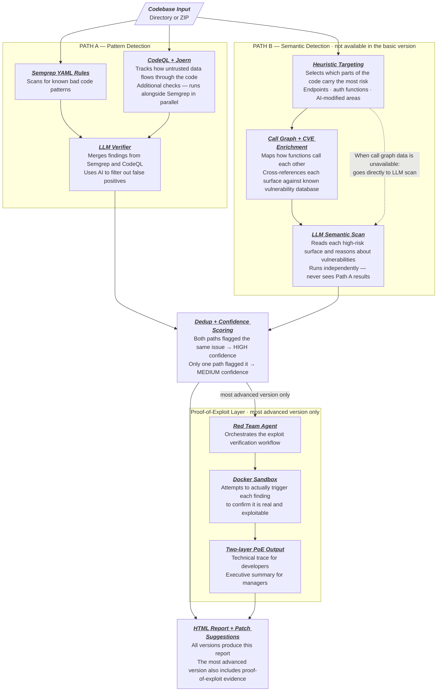

# ZeroTrust.sh — AI Codebase Security Scanner

## Idea Summary

ZeroTrust.sh is a local, privacy-first CLI security scanner and patch engine designed to audit codebases modified by AI coding agents. It accepts a codebase directory path or ZIP archive as input, performs deep security analysis entirely on-device, and outputs an interactive HTML vulnerability report with patch suggestions.

## Core Problem

AI coding agents (Cursor, Cline, Aider, Copilot Workspace) generate functional code at high speed but frequently introduce security vulnerabilities — including package hallucinations (slopsquatting), indirect prompt injection risks, and degraded security controls. Traditional cloud SAST tools (Snyk, SonarQube, CodeRabbit) require uploading source code externally, are too slow for real-time agent loops, and were never designed to detect AI-specific threat vectors.

## Key Features

- **Local & Offline Execution**: Source code never leaves the developer's machine.
- **ZIP or Directory Input**: Flexible ingestion layer — no VCS dependency.
- **AI-Specific Threat Detection**: Detects hallucinated packages, security control bypasses, and prompt injection in comments.
- **Dual-Path Analysis Engine**: Path A (fast pattern detection) runs in parallel with Path B (semantic/logic detection) — neither path gates the other.
- **Logic Vulnerability Detection**: Path B independently scans high-risk surfaces (endpoint handlers, auth functions, AI-modified regions) for vulnerabilities invisible to pattern matching — IDOR, missing access controls, business logic flaws.
- **HTML Report Output**: Generates an interactive, self-contained HTML vulnerability dashboard.
- **Patch Suggestions**: Outputs unified Git diff patches for each confirmed vulnerability.
- **Proof-of-Exploitability Documentation** *(Approach 3)*: Produces PoE reports with a technical trace for developers and an executive summary for managers — confirms vulnerabilities are real and triggerable before code ships.

## Architecture: Two-Path Design

ZeroTrust.sh uses two parallel detection paths that run against every codebase input. Neither path gates the other — they produce independent findings merged and deduplicated into a unified report.

**Path A — Pattern Detection (fast, deterministic)**
Finds vulnerabilities with a syntactic signature: code that *looks wrong* in a way a rule can describe. Uses Semgrep/Tree-sitter AST rules tuned for high recall. Fast (seconds), suitable for CI/CD, portable across tech stacks at the language-primitive level.

**Path B — Semantic/Logic Detection (targeted, thorough)**
Finds vulnerabilities where code looks locally correct but is wrong in context: IDOR, missing auth guards, business logic bypasses, AI-agent trust escalation. Uses heuristic targeting (endpoint handlers, auth functions, AI-modified code regions) to identify high-risk surfaces, then routes them to a local LLM for semantic reasoning. Catches what no static pattern can describe.

A finding confirmed by both paths is treated as high-confidence signal. A vulnerability missed by Path A remains visible to Path B.

### Phased Implementation

| Phase | Builds | Path A | Path B |
|---|---|---|---|
| **Approach 1** — Semgrep PoC | Custom Semgrep YAML rules, fake Java test codebase, CLI detection demo | Semgrep rules (Python + Java) | Not yet |
| **Approach 2** — Hybrid AST + Local LLM | Go core engine, LLM verifier, HTML report, patch suggestions | Tree-sitter + expanded rule set | Introduced: LLM independently scans endpoints and auth surfaces alongside verifying Path A findings |
| **Approach 3** — Agentic Scanner | LangGraph multi-agent orchestration, Docker sandbox, PoE documentation | Semgrep + taint-aware tools (CodeQL/Joern) | Fully realized: call graph traversal, CVE cross-referencing, sandbox exploit execution, two-layer PoE output |

## Tech Stack (Target)

- **Core Engine**: Rust or Go
- **Parser**: Tree-sitter
- **LLM Runtime**: Ollama / llama.cpp with quantized GGUF models
- **Templates**: Tera (Rust) or Jinja2 (Python)
- **Distribution**: Single standalone binary

## Market Position

- **Competitors**: CodeRabbit (cloud PR-based), Snyk (cloud SAST), Semgrep (local but rule-only, no LLM)
- **Differentiator**: Local-only execution + AI-specific threat vectors + agent-loop native speed + zero cloud token cost
- **Strategy**: Open-source core (community crowdsourced rules), optional enterprise cloud compliance dashboard

## Status

- [x] Idea validated
- [x] Market research complete
- [x] Technical architecture selected
- [ ] Repository initialized
- [ ] Core engine implementation
- [ ] Rule engine and YAML ruleset
- [ ] Local LLM integration
- [ ] HTML report generator
- [ ] Public release

## GitHub

Repository: <https://github.com/hoangharry-tm/ZeroTrust.sh>
