<div align="center">

<picture>
  <source media="(prefers-color-scheme: dark)" srcset="docs/architecture/diagrams/logo-dark.svg">
  
</picture>

<p align="center">
  <strong>Local, offline SAST that catches semantic and logic-level flaws at elevated frequency in AI-assisted codebases.</strong><br>
  Source never leaves your machine. No VCS token. No cloud upload. No trust.
</p>

[](https://hoangharry-tm.github.io/ZeroTrust.sh/)
[](LICENSE)
[](go.mod)
[]()
[]()

---

**[Website](https://hoangharry-tm.github.io/ZeroTrust.sh/) · [Architecture](docs/architecture/detail.md) · [Plan](docs/planning/implementation-plan.md) · [Live Report Demo](https://hoangharry-tm.github.io/ZeroTrust.sh/report.html)**

</div>

## The Problem

AI coding agents (Cursor, Cline, Aider, GitHub Copilot Workspace) generate syntactically plausible code without reasoning about security context. The result: standard semantic and logic-level flaws — IDOR, missing auth checks, business logic bypasses — appear at higher base rates. AI-generated code is a risk amplifier, not a new vulnerability class.

ZeroTrust.sh is an upgraded SAST: it scans **source code** for real, exploitable flaws regardless of authorship and reports them with proof of exploitation. The developer decides what's intentional.

<details>
<summary><b>Phantom dependencies (slopsquatting)</b></summary>

Your dependency manifest imports <code>requests-auth-aws</code> — a package that doesn't exist. An attacker registers it with a payload. No CVE list will catch this yet.

ZeroTrust.sh flags phantom imports in <code>go.mod</code>, <code>requirements.txt</code>, <code>pom.xml</code>, and <code>package.json</code> before they reach production.
</details>

<details>
<summary><b>Security regression detection</b></summary>

An auth check is present in commit N, silently absent in commit N+1. Functional tests still pass. No diff alert fires.

The Differential Indexer tracks auth/validate/sanitize AST nodes across scans; removal triggers deep semantic analysis.
</details>

<details>
<summary><b>Deep semantic taint analysis</b></summary>

Pattern-only tools miss logic-level flaws: SSRF through indirect calls, IDOR in non-obvious data flows, broken auth that passes unit tests.

ZeroTrust.sh's Path B runs a three-tier semantic funnel (heuristic → CodeT5+ classifier → bounded LLM) to surface what regex can't.
</details>

> [!NOTE]
> Traditional SAST tools require cloud upload, run against CVE databases, and miss logic-level flaws. **ZeroTrust.sh runs locally and reasons about code semantics.**

## Quickstart

```bash
# Install (single static binary)
go install github.com/hoangharry-tm/zerotrust/cmd/zerotrust@latest

# Scan a project (Docker mode — default)
zerotrust scan ~/my-project

# Scan without Docker
zerotrust scan --native ~/my-project

# Custom report path
zerotrust scan ~/my-project --report ~/Desktop/report.html
```

> [!WARNING]
> First run in Docker mode pulls the engine image (~500 MB). Subsequent runs use the cached image.

The HTML report is self-contained — one file, no external deps, shareable offline.

### Try the demo

```bash
git clone https://github.com/hoangharry-tm/ZeroTrust.sh
cd ZeroTrust.sh
go build -o build/zerotrust ./cmd/zerotrust
./build/zerotrust scan tests/integration/demo-app/
```

Scans a 21-file multi-language codebase. Writes `zerotrust-report.html`.

## Architecture

Two independent detection paths run in parallel. Neither gates the other. A finding confirmed by both receives a +15pp confidence boost.

<picture>
  <source media="(prefers-color-scheme: dark)" srcset="docs/architecture/diagrams/architecture-dark.svg">
  
</picture>

<details>
<summary><b>Diagram source</b></summary>

```text
flowchart LR
    Input[/"Codebase Directory"/]

    subgraph Ingestion["Ingestion"]
        DI["Differential Indexer"]
        MIV["Model Integrity Verifier"]
    end

    subgraph PA["Path A — Pattern Detection"]
        PS["Pattern Scanner"]
        TA["Taint Analyzer"]
        LV["LLM Verifier"]
    end

    subgraph PB["Path B — Semantic Detection"]
        SS["Surface Selector"]
        CC["Classifier Chain"]
        LR["LLM Reasoner"]
    end

    Input --> DI
    Input --> MIV
    DI --> PS
    DI --> TA
    DI --> SS
    TA --> LV
    PS --> LV
    TA -.-> SS
    SS --> CC
    CC -->|"uncertain"| LR

    LV --> Dedup
    CC -->|"high confidence"| Dedup
    LR --> Dedup

    Dedup["Dedup + SSVC Scoring"]
    Dedup --> Report["HTML Report + Patches"]

    style Ingestion fill:#eef2ff,stroke:#c7d2fe
    style PA fill:#f0f9ff,stroke:#bae6fd
    style PB fill:#ecfdf5,stroke:#a7f3d0
```
</details>

**Path A — fast, deterministic.** OpenGrep + ast-grep pattern matching across 42 rules. Joern CPG inter-file taint analysis. LLM Verifier (Chain-of-Doubt + SCoT + XGrammar-2) filters false positives. High-confidence rules bypass the verifier directly to Dedup.

**Path B — three-tier cost funnel.** ~95% of files eliminated by heuristic targeting. Local CodeT5+ classifier gates the remainder. Only uncertain surfaces reach bounded LLM reasoning (max 3 ReAct steps). Budget-exhausted surfaces emit `SUPPRESSED` — never silent drop. Token Budget Controller is an observer: it logs cost and warns but never stops a scan.

> [!IMPORTANT]
> **Differential Indexer** — content-hash snapshot in local SQLite. Repeat scans process only changed files + one-hop CPG neighbours: **~80–95% cost reduction**.
>
> **Model Integrity Verifier** — cosign/Sigstore Rekor-signed registry. `WARN` on unrecognized models, `BLOCK` on hash mismatch. Gates LLM calls only — pattern + CPG analysis unaffected.

<details>
<summary><b>Full pipeline detail</b></summary>

| Step | What it does |
|---|---|
| **Differential Indexer** | Content-hash diff against SQLite cache; passes only changed + expanded files |
| **MIV** | Verifies model binary against cosign/Sigstore Rekor before first LLM call |
| **Pattern Scanner** | OpenGrep + ast-grep + instrscan — 42 rules across 12 languages |
| **Taint Analyzer** | Joern CPG — traces untrusted input to sensitive sinks |
| **LLM Verifier** | CoD + SCoT + XGrammar-2; FP filter for pattern findings |
| **Surface Selector** | CPG heuristics + Trivy CVE enrichment + BOLAZ IDOR tracking |
| **Classifier Chain** | CodeT5+ (CPU) — classifies surfaces as vulnerable or safe |
| **LLM Reasoner** | Bounded ReAct (max 3 steps) — only for uncertain cases |
| **Dedup + SSVC** | Cross-path boost +15pp; BLOCK/HIGH/MEDIUM/LOW/SUPPRESSED |
</details>

## Severity Levels

| Severity | Meaning |
|---|---|
| 🔴 **BLOCK** | Exploitation imminent — patch immediately |
| 🟡 **HIGH** | Likely exploitable — high priority |
| 🔵 **MEDIUM** | Conditional or chained exploit path |
| ⚪ **LOW** | Best practice violation, low risk |
| 🟢 **SUPPRESSED** | Budget-exhausted — not silent drop |

## Language Coverage

<details>
<summary><b>12 languages · 3 detection axes</b></summary>

| Language | Pattern | Taint | Semantic |
|---|---|---|---|
| Python | ✅ OpenGrep | ✅ Joern | ✅ CodeT5+ |
| Java | ✅ OpenGrep | ✅ Joern | ✅ CodeT5+ |
| JavaScript / TypeScript | ✅ OpenGrep + ast-grep | ✅ Joern | ✅ CodeT5+ |
| Go | ✅ OpenGrep | ✅ Joern† | ✅ CodeT5+ |
| Ruby | ✅ OpenGrep + ast-grep | ✅ Joern | ✅ CodeT5+ |
| PHP | ✅ OpenGrep + ast-grep | ✅ Joern | ✅ CodeT5+ |
| Kotlin | ✅ ast-grep | — | ✅ LLM direct |
| C# | ✅ ast-grep | — | ✅ LLM direct |
| Rust | ✅ ast-grep | — | ✅ LLM direct |
| Swift | ✅ ast-grep | — | ✅ LLM direct |
| Dart | ✅ ast-grep | — | ✅ LLM direct |
| Generic (`.md`, `.mcp.json`) | ✅ OpenGrep + instrscan | — | — |

† Joern Go frontend is community-contributed; CPG quality empirically validated during development.

</details>

## Tech Stack

| Layer | Technology |
|---|---|
| CLI + orchestration | Go — cobra, goroutines, errgroup, Docker dispatch |
| Pattern matching | OpenGrep + ast-grep |
| Taint analysis | Joern CPG Engine |
| ML classifier | CodeT5+ `Salesforce/codet5p-220m` (CPU, local Python worker) |
| Structured output | XGrammar-2 constrained decoding |
| LLM runtime | Ollama HTTP API (model-agnostic, GPU passthrough) |
| CVE enrichment | Trivy `fs` subprocess |
| Model verification | cosign / Sigstore Rekor |
| State cache | SQLite — `modernc.org/sqlite` (pure-Go, no CGo) |
| HTML report | Go `html/template` + `embed`, native EventSource |
| Distribution | Single Go binary — Docker default, `--native` opt-in |

<details>
<summary><b>Repository structure</b></summary>

```
cmd/zerotrust/          CLI entry point — cobra, Docker orchestration, direct execution
pkg/                    cpg/ · ollama/ · sqlite/
internal/
  finding/              Finding struct + channel
  ingestion/            miv/ · diffindex/
  pattern/              opengrep/ · astgrep/ · joern/ · instrscan/ · verifier/
  semantic/             targeting/ · enrichment/ · classifier/ · assembler/ · summarizer/ · budget/ · llmscan/
  dedup/                Dedup + SSVC scoring
  report/               HTML report + patches
  output/               MinimalRenderer + WebRenderer (SSE)
  worker/               Python worker manager (NDJSON IPC)
worker/                 Python ML worker
rules/                  python/ · java/ · generic/ · astgrep/ — 42 rules total
tests/
  fixtures/             bad/ · ok/ · knockout/ — unit-level rule match fixtures
  integration/          demo-app/ · spring-boot-app/ · synthetic/
  corpus/               .gitignored — populated by data pipeline
pipeline/               collectors/ · normalizer/ · labeler/ · notebooks/
docs/                   architecture/ · planning/ · research-papers.md · report-example.html
site/                   SolidJS landing page — https://hoangharry-tm.github.io/ZeroTrust.sh/
```

</details>

## Requirements

**Docker mode (default)**
- Docker Desktop (macOS) or `docker.io` (Linux). The CLI handles `docker pull` and `docker run` transparently.
- Ollama (optional, recommended) — GPU-accelerated LLM inference. Detected automatically and passed through to the container.

**Native mode (`--native`)**
- JDK 19+, Joern, OpenGrep, ast-grep
- Python 3.11+ with worker dependencies (`pip install -r worker/requirements.txt`)

## Contributing

ZeroTrust.sh is in active development toward the **August 6, 2026** public testing release. Highest-leverage contributions:

- **Rules** — new OpenGrep or ast-grep rules for AI-specific patterns. See [`rules/`](rules/) and [`tests/fixtures/`](tests/fixtures/).
- **Test codebases** — vulnerable-by-design samples in Kotlin, Dart, Swift.
- **Bug reports** — open an issue with rule ID, input, and whether it was FP or FN.

Before submitting a rule PR: run `make test` and confirm 0 FP on clean controls.

---

<div align="center">

**Docs:** [Architecture](docs/architecture/detail.md) · [Implementation Plan](docs/planning/implementation-plan.md) · [Research Papers](docs/research-papers.md) · [Live Report Demo](https://hoangharry-tm.github.io/ZeroTrust.sh/report.html)

**Website:** [hoangharry-tm.github.io/ZeroTrust.sh](https://hoangharry-tm.github.io/ZeroTrust.sh/)

Apache 2.0

</div>
