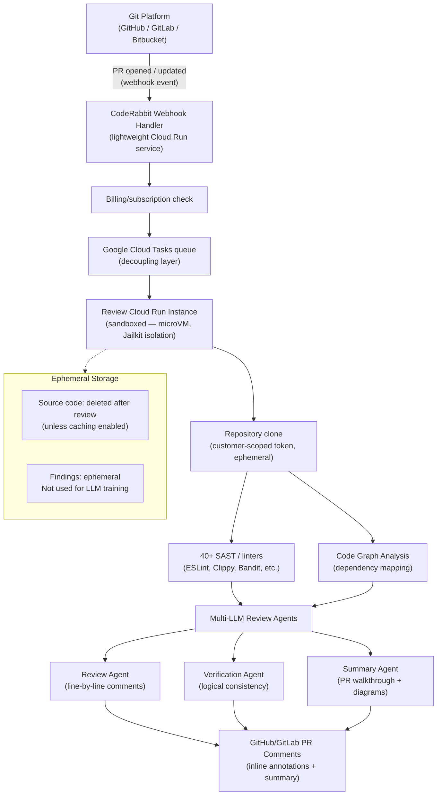

# Competitor Teardown: CodeRabbit

> **Document type:** Research & analysis only. Neutral assessment.  
> **Compiled:** June 2026  
> **Sources:** CodeRabbit official documentation, architecture blog, privacy policy, Google Cloud blog post, pricing page, published reviews

---

## Table of Contents

1. [Overview](#1-overview)
2. [Architecture](#2-architecture)
3. [Strengths](#3-strengths)
4. [Weaknesses](#4-weaknesses)
5. [AI-Generated Code Handling](#5-ai-generated-code-handling)
6. [Privacy & Data Handling](#6-privacy--data-handling)
7. [Pricing](#7-pricing)
8. [GitHub / Adoption Stats](#8-github--adoption-stats)
9. [ZeroTrust.sh Positioning vs. CodeRabbit](#9-zerotrustedsh-positioning-vs-coderabbit)

---

## 1. Overview

CodeRabbit is a cloud-based AI code review service that integrates with GitHub and GitLab pull requests. When a PR is opened or updated, CodeRabbit automatically clones the repository, runs a suite of 40+ static analysis tools and linters, then applies multiple cloud LLMs to generate a plain-English review summary, sequence diagrams, line-by-line comments, and one-click fix suggestions. It is designed as a PR-gated workflow tool — it operates on the PR, not on the local developer environment.

CodeRabbit was founded in 2023, raised $60M in a Series B at a $550M valuation in September 2025, and has connected over 2 million repositories as of early 2026.

---

## 2. Architecture

**Key architectural properties:**
- Each PR review runs in an isolated Cloud Run instance (microVM with Jailkit cgroup isolation)
- Repository is cloned using customer-scoped tokens that can only access the specific repository being reviewed
- No shared state between customers
- Google Cloud Platform (GCP) infrastructure
- LanceDB integration (2026) for semantic search at scale — sub-second latency on 50,000+ daily PRs

(Sources: [CodeRabbit architecture docs](https://docs.coderabbit.ai/overview/architecture), [Google Cloud blog on CodeRabbit](https://cloud.google.com/blog/products/ai-machine-learning/how-coderabbit-built-its-ai-code-review-agent-with-google-cloud-run))

---

## 3. Strengths

**S1: Comprehensive LLM-powered code understanding**  
CodeRabbit uses multiple cloud LLMs (specific models undisclosed) to generate natural-language summaries, sequence diagrams, and contextual code review comments. This is qualitatively different from pattern-matching tools: it can identify *logic errors*, *misuse of APIs*, and *architectural concerns* that rule-based SAST cannot.

**S2: Zero configuration — two-click GitHub/GitLab integration**  
Installation requires authorizing a GitHub App; no per-repository configuration is needed to get started. Code reviews begin automatically on the next PR. This produces extremely low adoption friction for developer teams.

**S3: Combines SAST tooling + LLM review in one product**  
CodeRabbit runs 40+ static analyzers (Bandit for Python, Clippy for Rust, ESLint for JavaScript, etc.) and integrates their findings alongside LLM-generated comments. Teams get both rule-based detection precision and LLM-powered semantic review in a single tool.

**S4: Real-time web context queries**  
A 2026 feature addition allows CodeRabbit to autonomously query documentation and web sources to augment its review with relevant context — for example, referencing the latest security advisories for a library being used.

**S5: Rapid adoption at scale**  
Over 2 million repositories connected, 13 million PRs reviewed, 8,000+ paying customers, 100,000+ open-source projects. This is substantial real-world validation of the product's utility.

**S6: Time savings quantified by users**  
Users report 50%+ reduction in manual review effort and up to 80% faster review cycles (CodeRabbit customer data, June 2026). These are self-reported metrics from the vendor; independent verification is not available.

(Source: [CodeRabbit pricing / features page](https://www.coderabbit.ai/pricing), [CodeRabbit review 2026](https://ucstrategies.com/news/coderabbit-review-2026-fast-ai-code-reviews-but-a-critical-gap-enterprises-cant-ignore/))

---

## 4. Weaknesses

**W1: Cloud-only, no offline or self-hosted option**  
CodeRabbit has no on-premise or self-hosted deployment. Organizations with strict data sovereignty policies (defense, financial services, healthcare under HIPAA, EU organizations with strict GDPR interpretations) cannot use CodeRabbit without code leaving their infrastructure. This is a fundamental architectural constraint, not a near-term feature gap.

**W2: PR-gated workflow — incompatible with real-time agent loops**  
CodeRabbit's review is triggered by PR creation or update. For AI agent workflows (Cursor, Cline, Aider) running in continuous mode, the developer's feedback loop operates at the speed of code generation — potentially many commits per minute. The minutes-long latency of a PR review does not fit this workflow. There is no pre-commit hook, inline CLI mode, or agent-native integration.

**W3: Cost adds up for large teams**  
At $24/dev/month (Pro) or $48/dev/month (Pro+), a 50-developer team pays $14,400–$28,800/year for CodeRabbit alone — on top of any CI/CD, SCM, and existing SAST tool costs. Multiple 2026 reviews note the cost-benefit question becomes difficult to answer for teams that already have robust security review processes.

**W4: LLM hallucination in reviews**  
Multiple user reviews (Gartner Peer Insights, G2, GitHub issue discussions) report that CodeRabbit occasionally generates incorrect or misleading review comments, particularly for complex business logic or framework-specific patterns the LLM misinterprets. As with all LLM-based tools, false positives and confidently wrong statements are a known failure mode.

**W5: Repository data must be transmitted to cloud**  
Even with strong isolation and ephemeral storage guarantees, some organizations' security policies prohibit *any* external transmission of source code, regardless of the provider's privacy commitments. CodeRabbit has no architectural path to satisfy this class of policy.

**W6: Dependent on cloud LLM provider terms**  
CodeRabbit's review quality is tied to the underlying LLMs (likely GPT-4o or equivalent). Changes in model behavior, pricing, or availability from cloud LLM providers create downstream risk for CodeRabbit's product quality and economics.

---

## 5. AI-Generated Code Handling

CodeRabbit is the competitor most directly impacted by AI-generated code volume: as AI agents produce more PRs, CodeRabbit's review pipeline processes more AI-generated code. Its approach:

**What it does:**
- LLM-powered review catches many vulnerability classes in AI-generated code, just as it does for human-written code
- The natural language summary highlights code patterns that are unusual or risky, which sometimes surfaces AI-generated oddities
- CodeRabbit's 40+ integrated SAST tools (e.g., Bandit, Clippy) will flag known vulnerability patterns regardless of code origin

**What it does not do:**
- No dedicated detection for package hallucination/slopsquatting — its SAST tools check packages against known vulnerability databases, not AI hallucination patterns
- No detection for indirect prompt injection in code comments or string literals
- No safety gate bypass detection
- No tracking of whether code was AI-generated

**Assessment:** CodeRabbit reviews AI-generated code well when the vulnerabilities it introduces are within the capability of existing LLM review + SAST tooling. It does not address the *AI-specific* threat vectors that arise from the nature of AI code generation itself.

---

## 6. Privacy & Data Handling

**Source code handling:**
- Repository is cloned per PR review into an isolated, ephemeral container on GCP
- Source code is **not retained** after review completion, unless the user explicitly enables review caching (for performance on large repos)
- Any cached data is encrypted, used only to accelerate future reviews, never used for LLM training, and expires automatically
- Reviews run in isolated containers; no shared state between customers
- Customer-scoped tokens ensure the review container can only access the repository being reviewed

**LLM queries:**
- Queries to LLMs are ephemeral; no data is stored or logged by the LLM providers (per CodeRabbit's contractual representations)
- Proprietary code is explicitly not used to train or improve AI models

**Compliance certifications:**
- SOC 2 Type II certified
- GDPR compliant
- Data Processing Addendum (DPA) available for enterprise customers

**Critical limitation:**
- Even with these protections, source code *does* leave the customer's infrastructure on every review. This is the key constraint for data-sovereign use cases.

(Sources: [CodeRabbit privacy policy](https://www.coderabbit.ai/privacy-policy), [CodeRabbit security posture](https://www.coderabbit.ai/blog/our-security-posture-how-we-safeguard-your-repositories), [CodeRabbit DPA](https://www.coderabbit.ai/dpa))

---

## 7. Pricing

| Tier | Price | Key Features |
|------|-------|-------------|
| Free | $0 | Public repositories only; rate-limited reviews |
| Pro | $24/dev/month (annual) / $30 month-to-month | All PR reviews, higher rate limits, Knowledge base, linter + SAST integration, analytics, docstrings, autofix |
| Pro+ | $48/dev/month (annual) / $60 month-to-month | Everything in Pro + CodeRabbit Plan (issue planning), unit test generation, merge conflict resolution |
| Enterprise | Custom | Custom integrations, SLAs, dedicated support, SSO, compliance reporting |

(Source: [CodeRabbit pricing](https://www.coderabbit.ai/pricing))

---

## 8. GitHub / Adoption Stats

| Metric | Value | Source |
|--------|-------|--------|
| Repositories connected | 2 million+ | CodeRabbit / press releases |
| Pull requests reviewed | 13 million+ | CodeRabbit / press releases |
| Paying customers | 8,000+ | CodeRabbit / press releases |
| Notable customers | Chegg, Groupon, Life360, Mercury | CodeRabbit website |
| Open-source projects served | 100,000+ | CodeRabbit |
| Series B funding | $60M at $550M valuation | September 2025 press release |
| Total funding | $88M | September 2025 disclosure |
| GitHub App marketplace | Listed; star count N/A (app listing format) | GitHub Marketplace |

Note: CodeRabbit is a GitHub/GitLab application, not a traditional open-source repository, so a "GitHub stars" metric is not directly comparable to open-source tool star counts.

---

## 9. ZeroTrust.sh Positioning vs. CodeRabbit

**Where they overlap:**
- Both provide AI-powered semantic code review beyond pattern matching
- Both produce actionable findings with remediation suggestions
- Both target developers using AI coding tools

**Where ZeroTrust.sh has distinct proposed coverage:**

1. **Local-only execution:** ZeroTrust.sh's primary architectural differentiator vs. CodeRabbit is zero code egress. For organizations that cannot use cloud tools due to policy, ZeroTrust.sh is the only option in this space.

2. **Agent-loop compatible latency:** ZeroTrust.sh is designed as a CLI tool suitable for pre-commit hooks and inline agent workflows. CodeRabbit operates on PRs, creating a multi-minute feedback gap. For Cursor/Cline agentic workflows, a local CLI is architecturally better suited.

3. **AI-specific threat vectors:** Both tools lack dedicated detection for slopsquatting, prompt injection in code, and safety gate bypass. ZeroTrust.sh targets these as first-class features; CodeRabbit does not.

4. **No per-seat subscription cost for individual developers:** A local open-source tool has no ongoing per-developer cost. For solo developers or small teams, this may be a significant factor.

**Where CodeRabbit is stronger:**

1. **LLM quality:** Cloud LLMs (GPT-4o class) significantly outperform local quantized 7B/8B models on code understanding tasks. CodeRabbit's review quality on complex, idiomatic code is likely higher than what a local GGUF model can provide.

2. **Zero-configuration workflow integration:** CodeRabbit has a two-click setup that runs automatically on every PR. ZeroTrust.sh requires explicit invocation (or pre-commit hook configuration).

3. **Breadth of SAST tooling:** CodeRabbit bundles 40+ analyzers alongside LLM review. ZeroTrust.sh's rule coverage starts from zero.

4. **PR-centric output format:** For teams that do code review in GitHub/GitLab, CodeRabbit's inline PR comment format is more natural than a generated HTML report.

5. **Established product with 2M+ repositories:** Market validation, feature stability, and support infrastructure.

**Strategic observation (neutral):** CodeRabbit and ZeroTrust.sh are architecturally incompatible for the same use case in data-sovereign environments. They may coexist in environments without data sovereignty constraints: CodeRabbit for PR-gated review, ZeroTrust.sh for local pre-commit AI-specific threat scanning. The key market segment where ZeroTrust.sh has exclusive coverage is organizations where "no cloud code egress" is a hard requirement.

---

*End of document.*
