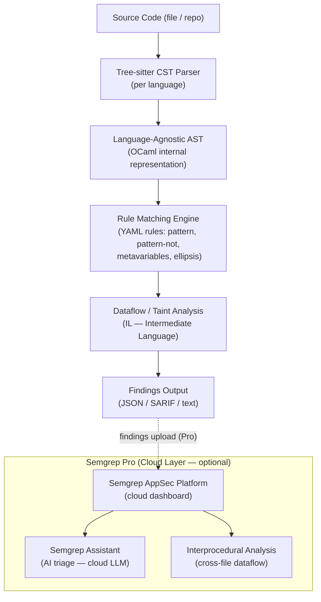

# Competitor Teardown: Semgrep

> **Document type:** Research & analysis only. Neutral assessment.  
> **Compiled:** June 2026  
> **Sources:** Semgrep public documentation, GitHub repository, pricing pages, community posts, published reviews

---

## Table of Contents

1. [Overview](#1-overview)
2. [Architecture](#2-architecture)
3. [Strengths](#3-strengths)
4. [Weaknesses](#4-weaknesses)
5. [AI-Generated Code Handling](#5-ai-generated-code-handling)
6. [Privacy & Data Handling](#6-privacy--data-handling)
7. [Pricing](#7-pricing)
8. [GitHub / Adoption Stats](#8-github--adoption-stats)
9. [ZeroTrust.sh Positioning vs. Semgrep](#9-zerotrustedsh-positioning-vs-semgrep)

---

## 1. Overview

Semgrep is a lightweight static analysis tool that matches user-defined patterns against a language-agnostic Abstract Syntax Tree (AST). It was originally developed by the security team at Dropbox (as "pfff" tooling), then commercialized by r2c (now Semgrep, Inc.). The open-source Community Edition (CE) is the engine; Semgrep Pro is a commercial AppSec platform adding cloud dashboards, interprocedural analysis, SCA, and AI-assisted triage.

Semgrep is widely used in two distinct contexts: (1) as a local CI/CD security tool via the open-source engine, and (2) as an enterprise AppSec platform via Semgrep Pro. These two use cases have different architectures and data handling properties.

---

## 2. Architecture

**Core mechanics:**
1. **Parsing:** Source code is parsed into a Concrete Syntax Tree (CST) via tree-sitter, then translated to Semgrep's language-agnostic AST via custom OCaml parsers
2. **Rule matching:** YAML rules use a pattern language that resembles source code itself (e.g., `os.system(...)` matches any call to `os.system` with any arguments). Rules support metavariables (`$X`), ellipsis (`...`), and logical operators (`pattern-either`, `pattern-not`, `pattern-inside`)
3. **Intermediate language:** For dataflow analysis, the AST is further compiled into an analysis-friendly IL, enabling taint tracking (source → sanitizer → sink)
4. **Taint mode (OSS):** Limited to intra-file (single-file) taint tracking in the Community Edition
5. **Interprocedural analysis:** Cross-file, cross-function dataflow analysis is gated behind Semgrep Pro

(Source: [Semgrep dataflow analysis docs](https://semgrep.dev/docs/writing-rules/data-flow/data-flow-overview), [semgrep-core contributing](https://semgrep.dev/docs/contributing/semgrep-core-contributing))

---

## 3. Strengths

**S1: Exceptional rule expressiveness with low barrier to entry**  
Rules look like the code they scan — a rule to detect SQL injection in Python using f-strings requires ~5 lines of YAML. This has driven 2,800+ community-contributed rules in the open registry, with 20,000+ Pro rules in the commercial tier. No other tool in this category has comparable community-driven rule coverage.

**S2: Broad language support (30+ languages)**  
Semgrep supports 30+ languages via tree-sitter parsers, covering mainstream languages (Python, JavaScript, TypeScript, Java, Go, C/C++, Ruby, Kotlin, Swift) and security-specific cases (Dockerfile, Terraform HCL, JSON/YAML configuration files).

**S3: True local execution — no network requirements**  
The Community Edition is entirely local. No account, no API key, no telemetry (configurable). This makes it appropriate for air-gapped environments and developers with privacy requirements.

**S4: Established community and ecosystem**  
60 million+ Docker pulls; used by companies including GitLab, Dropbox, Slack, Figma, Shopify, HashiCorp, Snowflake, and Trail of Bits (the security research firm that contributes many of its rules). This creates a flywheel: more users → more community rules → better detection.

**S5: Strong CI/CD integration story**  
Native integrations with GitHub Actions, GitLab CI, Jenkins, CircleCI, Buildkite, and others. Semgrep can gate PRs on finding severity, producing inline GitHub/GitLab comments without additional tooling.

**S6: Well-funded and commercially viable**  
Raised $193M+ total funding ($100M Series D in February 2025 led by Menlo Ventures). Revenue estimated at $33.6M ARR (2025). This provides organizational stability.

(Sources: [Semgrep CE docs](https://semgrep.dev/products/community-edition/), [Crunchbase Series D](https://news.crunchbase.com/cybersecurity/application-startup-semgrep-fundraise-menlo/))

---

## 4. Weaknesses

**W1: No semantic reasoning — patterns, not understanding**  
Semgrep's OSS engine is structurally a pattern matcher against an AST. It does not "understand" code semantics. This produces false positives when a pattern matches benign code that *looks like* a vulnerability but is contextually safe, and false negatives when a vulnerability exists in a form the rule author did not anticipate.

**W2: Intra-file taint analysis only (OSS)**  
The Community Edition's taint tracking is limited to a single file at a time. In real applications where user input flows through multiple modules, OSS taint analysis will miss vulnerabilities that cross file boundaries. Interprocedural analysis requires the commercial Pro tier.

**W3: Rule quality is highly variable**  
Community rules range from excellent (contributed by Trail of Bits, Semgrep's own team) to low-quality (false-positive-prone, outdated, or language-incorrect). There is no automated quality gate; users must vet rules themselves.

**W4: No LLM-powered review in local mode**  
Semgrep Assistant (AI triage) is a cloud-only feature in the commercial tier. For users who cannot send code to the cloud, there is no AI-assisted triage or patch generation available.

**W5: High false-positive rate for complex codebases**  
User reviews on G2 and Gartner Peer Insights frequently cite noisy output requiring manual triage. One G2 reviewer noted "spending more time managing false positives than fixing actual issues" (2024 review, paraphrased). This is an inherent limitation of pattern-based SAST.

**W6: Performance on very large monorepos**  
While Semgrep is generally fast, users report multi-minute scan times on monorepos with millions of lines of code when running multiple rule packs simultaneously.

---

## 5. AI-Generated Code Handling

As of June 2026, Semgrep does **not** have dedicated detection logic for AI-generated code threat vectors:

- **Package hallucination / slopsquatting:** Semgrep's Supply Chain product (Pro) checks known package vulnerability databases (OSV, NVD). It can flag packages with *known CVEs* but cannot detect hallucinated package names that don't exist in any database.
- **Prompt injection in code:** Semgrep has no published rules for detecting prompt injection patterns embedded in string literals, comments, or configuration values.
- **Safety gate bypass:** No rules for detecting removal or weakening of AI safety controls.
- **AI-generated code provenance:** Semgrep does not track whether code was AI-generated.

Semgrep's generic security rules (e.g., SQL injection, XSS, hardcoded secrets) will catch vulnerabilities *regardless* of whether the code was human- or AI-generated — this provides indirect coverage. But the AI-specific threat vectors enumerated above have no direct coverage.

**Semgrep Assistant (Pro)** uses a cloud LLM (undisclosed model) to triage findings and reduce false positives. While this is an AI-assisted feature, it operates *on existing findings* rather than detecting AI-specific vulnerabilities.

---

## 6. Privacy & Data Handling

**Community Edition (OSS):**
- Fully local execution; no data leaves the machine
- Optional anonymous metrics (can be disabled with `--no-rewrite-rule-ids` and `SEMGREP_SEND_METRICS=off`)
- No account required; no API keys

**Semgrep Pro (AppSec Platform):**
- Scan findings (not full source code) are uploaded to Semgrep's cloud dashboard
- Semgrep's Network Broker feature allows findings to route through a customer-controlled proxy
- Semgrep does not claim to store full source code permanently; documentation states findings and metadata are stored, not raw code
- Data is processed in the US (AWS infrastructure) unless enterprise agreements specify otherwise

The key privacy distinction: Semgrep OSS processes code entirely locally; Semgrep Pro sends findings metadata to the cloud, not full source code (unlike CodeRabbit which clones repositories).

(Source: [Semgrep licensing](https://semgrep.dev/docs/licensing), [Semgrep Pro vs OSS comparison](https://semgrep.dev/docs/semgrep-pro-vs-oss))

---

## 7. Pricing

| Tier | Price | Included Features |
|------|-------|-------------------|
| Community Edition (OSS) | Free, unlimited | Local CLI, 30+ languages, community rule registry, YAML custom rules, CI/CD integration |
| Team | $35/contributor/month (annual) | All CE features + cloud dashboard, unlimited contributors/repos, SAST + SCA + Secrets, Semgrep Assistant AI triage, policy management, priority support |
| Enterprise | Custom pricing | Everything in Team + interprocedural analysis, SSO/SAML, dedicated support, compliance reporting, custom deployment |

Note: Semgrep made the full Team plan free for up to 10 contributors and 10 private repositories (as of 2024), lowering the barrier to commercial adoption.

(Source: [Semgrep pricing page](https://semgrep.dev/pricing/))

---

## 8. GitHub / Adoption Stats

| Metric | Value | Source |
|--------|-------|--------|
| GitHub stars | ~14,300 | github.com/semgrep/semgrep, June 2026 |
| Docker pulls | 60 million+ | Semgrep marketing |
| Community rules | ~2,800 | semgrep-rules repository |
| Pro rules | 20,000+ | Semgrep Pro documentation |
| Total funding raised | $193M+ | Crunchbase |
| ARR (estimated) | $33.6M | getlatka.com (unverified, estimate) |
| Series D | $100M (Feb 2025) | Crunchbase |
| Investors | Menlo Ventures, Sequoia, Lightspeed, Redpoint, Felicis | Crunchbase |
| Notable users | GitLab, Dropbox, Slack, Figma, Shopify, HashiCorp, Snowflake, Trail of Bits | Semgrep website |

---

## 9. ZeroTrust.sh Positioning vs. Semgrep

**Where they overlap:**
- Both target the local CLI / developer-workflow security scanner niche
- Both (proposed) support YAML-based custom rules
- Both are intended for pre-commit hooks and CI/CD pipelines
- Both output findings that can be consumed programmatically

**Where ZeroTrust.sh has distinct proposed coverage:**
1. **AI-specific threat vectors:** Semgrep has no rules for package hallucination, prompt injection in code comments, or safety gate bypass. ZeroTrust.sh targets these as first-class detection categories.
2. **Embedded LLM for local semantic verification:** Semgrep OSS has no LLM component. ZeroTrust.sh proposes using a local GGUF model to reduce false positives through semantic reasoning — something only available in Semgrep's cloud tier today.
3. **Self-contained HTML report:** Semgrep OSS outputs JSON/SARIF/text; no interactive dashboard. ZeroTrust.sh targets an interactive standalone HTML report.

**Where Semgrep is stronger:**
1. **Rule library depth:** 2,800+ community rules vs. zero for ZeroTrust.sh (which does not yet exist)
2. **Language coverage:** 30+ languages, well-tested, actively maintained
3. **Organizational stability:** $193M+ funded, established company
4. **CI/CD ecosystem:** Native integrations with all major platforms
5. **Taint analysis:** Even the OSS taint mode is more rigorous than pattern matching; Pro interprocedural analysis is best-in-class for a local tool

**Strategic observation (neutral):** Semgrep is a well-positioned general-purpose SAST tool. ZeroTrust.sh's differentiation rests on the specific combination of local LLM + AI-specific rules — a narrower but unoccupied position. These products could also be complementary: ZeroTrust.sh running AI-specific checks alongside Semgrep's broader rule set.

---

*End of document.*
