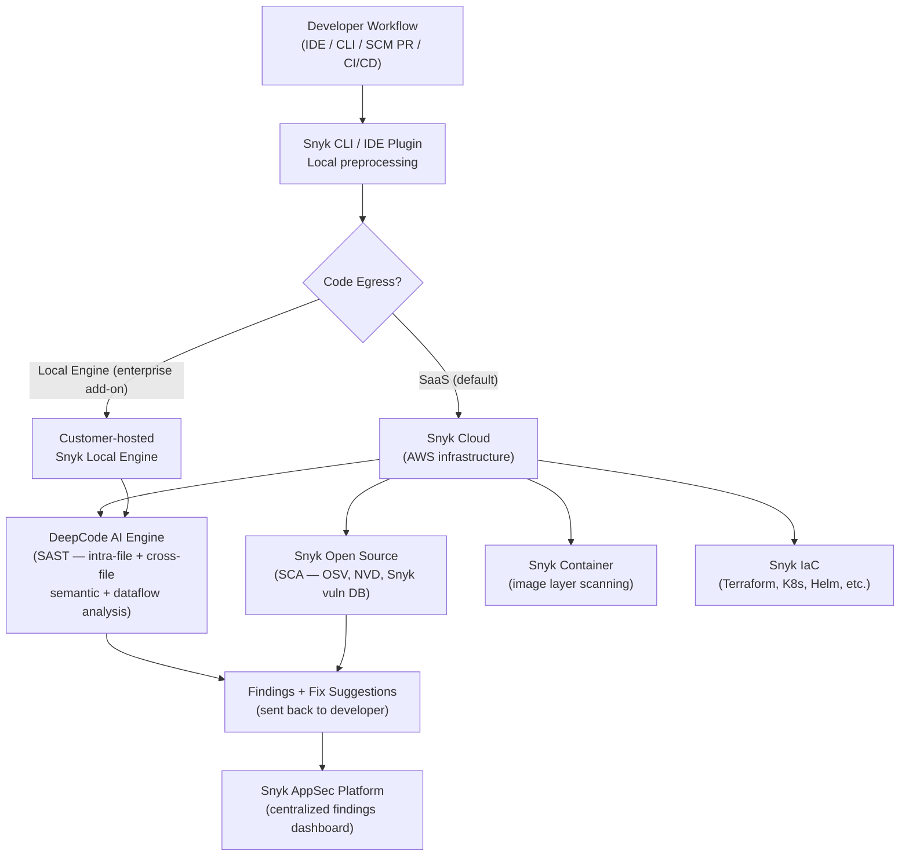

# Competitor Teardown: Snyk

> **Document type:** Research & analysis only. Neutral assessment.  
> **Compiled:** June 2026  
> **Sources:** Snyk official documentation, data handling policies, pricing pages, public financial disclosures, published reviews

---

## Table of Contents

1. [Overview](#1-overview)
2. [Architecture](#2-architecture)
3. [Strengths](#3-strengths)
4. [Weaknesses](#4-weaknesses)
5. [AI-Generated Code Handling](#5-ai-generated-code-handling)
6. [Privacy & Data Handling](#6-privacy--data-handling)
7. [Pricing](#7-pricing)
8. [GitHub / Adoption Stats](#8-github--adoption-stats)
9. [ZeroTrust.sh Positioning vs. Snyk](#9-zerotrustedsh-positioning-vs-snyk)

---

## 1. Overview

Snyk is a developer-first security platform covering five product lines: Snyk Code (SAST), Snyk Open Source (SCA), Snyk Container, Snyk IaC (Infrastructure as Code), and Snyk Cloud. Founded in 2015 in London, Snyk pioneered the "developer-first security" positioning — embedding security checks directly into developer workflows (IDE, CLI, SCM, CI/CD) rather than requiring a separate AppSec team workflow. As of 2025, Snyk has reached $300M+ ARR and is the largest dedicated developer security company by revenue among independent vendors.

Snyk Code, its SAST product, uses an AI-powered engine (branded DeepCode AI) that goes beyond pattern matching to perform inter-file semantic and dataflow analysis.

---

## 2. Architecture

**Core mechanics of Snyk Code (SAST):**
1. **Local preprocessing:** The CLI or IDE plugin preprocesses code locally, potentially compressing or normalizing it before transmission
2. **DeepCode AI engine (cloud):** Performs single-file and inter-file analysis including API usage modeling, null dereference detection, race condition identification, and cross-file dataflow tracking
3. **AI Fix Suggestions:** A separate AI model (trained on public repos with permissive licenses) generates diff-style patch suggestions for confirmed findings
4. **Intra-file + interfile:** Unlike Semgrep OSS, Snyk Code performs cross-file dataflow analysis in its standard SaaS deployment

(Source: [Snyk Code product page](https://snyk.io/product/snyk-code/), [Snyk Code user docs](https://docs.snyk.io/scan-with-snyk/snyk-code))

---

## 3. Strengths

**S1: Genuine semantic analysis across files**  
Snyk Code's DeepCode engine performs inter-file dataflow and semantic analysis — tracking data from input sources through function calls across module boundaries to sinks. This is more thorough than pattern-only SAST tools and produces fewer false negatives on real-world vulnerabilities.

**S2: Developer-workflow integration depth**  
Snyk integrates at every point in the development lifecycle: IDE plugins for VS Code, IntelliJ IDEA, Eclipse, and Visual Studio; SCM integrations (GitHub, GitLab, Bitbucket, Azure Repos); CLI for local/CI use; PR decoration with inline comments. The breadth of integration makes it low-friction to adopt alongside existing tooling.

**S3: Unified platform covering SAST + SCA + Container + IaC**  
Snyk's five-product suite allows organizations to use a single vendor and dashboard for the majority of their security needs. This reduces integration overhead and provides correlated findings across the stack.

**S4: AI-generated patch suggestions (Snyk Code Fix)**  
Snyk Code Fix automatically generates unified diff patches for confirmed vulnerabilities. The model is trained on public repositories with permissive licenses, not customer code. This is one of the few tools to provide automated remediation rather than just detection.

**S5: Large and trusted vulnerability database**  
Snyk's proprietary vulnerability database (used by Snyk Open Source) is one of the largest and most actively maintained in the industry, combining public CVE data with Snyk's own security research team's additions. This is a core asset that took years to build.

**S6: Strong financial position**  
$407.8M ARR (2025), $300M+ in cash reserves, path to profitability in 2025. Snyk is one of the most capitalized independent security companies. Not at IPO risk of runway concerns.

(Sources: [Snyk ARR data](https://techcrunch.com/2024/12/06/snyk-hits-300m-arr-but-isnt-rushing-to-go-public/), Snyk product documentation)

---

## 4. Weaknesses

**W1: Source code transmitted to cloud by default**  
The standard SaaS deployment requires source code to be uploaded to Snyk's cloud infrastructure for analysis. Snyk's documentation states code is deleted after scanning and not used for model training, but this does not satisfy organizations with strict data sovereignty policies (financial services, healthcare, defense, EU GDPR-sensitive environments).

**W2: Local Engine is an enterprise add-on with trade-offs**  
Snyk does offer a "Local Engine" deployment option for data-sovereign customers. However, this requires on-premise infrastructure to maintain, receives slower updates than the SaaS offering, and is not part of the standard pricing tier (requires enterprise negotiations). For a small team, this option is effectively unavailable.

**W3: High cost at scale**  
Enterprise tier pricing for 50 developers: $48,000–$84,000/year. For mid-sized teams, Snyk is one of the most expensive SAST options. Multiple Gartner Peer Insights reviews (2024–2025) cite cost as the primary dissatisfaction factor.

**W4: Dashboard / account required even for CLI use**  
Unlike Semgrep OSS or TruffleHog, Snyk CLI requires an account and API authentication token for full functionality. This creates friction for developers who want a zero-configuration local tool.

**W5: Coverage gaps for niche languages**  
While Snyk Code supports 25+ languages, it has historically weaker rule coverage for less mainstream languages (e.g., Rust, Elixir, Dart) compared to its coverage for Python, JavaScript, Java, and Go.

**W6: False positive management is customer's burden**  
Gartner Peer Insights reviews highlight that false positive management and policy tuning require significant ongoing investment from the customer's security team.

---

## 5. AI-Generated Code Handling

**Direct AI-specific tooling:**
- Snyk has published a blog post and guidance on "slopsquatting" mitigation strategies ([snyk.io/articles/slopsquatting-mitigation-strategies](https://snyk.io/articles/slopsquatting-mitigation-strategies))
- However, Snyk's actual tool does not currently ship dedicated slopsquatting detection. Snyk Open Source checks packages against known vulnerability databases; it cannot detect hallucinated package names that don't exist in any database
- No detection for prompt injection embedded in code comments or string literals
- No safety gate bypass detection

**Indirect coverage:**
- Snyk Code's semantic analysis will catch *known vulnerability classes* (SQL injection, XSS, command injection, etc.) in AI-generated code just as it would in human-generated code
- Snyk's AI Fix Suggestions accelerate remediation once vulnerabilities are found, but the detection itself is not AI-generation-aware
- Snyk has published a "Securing AI code with Snyk" guide, positioning existing tools for use on AI-generated output — but this is workflow guidance, not new detection capability

**Assessment:** Snyk is aware of the AI-generated code security problem and has publicly engaged with it, but as of June 2026 the tooling has not been updated with dedicated AI-specific detection rules. This is an acknowledged gap in their public documentation.

---

## 6. Privacy & Data Handling

**Default SaaS behavior:**
- Source code is uploaded to Snyk's cloud (AWS infrastructure) for analysis
- Code is used for a "one-time analysis" and cached briefly per cloud provider minimums, then deleted
- Only findings (file path, line, column, issue ID, explanations) are retained permanently; source code is not stored in Snyk's network or logs after the scan window
- Customer code is explicitly not used for model training: *"Snyk Code does not use any customer code for engine training purposes"* — Snyk documentation

**Self-hosted Local Engine:**
- Available as enterprise add-on; keeps source code within customer infrastructure
- Requires more maintenance, receives slower feature/rule updates
- Not available on standard tiers

**Compliance certifications:**
- SOC 2 Type II certified
- GDPR compliant
- ISO 27001 certified
- HIPAA-ready (with BAA for enterprise customers)

(Source: [Snyk data handling documentation](https://docs.snyk.io/snyk-data-and-governance/how-snyk-handles-your-data))

---

## 7. Pricing

| Tier | Price | Key Limits |
|------|-------|------------|
| Free | $0 | Limited tests/month, no CI/CD, basic features |
| Team | $25/contributing developer/month | Capped at 10 licenses; PR checks, basic dashboards |
| Enterprise | $1,260/year/contributing developer (starting) | Custom contracts; Local Engine option, SSO, compliance reporting |

Note: "Contributing developer" means active committers — a key definition that affects pricing. In practice, 50 developer teams in the Enterprise tier typically negotiate $48,000–$84,000/year total.

In 2025–2026, Snyk introduced credit-based licensing and an "Ignite" mid-tier as the company restructured pricing for mid-market customers.

(Source: [Snyk pricing page](https://snyk.io/plans/), [DEV Community pricing analysis](https://dev.to/rahulxsingh/snyk-pricing-in-2026-free-plan-team-business-and-enterprise-costs-breakdown-5e88))

---

## 8. GitHub / Adoption Stats

| Metric | Value | Source |
|--------|-------|--------|
| GitHub stars (Snyk CLI) | ~3,800 | github.com/snyk/cli, June 2026 |
| ARR | $407.8M (2025) | Sacra / TechCrunch |
| Revenue growth (2024) | +26.5% YoY | Sacra |
| Valuation | $7.4B (last disclosed round, 2022) | Crunchbase |
| Total funding | ~$1.2B+ | Crunchbase |
| Cash on hand | $435M (2024 disclosure) | CEO statement to TechCrunch |
| Enterprise customers | 1,200+ named accounts | Snyk website |
| Notable customers | Asurion, Google, Intuit, MongoDB, New Relic, Revolut, Salesforce | Snyk website |
| Fortune 500 presence | Undisclosed | |
| IPO status | Confidential S-1 drafted (2024); no rush per CEO McKay | TechCrunch |

---

## 9. ZeroTrust.sh Positioning vs. Snyk

**Where they overlap:**
- Both target developer security workflows
- Both provide SAST-style analysis of source code for vulnerabilities
- Both aim to produce actionable remediation guidance (patch suggestions)
- Both have potential CI/CD integration use cases

**Where ZeroTrust.sh has distinct proposed coverage:**

1. **Zero code egress:** Snyk's default (and the only practical option for most users) requires uploading source code. ZeroTrust.sh is designed with no egress as a core architectural property — not an add-on.

2. **AI-specific threat vectors:** Snyk has no shipped detection for package hallucination, prompt injection in code comments, or safety gate bypass. ZeroTrust.sh targets these explicitly.

3. **Cost at the low end:** Snyk's Team plan starts at $25/dev/month and caps at 10 licenses; Enterprise is $1,260+/dev/year. ZeroTrust.sh (if open-source) would have zero marginal cost for the individual developer or small team.

4. **No account required:** ZeroTrust.sh targets zero-friction local use; Snyk requires an account and API token.

**Where Snyk is stronger:**

1. **Semantic analysis depth:** Snyk Code's DeepCode AI engine provides genuine cross-file semantic analysis — significantly more capable than pattern-only tools. ZeroTrust.sh's proposed LLM stage would need to reach comparable semantic depth.

2. **Platform breadth:** SCA, container scanning, IaC, and cloud scanning are out of ZeroTrust.sh's initial scope. Snyk provides these under one roof.

3. **Vulnerability database:** Snyk's proprietary vulnerability database for open-source dependencies is a moat built over years and contains data not available in public sources.

4. **Enterprise readiness:** SOC 2, ISO 27001, HIPAA, GDPR compliance certifications; enterprise support; SLAs; audit trails. ZeroTrust.sh would need years to build equivalent enterprise certification posture.

5. **Revenue and organizational stability:** $407.8M ARR provides resources for continuous R&D investment that an early-stage product cannot match.

**Strategic observation (neutral):** Snyk occupies the commercial enterprise security platform space. ZeroTrust.sh, if positioned as a local/privacy-first developer tool, competes in a different market segment — targeting developers who either cannot (policy) or do not want to (philosophy) send code to cloud services. The two tools could coexist in the same organization: Snyk for broad SCA/container/cloud coverage, ZeroTrust.sh for local AI-generated code scanning.

---

*End of document.*
