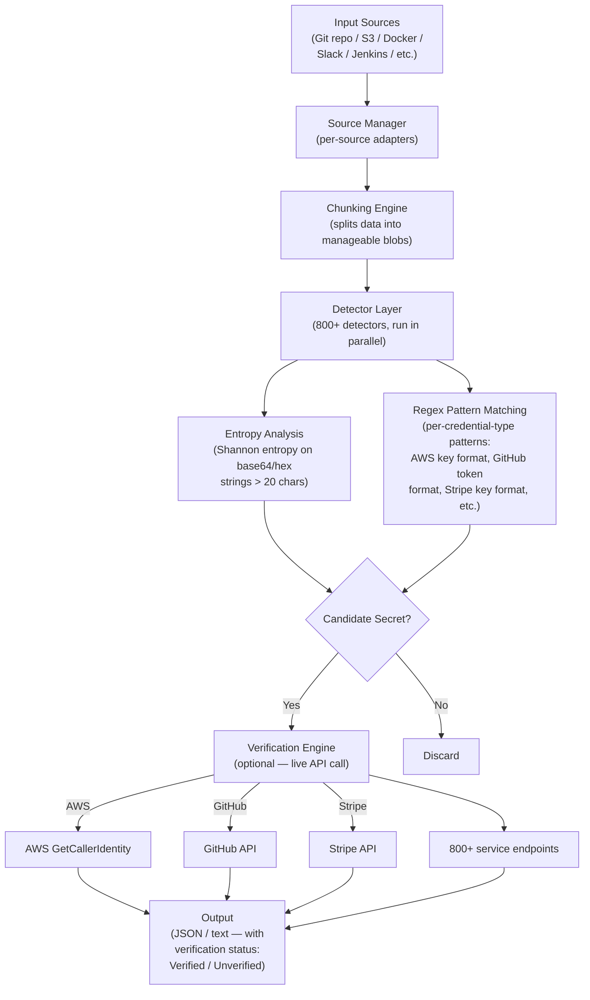

# Competitor Teardown: TruffleHog

> **Document type:** Research & analysis only. Neutral assessment.  
> **Compiled:** June 2026  
> **Sources:** TruffleHog GitHub repository, official documentation, Truffle Security website, published reviews, DevSecOps community posts

---

## Table of Contents

1. [Overview](#1-overview)
2. [Architecture](#2-architecture)
3. [Strengths](#3-strengths)
4. [Weaknesses](#4-weaknesses)
5. [AI-Generated Code Handling](#5-ai-generated-code-handling)
6. [Privacy & Data Handling](#6-privacy--data-handling)
7. [Pricing](#7-pricing)
8. [GitHub / Adoption Stats](#8-github--adoption-stats)
9. [ZeroTrust.sh Positioning vs. TruffleHog](#9-zerotrustedsh-positioning-vs-trufflehog)

---

## 1. Overview

TruffleHog is an open-source secret scanner developed and maintained by Truffle Security Co. Its core differentiator over other secret scanners (Gitleaks, detect-secrets) is *live credential verification*: after detecting a candidate secret using entropy analysis and regex patterns, TruffleHog makes API calls to the relevant service (AWS, GitHub, Slack, Stripe, etc.) to confirm whether the credential is still active. This eliminates a large class of false positives from secrets that have already been rotated or invalidated.

TruffleHog supports scanning Git repositories (including full history), S3 buckets, Docker images, Jenkins builds, Slack workspaces, Postman collections, CircleCI, Travis CI, and more. It is written in Go, distributed as a single binary, and runs fully locally.

TruffleHog is *not* a SAST vulnerability scanner. It does not analyze code for security flaws like SQL injection, XSS, or hardcoded logic vulnerabilities. Its scope is exclusively credential and secret detection.

---

## 2. Architecture

**Core mechanics:**
1. **Chunking:** Input data (commit diffs, file contents, log entries) is split into chunks for parallel processing
2. **Detection — two-phase:**
   - Phase 1: Shannon entropy analysis flags high-entropy strings (base64 or hex character sets, >20 characters)
   - Phase 2: Per-credential-type regex patterns match known credential formats (AWS keys, GitHub tokens, Stripe keys, etc.)
3. **Verification:** Detected candidates are optionally verified by making API calls to the actual service. Verified secrets are flagged as still-active; unverified secrets are reported separately.
4. **Concurrency:** Default 20 concurrent workers for scan throughput
5. **Custom detectors:** Users can define custom detectors with entropy thresholds, regex patterns, and excluded word lists

(Sources: [TruffleHog GitHub README](https://github.com/trufflesecurity/trufflehog), [TruffleHog custom detectors](https://docs.trufflesecurity.com/custom-detectors), [TruffleHog deep dive](https://devsecopsschool.com/blog/a-comprehensive-guide-to-trufflehog-in-devsecops/))

---

## 3. Strengths

**S1: Live verification eliminates false positive noise**  
This is TruffleHog's primary innovation. Most secret scanners produce hundreds of false positives (test credentials, example values, rotated keys). TruffleHog's verification layer reduces actionable alerts to only currently-live secrets. This makes findings immediately actionable without manual triage.

**S2: Git history scanning**  
TruffleHog scans the *full commit history*, not just the current codebase state. Credentials that were committed and then deleted from HEAD still exist in git history and are discoverable. This is critical for supply chain security assessments and leak detection.

**S3: Breadth of input sources**  
Beyond Git repositories, TruffleHog scans Slack workspaces, S3 buckets, Google Cloud Storage, Docker images, Jenkins, Elasticsearch, Postman collections, CircleCI, Travis CI, and more. No other open-source secret scanner matches this source breadth.

**S4: Single binary, fully local**  
Written in Go; distributed as a single static binary with no runtime dependencies. Runs offline; no API key or account required for core scanning functionality (verification requires outbound network access to the target service's API, but this is optional).

**S5: 800+ detector types**  
TruffleHog ships with 800+ pre-built detectors covering the major cloud providers, SaaS platforms, payment processors, and developer tools. This covers the overwhelming majority of credentials that would be encountered in a typical codebase.

**S6: Strong community and industry validation**  
25,700+ GitHub stars, 250,000+ daily scans. Widely used by security teams, included in DevSecOps platform integrations (Jit, Wiz, etc.).

(Source: [GitHub TruffleHog](https://github.com/trufflesecurity/trufflehog), [Help Net Security review](https://www.helpnetsecurity.com/2024/02/21/trufflehog-open-source-solution-for-scanning-secrets/))

---

## 4. Weaknesses

**W1: Scope limited to secrets — not a SAST tool**  
TruffleHog does not detect code vulnerabilities. SQL injection, XSS, command injection, insecure deserialization, path traversal — none of these are in its scope. Teams need TruffleHog *and* a SAST tool (Semgrep, Bandit, etc.) for comprehensive local security coverage.

**W2: Verification requires outbound network access**  
The key differentiating feature (live verification) requires the scanner to make API calls to external services. In air-gapped environments, verification is unavailable and the tool falls back to unverified detections (with higher false positive rates).

**W3: No semantic analysis**  
TruffleHog uses entropy and regex — it has no understanding of code context. This means it cannot distinguish between a hardcoded credential in production code vs. the same credential in a test fixture or documentation example (beyond using excluded word lists in custom detectors).

**W4: AGPL-3.0 license creates enterprise concerns**  
The AGPL-3.0 license requires that organizations distributing modified versions make their changes open source. For enterprises that want to build proprietary tooling on top of TruffleHog, this can create legal friction. (Truffle Security offers a commercial license separately.)

**W5: Scan performance on very large histories**  
Users scanning repositories with many years of history and thousands of commits report long scan times. Default settings scan all history; tuning is required for CI/CD speed requirements.

---

## 5. AI-Generated Code Handling

TruffleHog's scope makes AI-generated code handling a narrow question:

**What TruffleHog does (relevant to AI-generated code):**
- Detects hardcoded credentials in AI-generated code, just as it does in human-written code
- AI coding agents are known to sometimes hardcode API keys, tokens, and passwords as placeholder values — TruffleHog would detect these
- The slopsquatting threat is specifically about *package names*, not credentials — outside TruffleHog's scope
- Prompt injection embedded in code comments is outside TruffleHog's scope

**What TruffleHog does not do:**
- No detection of hallucinated package names
- No code vulnerability detection
- No prompt injection detection
- No safety gate bypass detection

**Assessment:** TruffleHog is complementary to ZeroTrust.sh rather than directly competitive in AI-generated code security. TruffleHog covers credential leakage; ZeroTrust.sh proposes to cover vulnerability patterns, package hallucination, and prompt injection. The two tools target different threat categories.

One real-world risk where TruffleHog is relevant: AI coding agents (especially in autonomous/vibe-coding mode) may generate code that includes example API keys or credentials from the model's training data. TruffleHog would detect these; ZeroTrust.sh would not (different scope).

---

## 6. Privacy & Data Handling

**Core scanning engine:**
- Fully local execution; no data transmitted externally during pattern matching or entropy analysis
- No account required; no API key for scanning

**Verification feature (optional):**
- When verification is enabled, TruffleHog makes API calls to external services (AWS, GitHub, Stripe, etc.) to test if discovered credentials are valid
- This means the *credential itself* (not the full source code) is transmitted to the target service's API endpoint
- Verification can be disabled: `--no-verification` flag
- Users should consider whether live verification against third-party APIs is appropriate for their environment

**No data retention:** TruffleHog does not send scan results, code, or findings to Truffle Security's servers. All processing is local. The only external communication is credential verification calls, and only when verification is enabled.

(Source: [TruffleHog GitHub README](https://github.com/trufflesecurity/trufflehog))

---

## 7. Pricing

| Tier | Price | Notes |
|------|-------|-------|
| TruffleHog OSS | Free | AGPL-3.0; full scanning capability |
| TruffleHog Enterprise | Commercial (pricing not publicly disclosed) | Offered by Truffle Security; includes support, compliance features, enterprise deployment |
| Truffle Security Platform | Commercial (pricing not publicly disclosed) | Managed service built on TruffleHog; web UI, team features |

The open-source version has no feature limitations vs. the enterprise version for scanning capability; enterprise adds support, compliance tooling, and managed infrastructure.

(Source: [TruffleHog GitHub](https://github.com/trufflesecurity/trufflehog), [Truffle Security website](https://trufflesecurity.com/))

---

## 8. GitHub / Adoption Stats

| Metric | Value | Source |
|--------|-------|--------|
| GitHub stars | ~25,700 | github.com/trufflesecurity/trufflehog, June 2026 |
| License | AGPL-3.0 | GitHub repository |
| Daily scans | 250,000+ | Truffle Security marketing |
| Credential detector types | 800+ | GitHub README |
| Language (implementation) | Go | GitHub repository |
| Supported input sources | 15+ (Git, S3, GCS, Docker, Jenkins, Slack, Postman, CircleCI, Travis CI, etc.) | Documentation |
| GitHub Actions marketplace | Available as action | GitHub Marketplace |
| Company backing | Truffle Security Co. | Commercial backer |

---

## 9. ZeroTrust.sh Positioning vs. TruffleHog

**Overlap:**
- Both are local CLI tools with no code egress
- Both target security scanning in the developer workflow
- Both are designed for pre-commit hook or CI/CD pipeline use
- Both aim for single-binary distribution and zero-friction local execution

**Distinct coverage:**

| Threat Vector | TruffleHog | ZeroTrust.sh (proposed) |
|--------------|------------|------------------------|
| Hardcoded credentials / secrets | ✅ (primary feature, 800+ detectors, live verification) | ❌ (out of scope — TruffleHog recommended) |
| Code vulnerability patterns (SAST) | ❌ | ✅ (design goal) |
| Package hallucination / slopsquatting | ❌ | ✅ (design goal) |
| Prompt injection in code comments | ❌ | ✅ (design goal) |
| Safety gate bypass | ❌ | ✅ (design goal) |
| Semantic LLM verification | ❌ | ✅ (local GGUF, design goal) |

**Strategic observation (neutral):** TruffleHog and ZeroTrust.sh are largely complementary, not directly competitive. A comprehensive local security posture for a developer running AI coding tools would likely use both: TruffleHog for credential detection and ZeroTrust.sh for vulnerability and AI-specific threat detection. The key overlap is in the local CLI / privacy-first positioning and target user segment, but the threat categories are distinct.

Where they compete for developer attention: both tools require configuration in pre-commit hooks or CI/CD pipelines. Developers have limited tolerance for tool proliferation; there is a realistic question of whether a developer will run two local security tools or choose one. ZeroTrust.sh would benefit from making its credential-scanning gap explicit and recommending TruffleHog as a companion, rather than attempting to replicate that functionality.

---

*End of document.*
