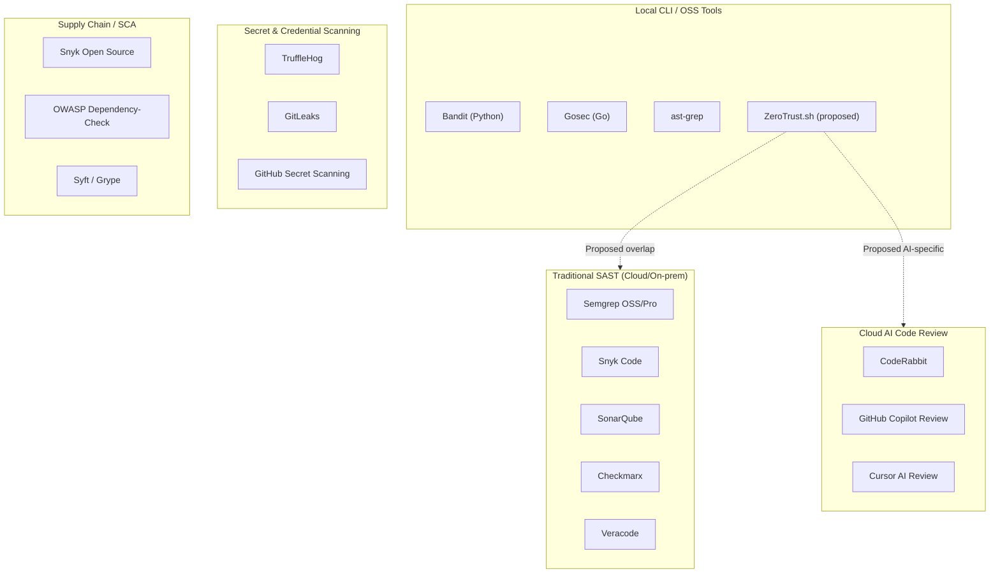

# Market Analysis & Go-To-Market Research — ZeroTrust.sh

> **Document type:** Research & analysis only. This document presents evidence and frameworks neutrally; it does not make product or go-to-market decisions.
> **Compiled:** June 2026
> **Status:** Living document — sources should be re-verified before major decisions.

---

## Table of Contents

1. [Market Context: The AI Coding Agent Adoption Curve](#1-market-context-the-ai-coding-agent-adoption-curve)
2. [The Security Problem: Evidence Base](#2-the-security-problem-evidence-base)
3. [Competitive Market Map](#3-competitive-market-map)
4. [Competitive Gaps Analysis](#4-competitive-gaps-analysis)
5. [SWOT Analysis](#5-swot-analysis)
6. [Strategic Go-To-Market Options](#6-strategic-go-to-market-options)
7. [Regulatory Tailwinds](#7-regulatory-tailwinds)

---

## 1. Market Context: The AI Coding Agent Adoption Curve

### 1.1 GitHub Copilot

GitHub Copilot is the market-leading AI coding assistant by user count. Key publicly disclosed figures:

| Metric                                            | Value                           | Source                                 | Date         |
| ------------------------------------------------- | ------------------------------- | -------------------------------------- | ------------ |
| All-time users                                    | 20 million+                     | Satya Nadella, Microsoft earnings call | July 2025    |
| Paid subscribers                                  | ~4.7 million                    | Microsoft FY26 Q2 earnings call        | January 2026 |
| Paid subscription YoY growth                      | ~75%                            | Microsoft FY26 Q2 earnings call        | January 2026 |
| Fortune 100 adoption                              | 90%                             | GitHub / Microsoft                     | 2025         |
| New developers to Copilot (per week, approximate) | 5 million new users in 3 months | Microsoft earnings disclosure          | Q2 FY26      |
| Copilot share of developer code output            | ~46% of code for active users   | GitHub internal data / Octoverse       | 2025         |

Microsoft does not publicly disclose monthly active users (MAU) or daily active users (DAU) for Copilot, meaning the gap between "all-time users" and regular active users is unknown.

(Source: [TechCrunch — GitHub Copilot crosses 20M all-time users](https://techcrunch.com/2025/07/30/github-copilot-crosses-20-million-all-time-users/))

### 1.2 Cursor (Anysphere)

Cursor has become the fastest-growing developer tool by ARR in recorded history:

| Metric                      | Value                                        | Source                      | Date       |
| --------------------------- | -------------------------------------------- | --------------------------- | ---------- |
| Monthly active users (MAU)  | 7 million+                                   | Anysphere public disclosure | 2026       |
| Daily active users (DAU)    | 1 million+                                   | Anysphere public disclosure | 2025       |
| Paying teams                | 50,000+                                      | Anysphere                   | 2026       |
| ARR                         | \$2B+ (Sacra estimates $3B as of April 2026) | TechCrunch / Sacra          | March 2026 |
| Valuation                   | $29.3 billion                                | Funding round data          | 2026       |
| Fortune 1000 representation | ~70% of companies                            | Anysphere                   | 2026       |
| Revenue from enterprise     | ~60% of ARR                                  | Anysphere                   | 2026       |

Growth trajectory: Cursor grew from \$1M ARR in late 2023 to \$1B ARR by November 2025 and \$2B+ by March 2026 — reportedly the fastest SaaS company ever from \$1M to \$500M ARR.

(Source: [TechCrunch — Cursor surpasses $2B ARR](https://techcrunch.com/2026/03/02/cursor-has-reportedly-surpassed-2b-in-annualized-revenue/))

### 1.3 Analyst and Survey Data on AI Coding Tool Adoption

**Stack Overflow Developer Survey 2025** (annual survey, ~65,000+ respondents):

- 84% of developers use or plan to use AI tools in development (up from 76% in 2024)
- 51% of professional developers use AI tools daily
- Trust in AI-generated code accuracy: only 33% of developers, down from 43% in 2024
- Positive sentiment for AI tools: 60% in 2025 vs. 70%+ in 2023–2024

(Source: [Stack Overflow Developer Survey 2025](https://survey.stackoverflow.co/2025/ai/))

**JetBrains State of Developer Ecosystem 2025** (24,534 respondents, 194 countries):

- 85% of developers regularly use AI tools for coding
- 62% rely on at least one AI coding assistant, agent, or code editor
- Only 44% report AI is fully or partially integrated into their workflows (integration lag vs. usage)
- By January 2026: 90% of developers regularly used at least one AI tool at work

(Source: [JetBrains State of Developer Ecosystem 2025](https://devecosystem-2025.jetbrains.com/artificial-intelligence))

**GitHub Octoverse 2025**:

- 180 million+ total developers on GitHub
- 36 million new developers joined GitHub in 2025
- 80% of new developers use Copilot within their first week
- 1.1 million+ public repositories now import an LLM SDK (+178% YoY)
- 50% of open-source projects have at least one maintainer using GitHub Copilot
- GitHub processed nearly 1 billion commits in 2025 (+25.1% YoY)

(Source: [GitHub Octoverse 2025](https://octoverse.github.com/))

### 1.4 Volume of AI-Generated Code

Published data points on the share of code that is AI-generated:

| Claim                                                          | Source                               | Notes                                                              |
| -------------------------------------------------------------- | ------------------------------------ | ------------------------------------------------------------------ |
| 41% of new code on GitHub is AI-generated                      | GitHub / industry reports            | Widely cited; methodology not fully disclosed                      |
| 5% of GitHub commits are AI-authored                           | X/@yq_acc analysis of 932K agent PRs | Distinct from "AI-generated code" — measures committed attribution |
| GitHub Copilot generates ~46% of code for active Copilot users | GitHub                               | Per-user average                                                   |
| Java developers: 61% of code AI-generated (Copilot users)      | GitHub                               | Language-specific breakdown                                        |
| AI-generated PRs: ~17 million/month on GitHub                  | GitHub infrastructure data           | March 2026 (vs. 4M/month in September 2025)                        |
| Commits on GitHub up 14× YoY                                   | Daring Fireball / GitHub data        | 2026 projection                                                    |
| Claude Code: 4.5% of all public commits on GitHub              | GitHub data                          | June 2026 — 25× increase from late 2025                            |

(Source: [GitHub commit growth analysis](https://daringfireball.net/linked/2026/05/04/commits-on-github-are-up-14x-year-over-year))

### 1.5 "Vibe Coding" Adoption

"Vibe coding" — the practice of accepting AI agent diffs with minimal manual review — has grown significantly:

- 72% of developers use AI-powered coding tools daily (estimate, multiple surveys aggregated)
- 78% of Fortune 500 companies have AI-assisted development in production (up from 42% in 2024)
- GitHub AI-generated PR volume grew 4× in 6 months (September 2025 to March 2026)

(Source: [Vibe Coding Statistics 2026, Hostinger](https://www.hostinger.com/blog/vibe-coding-statistics))

---

## 2. The Security Problem: Evidence Base

### 2.1 Academic Research on AI-Generated Code Vulnerability Rates

**NYU Study — "Asleep at the Keyboard?" (2022)**

- Institution: New York University
- Finding: ~40% of GitHub Copilot-generated programs contained potentially exploitable vulnerabilities across 89 security-relevant scenarios
- Common vulnerability classes: CWE-79 (XSS), CWE-89 (SQL injection), CWE-798 (hardcoded credentials), CWE-22 (path traversal)
- Citation: Pearce et al., "Asleep at the Keyboard? Assessing the Security of GitHub Copilot's Code Contributions," arXiv:2108.09293

**Stanford Study — "Do Users Write More Insecure Code with AI Assistants?" (2022)**

- Institution: Stanford University
- Authors: Neil Perry, Megha Srivastava, Deepak Kumar, Dan Boneh
- Finding: Participants with AI assistant access produced more security vulnerabilities than those without; they were also more likely to *believe* their code was secure (false confidence effect)
- This study quantified the "trust gap" risk: AI coding tools may cause developers to lower their security review standards

**Empirical Study on Copilot Code in GitHub Projects (2023)**

- arXiv: 2310.02059 (published in ACM Transactions on Software Engineering and Methodology, 2024)
- Finding: 29.8% of 452 analyzed Copilot-generated code snippets contained security weaknesses
- Scope: real-world code in public GitHub repositories (not controlled lab environment)
- Citation: [arxiv.org/abs/2310.02059](https://arxiv.org/abs/2310.02059)

**Large-Scale GitHub Analysis (2025)**

- arXiv: 2510.26103
- Title: "Security Vulnerabilities in AI-Generated Code: A Large-Scale Analysis of Public GitHub Repositories"
- Real-world repository scan; extends prior work to more tools and languages

**Veracode Analysis (2025–2026)**

- Tested 100+ LLMs on security-sensitive coding tasks
- Finding: 45% of AI-generated code samples introduce OWASP Top 10 vulnerabilities
- Additional finding: public GitHub repositories contain 40–50% vulnerable code patterns that LLMs learn from during training

(Source: [Veracode blog on AI-generated code security risks](https://www.veracode.com/blog/ai-generated-code-security-risks/))

**Cloud Security Alliance Note (2026)**

- Finding: AI-generated code contains 2.74× more vulnerabilities than human-written code
- By June 2025: AI-generated code introduced over 10,000 new security findings monthly in tracked organizations — a 10× increase from December 2024

**Security Degradation in Iterative AI Code Generation (2025)**

- arXiv: 2506.11022
- Studies how security posture degrades as AI models iteratively refine code

**Aikido Security (2026)**

- AI-generated code is now the cause of **1 in 5 breaches** in tracked organizations
- 69% of organizations have already found AI-introduced vulnerabilities in production

(Source: AI Coding Security Vulnerability Statistics 2026, SQ Magazine)

**Real-World Breach Examples (2026)**

Concrete incidents confirming the threat model is no longer theoretical:

- **CVE-2025-48757 (Lovable)** — AI coding tool generated Supabase schemas without Row Level Security, exposing over 170 production applications. Directly caused by AI agent behavior, not human developer error.
- **Moltbook** — Leaked 1.5 million authentication tokens and 35,000 email addresses; API endpoints returned sensitive data without authorization checks. Classic missing-auth pattern introduced by AI agent.
- **The Tea App** — Exposed 72,000 user images and 1.1 million private messages through missing access controls. Same pattern class — logic vulnerability introduced by AI code generation.

These incidents represent the exact threat class ZeroTrust.sh Path B is designed to detect: authorization gaps and missing access controls that look like correct code locally.

(Source: [The Security Crisis in AI-Generated Code in 2026](https://blog.vibecoder.me/security-crisis-ai-generated-code-2026))

**Development Velocity vs. Security (Sonar, 2026)**

- Teams using AI coding assistants report **4× faster code generation** but **10× more security findings**
- Fewer than **half of developers review AI-generated code** before committing it

(Source: AI-Generated Code Vulnerabilities 2026, Paperclipped)

### 2.2 Specific Vulnerability Type Data

| Vulnerability Type                          | Statistic                   | Source                           |
| ------------------------------------------- | --------------------------- | -------------------------------- |
| XSS failure rate                            | 86% of AI-generated samples | Veracode                         |
| Log injection vulnerability                 | 88% of AI-generated samples | Veracode                         |
| Java security failure rate                  | 72%                         | Veracode                         |
| Overall OWASP Top 10 introduction rate      | 45%                         | Veracode                         |
| CVEs directly attributed to AI coding tools | 35 in March 2026 alone      | Georgia Tech Vibe Security Radar |

### 2.3 Slopsquatting / Package Hallucination

**Primary research (2024):**

- Researchers generated 2.23 million code samples using 16 popular code-generating models across Python and JavaScript
- Finding: 19.7% (440,445 samples) contained at least one hallucinated package name
- Commercial tools (e.g., GPT-4): ~5% hallucination rate
- Open-source models (CodeLlama, DeepSeek, WizardCoder, Mistral): significantly higher rates
- Hallucination types: pure fabrications (51%), conflations of two real package names (38%), typo variants (13%)
- Predictability: 43% of hallucinated package names reappeared on *every* re-run of the same prompt; 58% on more than one run — making them attackable via pre-seeding malicious packages

**Real-world validation:**

- In early 2024, researchers noticed AI models repeatedly hallucinating a Python package called `huggingface-cli`
- An empty package uploaded under that name to PyPI received 30,000+ authentic downloads in three months

- Term "slopsquatting" coined by Seth Larson, Security Developer-in-Residence at the Python Software Foundation

(Sources: [CSA Research Note on Slopsquatting](https://labs.cloudsecurityalliance.org/research/csa-research-note-slopsquatting-ai-supply-chain-20260419-csa/), [BleepingComputer](https://www.bleepingcomputer.com/news/security/ai-hallucinated-code-dependencies-become-new-supply-chain-risk/))

### 2.4 Indirect Prompt Injection via Code Comments

- OWASP ranked prompt injection as the **#1 AI security risk** in the 2025 OWASP Top 10 for LLMs
- The InjecAgent benchmark (Zhan et al., 2024): attack success rates in auto-execution mode ranged from 66.9% to 84.1%
- arXiv paper (2603.21642): examined whether AI-assisted development tools are immune to prompt injection through comments, README files, and documentation — finding they are not
- Real-world exploitation vectors include: CurXecute and MCPoison (Schulz et al., 2025) — attacks that exploit prompt injection in IDE/agent contexts to achieve remote code execution, credential theft, and shell access

(Sources: [OWASP Gen AI LLM01:2025](https://genai.owasp.org/llmrisk/llm01-prompt-injection/), [arXiv 2603.21642](https://arxiv.org/html/2603.21642))

### 2.5 Government and Regulatory Acknowledgment

- **NIST AI 600-1** (July 2024): "Artificial Intelligence Risk Management Framework: Generative AI Profile" — explicitly addresses risks of generative AI including code generation
- **NIST SSDF Update**: Updated Secure Software Development Framework to add recommendations for AI-generated code review: "review of all source code during AI development... whether human-written or AI-generated, to detect, evaluate, and address any identified and/or potential vulnerabilities"
- **CISA**: Has published guidance on software supply chain risks, though as of June 2026 no dedicated AI-generated code guidance has been issued

---

## 3. Competitive Market Map

### 3.1 Tool Clusters

The security tooling landscape for developers can be segmented into five clusters:

<!-- ZT -.->|"Proposed overlap"| Local_CLI -->

### 3.2 Tool Summary Table

| Tool                  | Category        | Local/Cloud                 | Open Source      | Primary Language |
| --------------------- | --------------- | --------------------------- | ---------------- | ---------------- |
| Semgrep OSS           | SAST            | Local CLI                   | Yes (LGPL-2.1)   | Multi-language   |
| Semgrep Pro           | SAST + SCA      | Cloud dashboard             | No               | Multi-language   |
| Snyk Code             | SAST            | Cloud (local engine option) | No               | Multi-language   |
| SonarQube Community   | SAST            | Self-hosted                 | Yes (LGPL-3.0)   | Multi-language   |
| CodeRabbit            | AI Code Review  | Cloud only                  | No               | Multi-language   |
| GitHub Copilot Review | AI Code Review  | Cloud only                  | No               | Multi-language   |
| TruffleHog            | Secret Scanning | Local CLI                   | Yes (AGPL-3.0)   | N/A (scanning)   |
| Bandit                | SAST            | Local CLI                   | Yes (Apache-2.0) | Python only      |
| ast-grep              | SAST/Refactor   | Local CLI                   | Yes (MIT)        | Multi-language   |
| Gosec                 | SAST            | Local CLI                   | Yes (Apache-2.0) | Go only          |
| GitLeaks              | Secret Scanning | Local CLI                   | Yes (MIT)        | N/A (scanning)   |
| Checkmarx             | SAST            | Cloud/On-prem               | No               | Multi-language   |
| Veracode              | SAST/DAST       | Cloud                       | No               | Multi-language   |

---

## 4. Competitive Gaps Analysis

### Gap 1: No Local Tool with Semantic LLM Verification

- **Observation:** All tools offering LLM-powered semantic code review (CodeRabbit, Snyk Code's DeepCode AI engine, GitHub Copilot Review) are cloud-based services that require source code to be transmitted to external servers.
- **Observation:** All local/offline tools (Semgrep OSS, Bandit, TruffleHog, ast-grep, Gosec) use pattern matching, regex, or AST rules — none use an embedded LLM for semantic reasoning.
- **Evidence:** Semgrep's community documentation explicitly positions its pattern-matching approach as "unlike machine-learning based approaches"; the Pro tier adds interprocedural analysis but not LLM inference.
- **Evidence:** TruffleHog's semantic layer is limited to credential verification (live API calls to validate secrets) — it does not perform semantic code vulnerability analysis.

This creates a gap: developers requiring both (a) local execution for privacy reasons and (b) semantic/contextual analysis can find no existing tool that satisfies both constraints simultaneously.

### Gap 2: No Tool Specifically Designed for AI-Generated Threat Vectors

- **Observation:** No shipping tool in this market has published detection logic or rules specifically designed for:
  - Package hallucination (slopsquatting) — detecting packages that match known AI hallucination patterns
  - Indirect prompt injection embedded in code comments or strings
  - Safety gate bypass — detecting code that disables or weakens human-in-the-loop safeguards introduced by AI agents
- **Evidence:** Snyk has published a blog post on slopsquatting mitigation but its tooling addresses supply-chain risk through known vulnerability databases, not hallucinated package detection.
- **Evidence:** Semgrep's registry contains community-contributed rules for many vulnerability classes but has no published ruleset for AI-agent-specific threat vectors as of June 2026.
- **Evidence:** OWASP ranked prompt injection #1 in its LLM Top 10 (2025), yet no major SAST tool ships with prompt injection detection in code artifacts as a first-class feature.

### Gap 3: Automated Pentest Tools Operate Post-Deployment — Cannot Serve the Developer Workflow

As of June 2026, a category of automated pentest/security validation agents has emerged: Strix AI (open-source, November 2025), XBOW (Pentest On-Demand, $6,000+/engagement), PentestGPT (USENIX 2024 research tool), and RidgeGen/RidgeBot (enterprise, 88% DEFCON 2025 benchmark). These are powerful tools but occupy a **fundamentally different lane**:

- They all require a **running, deployed application** to test against
- They are designed for **security teams**, not individual developers
- Their cost and cadence ($6,000+ per engagement, periodic use) make them economically incompatible with developer-session-level scanning
- They detect traditional vulnerability classes in live systems — none specifically target AI-agent-introduced patterns in source code

**The gap:** No tool serves the developer's question *"What did the AI coding agent introduce into my source code right now?"* — asked before deployment, during coding, in a local terminal, with near-zero marginal cost per check. Automated pentest tools answer the question *"Is my deployed app exploitable?"* — asked after deployment, periodically, by a security team.

These two questions are complementary, not competing. ZeroTrust.sh answers the first. Pentest tools answer the second.

### Gap 4: PR-Gated Review Tools Are Too Slow for Real-Time Agent Loops

- **Observation:** The dominant AI code review workflow (CodeRabbit, GitHub Copilot Review) is gated on pull requests — meaning security analysis happens *after* code is written and staged, not during the agent's generation loop.
- **Evidence:** CodeRabbit reports first review comments arrive "within minutes of PR opening." For AI agent loops running at high speed (e.g., Cursor background agents, Cline autonomous mode), this multi-minute latency is architecturally incompatible with real-time feedback.
- **Comparison:** A local CLI tool run as a pre-commit hook or inline after each agent commit can provide feedback in seconds, within the same terminal session.
- **Implication (neutral):** This is not a criticism of PR-gated tools; they serve a different workflow. The gap is that there is no equivalent *fast, local* tool for the agentic coding loop.

### Gap 5: Cloud Tools Require Source Code Egress

Documentation review of cloud tools' data handling policies:

| Tool                    | Source Code Egress                 | Retention Policy                                | Self-Hosted Option                                             |
| ----------------------- | ---------------------------------- | ----------------------------------------------- | -------------------------------------------------------------- |
| Snyk Code               | Yes — code uploaded for analysis   | Temporary; not used for training                | Yes (Snyk Code Local Engine — additional cost, slower updates) |
| CodeRabbit              | Yes — repository cloned per review | Not retained after review; ephemeral containers | No self-hosted option                                          |
| GitHub Copilot Review   | Yes — PR context sent to cloud     | Per Microsoft privacy policy                    | No                                                             |
| Semgrep Pro (dashboard) | Findings + metadata sent to cloud  | Configurable                                    | Yes (Semgrep Network Broker)                                   |
| Semgrep OSS             | No egress                          | N/A                                             | N/A (local only)                                               |
| TruffleHog              | No egress                          | N/A                                             | N/A (local only)                                               |
| Bandit                  | No egress                          | N/A                                             | N/A (local only)                                               |

(Sources: [Snyk data handling docs](https://docs.snyk.io/snyk-data-and-governance/how-snyk-handles-your-data), [CodeRabbit privacy policy](https://www.coderabbit.ai/privacy-policy))

For organizations in financial services, healthcare, defense, or subject to GDPR/EU data residency rules, the mandatory code egress of cloud tools creates a compliance barrier. This segment has no fully capable solution today.

---

## 5. SWOT Analysis

> Each point is evidence-anchored. Speculative points are marked as (estimate).

### Strengths

| Strength                                                                                | Evidence Anchor                                                                                                                        |
| --------------------------------------------------------------------------------------- | -------------------------------------------------------------------------------------------------------------------------------------- |
| **S1: Addresses a documented and growing security problem**                             | Veracode: 45% of AI-generated code has OWASP Top 10 vulnerabilities; CSA: 2.74× more vulnerabilities than human code                   |
| **S2: Local-only execution satisfies enterprise data sovereignty requirements**         | Financial services, healthcare, and EU-regulated sectors increasingly require on-premise tools; HIPAA, GDPR, FINRA compliance pressure |
| **S3: No direct competitor exists in the "local + LLM + AI-specific threats" quadrant** | Gap analysis above; no existing tool combines all three properties                                                                     |
| **S4: Timing aligns with vibe coding adoption surge**                                   | AI-generated PRs grew 4× in 6 months (Sep 2025 – Mar 2026); 41% of new code is AI-generated                                            |
| **S5: Single binary distribution lowers adoption friction**                             | Comparable tools (TruffleHog, Bandit) achieve wide adoption via similar distribution; TruffleHog has 25.7K+ stars                      |

### Weaknesses

| Weakness                                                             | Evidence Anchor                                                                                                        |
| -------------------------------------------------------------------- | ---------------------------------------------------------------------------------------------------------------------- |
| **W1: Local LLM inference requires capable hardware**                | Quantized 7B parameter models require 4–8 GB VRAM or equivalent RAM; not feasible on all developer machines (estimate) |
| **W2: False-positive rate of local LLMs is unvalidated**             | No published benchmarks for local GGUF models on security-specific SAST tasks as of June 2026 (gap in evidence)        |
| **W3: AI-specific rule library must be built from scratch**          | No existing open dataset of AI-generated code vulnerability patterns suitable for rule extraction                      |
| **W4: No brand recognition; entering a crowded market**              | Semgrep (14,300+ GitHub stars), TruffleHog (25,700+ stars), Snyk ($407.8M ARR) already have established communities    |
| **W5: LLM verification step adds latency vs. pure rule-based tools** | Pure AST tools (Semgrep, Bandit) run in seconds on large codebases; LLM inference adds variable overhead               |

### Opportunities

| Opportunity                                                                        | Evidence Anchor                                                                                             |
| ---------------------------------------------------------------------------------- | ----------------------------------------------------------------------------------------------------------- |
| **O1: AI coding agent market growing at compound rate**                            | Cursor: $1M to $2B ARR in ~24 months; GitHub Copilot: 75% YoY subscriber growth                             |
| **O2: EU AI Act and data sovereignty regulations create compliance market**        | EU AI Act enforcement from August 2026; GDPR; sector-specific data residency requirements                   |
| **O3: Trust in AI-generated code is declining — creating demand for verification** | Stack Overflow: trust in AI accuracy fell from 43% (2024) to 33% (2025)                                     |
| **O4: Open-source community model (Semgrep precedent) can bootstrap rule library** | Semgrep's community registry grew to 2,800+ rules via crowdsourcing; proves viability                       |
| **O5: Enterprise AppSec budgets are growing**                                      | Application security testing market: $1.83B (2025) → $7.6B (2031) projected, CAGR 26.7% (MarketsandMarkets) |

### Threats

| Threat                                                                       | Evidence Anchor                                                                                             |
| ---------------------------------------------------------------------------- | ----------------------------------------------------------------------------------------------------------- |
| **T1: Established vendors (Snyk, Semgrep) can add AI-specific rules**        | Snyk has already published slopsquatting documentation; Semgrep has published framework for community rules |
| **T2: GitHub / Microsoft may add Copilot-native security scanning**          | Microsoft controls both the coding tool and CI/CD pipeline; integration advantage is significant            |
| **T3: CodeRabbit can add on-premise/local deployment as an enterprise tier** | CodeRabbit raised $60M Series B at $550M valuation; has resources to expand (hypothetical, not confirmed)   |
| **T4: Local LLM quality gap vs. cloud frontier models**                      | Local quantized models (7B/8B) lag behind GPT-4o/Claude Sonnet in code understanding benchmarks             |
| **T5: Developer security fatigue**                                           | Stack Overflow data: tool proliferation and alert fatigue are cited as barriers to security tool adoption   |

---

## 6. Strategic Go-To-Market Options

> Presented neutrally with trade-offs. No recommendation is made.

### Strategy A: Developer-First Open Source (Semgrep model)

**Description:** Release the full CLI engine as open source (permissive or copyleft license). Build adoption through GitHub, Hacker News, and developer communities. Monetize via an optional commercial cloud dashboard for team/enterprise features.

**Precedent:** Semgrep raised $193M+ in funding while maintaining a free open-source CLI. The community drove adoption through crowdsourced rules; the company monetized through the Pro/Enterprise platform. TruffleHog similarly built 25,700+ GitHub stars as a fully open-source tool before its acquisition by Truffle Security.

**Trade-offs:**

| Pros                                                    | Cons                                                                                              |
| ------------------------------------------------------- | ------------------------------------------------------------------------------------------------- |
| Fastest path to community adoption and feedback         | Revenue timeline is long; early product may fund-raise on traction, not cash                      |
| Community contributes rules, reducing internal R&D cost | Open-source competitors can fork and commoditize the engine                                       |
| Developer trust is high for privacy-first, local tools  | Enterprise sales cycle requires significant additional product work (dashboards, audit logs, SSO) |
| Low cost of distribution                                | Requires significant community management                                                         |

### Strategy B: Enterprise-First Commercial (Snyk model)

**Description:** Build and sell a commercial product directly to enterprise AppSec teams. Prioritize compliance reporting, audit trails, and on-premise deployment. Go to market through direct sales, AppSec conference presence (DEF CON, Black Hat, AppSec USA), and analyst relations.

**Precedent:** Snyk built to $300M ARR with a commercial-first model targeting developer security budgets. Snyk Code's "local engine" option for data-sovereign customers shows there is a paid enterprise market for on-premise SAST.

**Trade-offs:**

| Pros                                                                 | Cons                                                                            |
| -------------------------------------------------------------------- | ------------------------------------------------------------------------------- |
| Higher revenue per customer; faster path to meaningful ARR           | Requires sales team and long enterprise procurement cycles                      |
| Enterprise AppSec budgets are large ($1.83B market in 2025)          | Product must be enterprise-ready from day one (SSO, RBAC, audit logs, SLAs)     |
| Data sovereignty compliance is a differentiator in regulated sectors | Low developer community visibility; viral adoption is harder                    |
| Snyk's $407.8M ARR validates the market size                         | Competing against Snyk on enterprise features is difficult without a large team |

### Strategy C: Open-Core (open-source CLI + commercial compliance dashboard)

**Description:** Release the scanning CLI and base rule engine as open source. Provide a paid commercial layer that adds: centralized finding management, compliance reporting (SOC 2, PCI DSS evidence generation), team dashboards, enterprise support, and SaaS/on-premise deployment options.

**Precedent:** HashiCorp (Vault OSS + Enterprise), Elastic (open core), and Semgrep itself use this model. The open-source layer drives adoption; the commercial layer converts teams and enterprises.

**Trade-offs:**

| Pros                                                                                                   | Cons                                                                                              |
| ------------------------------------------------------------------------------------------------------ | ------------------------------------------------------------------------------------------------- |
| Combines community trust of open source with commercial monetization                                   | "Open core" tension: community may resist if commercial features are perceived as too restrictive |
| Developer adoption drives inbound enterprise leads                                                     | Requires building and maintaining two product surfaces                                            |
| Can serve both Persona 1 (free CLI) and Persona 3 (enterprise compliance) simultaneously               | License management complexity (choosing between copyleft, permissive, SSPL, etc.)                 |
| Aligns with regulatory tailwinds (compliance dashboard addresses EU AI Act documentation requirements) | Management overhead for open-source community                                                     |

---

## 7. Regulatory Tailwinds

### 7.1 EU AI Act

- Status: Enforcement of main high-risk AI compliance framework begins **August 2, 2026**
- The Act's Annex III regulates specific high-risk AI use cases; ordinary AI coding assistants generating general-purpose code do not typically fall under high-risk classification
- **However:** Article 50 transparency requirements for AI-generated content take effect August 2, 2026; documentation, traceability, and human oversight obligations apply across a broad range of AI systems
- The GPAI Code of Practice (published July 10, 2025) makes privacy-preserving data logging, watermarking, and provenance tracking monitoring obligations for signatories
- **Implication for ZeroTrust.sh:** A compliance reporting layer (showing audit trails of AI-generated code that was reviewed, flagged, and remediated) could align with EU AI Act documentation requirements — though this mapping is not yet validated by legal analysis

(Sources: [EU AI Act enforcement timeline](https://digital-strategy.ec.europa.eu/en/policies/regulatory-framework-ai), [Augment Code EU AI Act guide](https://www.augmentcode.com/guides/eu-ai-act-2026))

### 7.2 NIST AI RMF and Secure Software Development Framework (SSDF)

- NIST AI 600-1 (Generative AI Profile, July 2024): A structured risk management framework specifically for generative AI, covering risks including AI-generated code
- NIST SSDF update: Added recommendations specifically requiring that "all source code during AI development... whether human-written or AI-generated" be reviewed for vulnerabilities
- NIST released "Dioptra" software testbed for AI security testing, indicating governmental interest in tooling for AI-generated artifact verification
- These frameworks are **voluntary** in the United States but are used as compliance benchmarks by federal contractors (FedRAMP alignment) and enterprise procurement processes

(Source: [NIST AI RMF](https://www.nist.gov/itl/ai-risk-management-framework), [NIST AI 600-1](https://nvlpubs.nist.gov/nistpubs/ai/NIST.AI.600-1.pdf))

### 7.3 Data Sovereignty Regulations Creating On-Premise Demand

The following regulations create explicit demand for security tools that do not require source code to leave organizational infrastructure:

| Regulation              | Geography     | Relevance                                                                                                                     |
| ----------------------- | ------------- | ----------------------------------------------------------------------------------------------------------------------------- |
| GDPR                    | EU            | Source code from EU-based developers processed by non-EU cloud SAST may constitute data transfer requiring adequacy decisions |
| EU AI Act               | EU            | Documentation and audit requirements encourage traceable, local tooling                                                       |
| India DPDP Act          | India         | Stricter cloud vendor audits; local processing preference                                                                     |
| China Data Security Law | China         | Expands cross-border data restrictions; foreign cloud tools for sensitive code face barriers                                  |
| HIPAA                   | United States | Patient-adjacent code processed by cloud tools requires BAA; not all SAST vendors offer this                                  |
| FINRA                   | United States | Financial services code subject to data handling regulations                                                                  |
| DoD CMMC                | United States | Defense contractor code may not be processed by non-FedRAMP-authorized tools                                                  |

---

*End of document. All statistics should be re-verified at time of decision-making, as figures are subject to change.*
