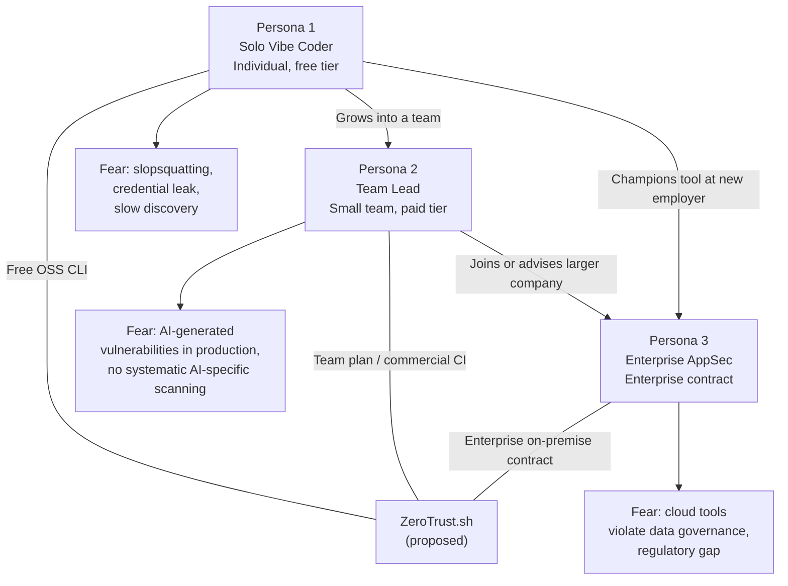

# User Personas & Ideal Customer Profile (ICP) Analysis — ZeroTrust.sh

> **Document type:** Research & analysis only. No product decisions are made here.  
> **Compiled:** June 2026  
> **Important methodology note:** These personas are *synthesized from publicly available research data*, not from primary user interviews conducted for this product. Primary user interviews have not yet been conducted. This document should be treated as a hypothesis document to be validated, not as validated user research.

---

## Table of Contents

1. [Methodology](#1-methodology)
2. [Persona 1 — "The Solo Vibe Coder"](#2-persona-1--the-solo-vibe-coder)
3. [Persona 2 — "The Security-Conscious Team Lead"](#3-persona-2--the-security-conscious-team-lead)
4. [Persona 3 — "The Enterprise Security Engineer"](#4-persona-3--the-enterprise-security-engineer)
5. [Primary ICP Analysis](#5-primary-icp-analysis)
6. [Persona Relationship Diagram](#6-persona-relationship-diagram)

---

## 1. Methodology

Personas are synthesized from the following publicly available data sources:

- **Stack Overflow Developer Survey 2025** — 65,000+ respondents; AI tool usage, trust levels, security practices
- **JetBrains State of Developer Ecosystem 2025** — 24,534 respondents, 194 countries; AI adoption, workflow integration
- **GitHub Octoverse 2025** — 180M+ developer population, AI-generated code metrics
- **CSA Slopsquatting Research Note (2026)** — AI-generated code supply chain risk
- **Vibe Coding Statistics 2026** (Hostinger, Second Talent) — AI agent adoption patterns
- **AppSec industry reports** — Gartner, MarketsandMarkets (application security market sizing)
- **Community discourse** — r/netsec, r/programming, DevSecOps Slack communities (qualitative signal only; not quantified)

**Limitations:** These personas have not been validated through primary interviews. Assumptions about pain points, willingness to pay, and adoption criteria are inferences from aggregate survey data, not confirmed with individuals. Primary user interview validation is recommended before major product decisions.

---

## 2. Persona 1 — "The Solo Vibe Coder"

### Profile Summary

A solo developer or freelancer who uses AI coding agents (Cursor, Cline, Claude Code, GitHub Copilot) as their primary development method. They work alone or in very small teams. They accept AI-generated diffs at high velocity, often without line-by-line review. They are generalists — capable developers, but not security specialists.

### Detailed Profile

| Attribute | Detail |
|-----------|--------|
| **Job title** | Indie developer, freelance software developer, solo founder, "vibe coder" |
| **Company size** | Solo / 1-5 person team; no dedicated security function |
| **Experience level** | 1–8 years development experience; broadly capable but not security-specialized |
| **Primary OS** | macOS (MacBook Pro or Air); some Linux; rare Windows |
| **Hardware constraint** | Consumer-grade: 16–32 GB RAM; M-series Apple Silicon or equivalent |
| **Development stack** | Python, JavaScript/TypeScript, occasionally Go or Rust; web apps, scripts, APIs |
| **AI tool usage** | Daily; Cursor or Claude Code as primary IDE; uses agent/autonomous mode regularly |
| **Security maturity** | Low — may run `npm audit` or `pip check` occasionally; does not have a formal security review process |
| **Security tooling** | Minimal; possibly `npm audit`, Dependabot alerts, GitHub default scanning |

### Pain Points

**Primary pain point:** Accepts AI agent diffs without review and occasionally gets burned — an AI-generated package that doesn't exist (slopsquatting), a hardcoded credential, or a vulnerability that passes through to production. They only learn about it retroactively (security advisory, API key leaked, etc.).

**Secondary pain point:** Doesn't have the security expertise to manually review every AI-generated diff for subtle vulnerabilities. Wants automated verification that is fast enough not to interrupt their flow.

**Illustrative context:** Stack Overflow 2025 survey data shows that trust in AI-generated code accuracy fell to 33% among all developers — but developers continue using AI tools at 84%+ rates. This gap between trust and usage is observable in the solo developer segment: they know AI generates imperfect code but don't have a better alternative that is fast enough.

### Current Workflow

1. Opens Cursor or Claude Code
2. Describes desired feature in natural language
3. Reviews generated diff visually (skimming, not line-by-line)
4. Accepts with `Tab` / "Accept All"
5. Runs tests (if they exist)
6. Ships

Security review: absent or ad hoc.

### Decision Criteria for New Security Tool

| Criterion | Weight (estimated) |
|-----------|------------------|
| Zero-friction install (single command / single binary) | Very high |
| Speed (must complete in <10 seconds for typical project) | Very high |
| Free or near-free cost | High |
| Doesn't block workflow (runs as background check, not gatekeeper) | High |
| Plain-language output (not cryptic SAST jargon) | High |
| Actionable findings (tells them what to fix, not just what's wrong) | Medium |
| False positive rate | Medium (they have low tolerance for noise) |

### How They Would Discover ZeroTrust.sh

- GitHub Trending page
- Hacker News "Show HN" post
- Twitter/X developer community (search for "AI code security", "vibe coding security")
- Reddit r/programming, r/cursor
- Referenced in AI coding tool documentation or community

### Estimated Population

- Stack Overflow 2025: ~84% of developers use AI tools (84% of ~65,000 survey respondents are not individually solo coders, but extrapolation suggests high AI tool usage across the solo developer segment)
- GitHub Octoverse 2025: 180M+ total developers on GitHub; meaningful subset work solo on side projects or freelance
- JetBrains 2025: 62% rely on at least one AI coding assistant as a primary tool
- *Rough estimate:* Given ~47 million total developers globally (SlashData 2025) and ~84% using AI tools, the population of AI-tool-using developers is approximately 39 million. Solo/indie developers are a subset estimated at 10–20% of the total developer population, suggesting a potential addressable count of 4–8 million developers fitting this rough profile. This is a very rough estimate and should not be used for financial projections without primary research.

### Willingness to Pay

- Free tool: immediate adoption candidate
- $1–5/month: possible if clearly valuable
- $10+/month: unlikely without team budget or demonstrated ROI
- Primary motivation is risk avoidance, not compliance — harder to build willingness-to-pay arguments without a concrete incident

---

## 3. Persona 2 — "The Security-Conscious Team Lead"

### Profile Summary

A tech lead, senior engineer, or engineering manager at a startup or growth-stage company (10–50 people on the engineering team). They are responsible for code quality and security posture. Their team uses AI agents heavily — they embrace this productivity gain — but they worry about what AI-generated code is actually getting merged. They have some security background and are already using lightweight tooling.

### Detailed Profile

| Attribute | Detail |
|-----------|--------|
| **Job title** | Tech Lead, Senior Software Engineer, Engineering Manager, Platform Engineer |
| **Company size** | 20–200 employees; 5–50 person engineering team |
| **Industry** | SaaS, fintech, healthtech, developer tools (security-aware verticals) |
| **Experience level** | 5–15 years; senior to staff level |
| **Security maturity** | Medium — runs Semgrep or Dependabot in CI, may have pen-tested, but no dedicated AppSec team |
| **Existing tools** | Pre-commit hooks, Semgrep OSS or Dependabot, GitHub Actions CI/CD, possibly Snyk at team tier |
| **AI tool usage** | Team uses Cursor, GitHub Copilot, or Claude Code daily; tech lead may personally review AI-generated PRs more carefully |
| **Pain** | Team moves fast with AI agents; tech lead cannot review every diff; needs automated AI-aware scanning that integrates with existing CI/CD |

### Pain Points

**Primary pain point:** Their team is merging AI-generated code faster than they can review it. Standard SAST tools (Semgrep, Dependabot) were not designed for AI-generated code threat vectors. They are aware of slopsquatting and prompt injection risks but have no tooling to detect them systematically.

**Secondary pain point:** High false-positive rates from existing SAST tools create alert fatigue. They need a tool with low noise that flags real, actionable issues — particularly the AI-specific categories they know are blind spots.

**Illustrative context:** JetBrains 2025 data shows that while 85% of developers use AI tools, only 44% have fully integrated AI into their workflow — suggesting that team leads are still grappling with how to fit AI-generated code into quality and security processes. Stack Overflow 2025 also found that only 33% of developers trust AI accuracy, down from 43% in 2024.

### Current Workflow

1. Engineers work with AI agents; create PRs
2. Tech lead or peer does code review (may or may not be security-focused)
3. Semgrep / Dependabot runs in CI/CD; findings reviewed in GitHub PR
4. No AI-specific security checks in pipeline

Gap: AI-specific threat vectors (slopsquatting, prompt injection, safety gate bypass) are not covered by any existing step.

### Decision Criteria for New Security Tool

| Criterion | Weight (estimated) |
|-----------|------------------|
| CI/CD integration (GitHub Actions, GitLab CI, pre-commit) | Very high |
| Low false positive rate (actionable output, not noise) | Very high |
| SARIF / JSON output (parseable, integratable with existing tooling) | High |
| AI-specific detection (slopsquatting, prompt injection) | High |
| Team-level configuration (custom rules, ignore files, severity thresholds) | High |
| Cost (per-seat, per-month) | Medium — has budget; cost-conscious but not cost-prohibitive |
| Patch suggestions | Medium |
| Single binary / simple self-service install | Medium |

### How They Would Discover ZeroTrust.sh

- Security-focused developer blog posts (The Hacker News, TLDR Security, AppSec Ezine)
- Semgrep community discussions (Slack, Discord)
- DevSecOps channels (OWASP community, DevSecOps Institute)
- Direct search for "AI generated code security scanner" or "slopsquatting detection tool"
- Conference talks at AppSec USA, DEF CON, OWASP Global AppSec

### Willingness to Pay

- Free/OSS: immediate trial and adoption if quality is good
- $5–15/dev/month: reasonable if integrated well and demonstrably reduces security risk
- Team plans ($50–200/month flat): preferred over per-seat pricing for budget predictability
- This persona has a budget, understands security tool ROI, and can make a departmental purchase decision without lengthy procurement

---

## 4. Persona 3 — "The Enterprise Security Engineer"

### Profile Summary

An Application Security (AppSec) Engineer, DevSecOps Engineer, or Security Architect at a company with 200+ employees in a regulated industry (financial services, healthcare, defense, or a company under EU GDPR data residency requirements). They have strict data governance requirements: source code cannot leave the corporate network. Cloud-based security tools are categorically blocked or require extensive legal review before approval.

### Detailed Profile

| Attribute | Detail |
|-----------|--------|
| **Job title** | AppSec Engineer, DevSecOps Engineer, Security Architect, CISO (at mid-size firms) |
| **Company size** | 200+ employees; dedicated security team |
| **Industry** | Financial services (FINRA, SOX, PCI DSS), healthcare (HIPAA), defense (CMMC, ITAR), or EU-regulated enterprise (GDPR Article 46) |
| **Experience level** | 8–20 years; security specialist with development background |
| **Security maturity** | High — runs multiple SAST tools, has threat modeling process, conducts regular pen tests |
| **Existing tools** | SonarQube (self-hosted), Checkmarx or Veracode, Snyk (may have Local Engine), internal SAST tooling |
| **AI tool usage** | Organization is adopting AI coding tools but under strict governance — Copilot for Business or Cursor Business tier with data controls enabled |
| **Pain** | Cloud SAST tools violate data governance; existing on-premise tools (SonarQube) were not designed for AI-specific threats; governance gap between AI adoption and AI-specific security tooling |

### Pain Points

**Primary pain point:** Their organization has adopted AI coding tools enterprise-wide (or is about to), but has no security tooling that (a) detects AI-specific vulnerabilities and (b) runs fully on-premise with zero source code egress. CodeRabbit, cloud-based Snyk, and SaaS SAST tools are blocked by policy. Existing on-premise tools (SonarQube Community, Semgrep OSS) have no AI-specific threat detection.

**Secondary pain point:** Documentation and compliance reporting requirements. EU AI Act (effective August 2026), NIST AI RMF alignment, internal audit requirements for AI-generated code review. There is no tooling today that produces AI-specific security review artifacts suitable for compliance documentation.

**Illustrative context:** Data sovereignty regulations increasingly require on-premise processing for sensitive workloads. Financial and healthcare organizations are subject to data residency requirements that categorically prevent source code from being processed by external SaaS tools without explicit legal review. The EU AI Act's August 2026 enforcement creates new documentation obligations around AI-generated content.

### Current Workflow

1. Developers use AI coding tools under approved governance framework
2. Code goes through standard CI/CD pipeline with Semgrep OSS, SonarQube, Checkmarx
3. No AI-specific threat detection in any stage
4. Manual security review of high-risk AI-generated code (ad hoc, not systematic)

Gap: No systematic tooling for AI-specific threat vectors; compliance documentation for AI-generated code review is absent.

### Decision Criteria for New Security Tool

| Criterion | Weight (estimated) |
|-----------|------------------|
| Zero code egress (on-premise, fully local, no external API calls) | Critical / blocking |
| Enterprise deployment model (binary + container, not SaaS) | Critical |
| Compliance reporting output (audit trails, finding history, SARIF for SIEM) | Very high |
| SSO/SAML integration | High |
| AI-specific threat detection (slopsquatting, prompt injection) | High |
| Low false positive rate | High |
| Vendor support SLA | High |
| Multi-language support | High |
| Cost | Medium (large budget available; cost is secondary to compliance) |

### How They Would Discover ZeroTrust.sh

- AppSec conference talks (Black Hat, DEF CON, OWASP Global AppSec, RSA Conference)
- OWASP community projects and working groups
- CSA research publications (they already follow CSA slopsquatting research)
- Analyst reports (if ZeroTrust.sh achieves Gartner/Forrester visibility)
- AppSec vendor newsletters, CISA advisories
- Internal security team research (they actively search for tools addressing known gaps)

### Willingness to Pay

- Enterprise contracts: $50,000–$250,000/year for a proven tool with enterprise support
- This persona's organization has an AppSec tool budget, procurement process, and legal review capability
- Decisions take 3–12 months (procurement, legal review, security assessment, pilot)
- Requires: enterprise support contract, SLA, SOC 2 compliance of the tooling vendor, documented data handling

---

## 5. Primary ICP Analysis

> This section presents the trade-offs for each persona as an initial target market. No recommendation is made.

### Option A: Target Persona 1 (Solo Vibe Coder) First

**Arguments for:**
- Largest population by absolute count (~4–8M rough estimate of AI-tool-using solo developers)
- Fastest adoption cycle — can trial and adopt within minutes
- GitHub community can drive viral growth (Hacker News, GitHub Trending)
- Validates product quality signals quickly from many users
- Consistent with open-source community strategies (Semgrep, TruffleHog precedent)

**Arguments against:**
- Willingness to pay is very low (primarily free tier users)
- High churn if false positive rate is high or tool is slow
- Monetization path requires converting to a commercial tier (longer path to revenue)
- Security maturity is low — they may not know what AI-specific threat vectors to care about, reducing perceived value

**Key risk:** Building a product for a segment that won't pay creates adoption metrics without corresponding revenue.

### Option B: Target Persona 2 (Security-Conscious Team Lead) First

**Arguments for:**
- Meaningful willingness to pay ($5–15/dev/month or team plans)
- Already uses and understands security tooling (Semgrep, Dependabot) — lower education barrier
- Can evaluate and champion adoption within their team
- Product feedback quality is higher (they know what good security tools look like)
- Reachable through existing security tool communities (Semgrep Slack, DevSecOps channels)

**Arguments against:**
- Smaller population than Persona 1 (fewer team leads than solo developers)
- Decision involves more people (team lead + engineering manager + possibly finance)
- Expects CI/CD integration to work well from day one — higher product quality bar
- Will compare rigorously against Semgrep, which is free and has 14,300+ stars

**Key risk:** Product must be genuinely better than Semgrep OSS + TruffleHog for the specific AI-generated code use case; otherwise, the team lead uses Semgrep instead.

### Option C: Target Persona 3 (Enterprise Security Engineer) First

**Arguments for:**
- Highest potential revenue per customer ($50,000–$250,000/year)
- Unique position: no competing tool satisfies "local + LLM + AI-specific threats + enterprise compliance"
- Regulatory tailwinds (EU AI Act, data sovereignty) create urgency
- Long contract term creates predictable revenue

**Arguments against:**
- 3–12 month sales cycle; not suitable for an early-stage product without enterprise readiness
- Requires SOC 2 Type II, enterprise support, SLA — significant pre-revenue investment
- Small addressable market in early years (not many organizations with *all* of: AI tool adoption + data sovereignty requirement + AppSec budget + awareness of AI-specific threat vectors)
- Product must be extremely polished and reliable — enterprise users will not tolerate beta-quality tooling

**Key risk:** Enterprise sales cycle and compliance requirements may consume all early resources before product-market fit is validated.

### Summary Trade-off Matrix

| Factor | Persona 1 (Solo) | Persona 2 (Team Lead) | Persona 3 (Enterprise) |
|--------|-----------------|----------------------|----------------------|
| Population size | Very large | Medium | Small |
| Adoption speed | Very fast | Medium | Very slow (6–18 months) |
| Willingness to pay | Low | Medium | High |
| Feedback quality | Low-medium | High | Very high |
| Competitive intensity | Medium (vs. Semgrep free) | High (vs. Semgrep, Snyk) | Low (unique position) |
| Product maturity required | Low (basic CLI) | Medium (CI/CD integration) | Very high (enterprise features) |
| Revenue per customer | Near zero | $50–500/month | $50,000–$250,000/year |
| Time to first revenue | Fast (if monetizing) | Medium | Very slow |

---

## 6. Persona Relationship Diagram

---

*End of document. Primary user interviews are required to validate these hypotheses before product decisions are based on this analysis.*
