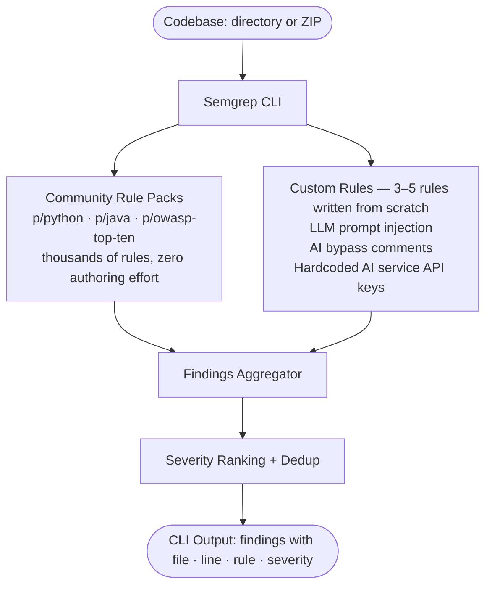

# Approach 1 — Custom Semgrep Rules on Existing Engine

> **Document status:** Proposal — for tech lead review. No recommendation implied.
> See `tech_stack_analysis.md` for detailed technology comparison.

---

## Table of Contents

1. [Overview](#1-overview)
2. [Architecture Deep Dive](#2-architecture-deep-dive)
   - 2.1 [Ingestion Layer](#21-ingestion-layer)
   - 2.2 [Language Detection](#22-language-detection)
   - 2.3 [Tree-sitter Parsing](#23-tree-sitter-parsing)
   - 2.4 [Rule Engine Design](#24-rule-engine-design)
   - 2.5 [Package Hallucination Detection (Slopsquatting)](#25-package-hallucination-detection-slopsquatting)
   - 2.6 [Safety Gate Bypass Detection](#26-safety-gate-bypass-detection)
   - 2.7 [Taint Analysis (Optional Extension)](#27-taint-analysis-optional-extension)
   - 2.8 [Report Generation](#28-report-generation)
3. [AI-Specific Threat Coverage Matrix](#3-ai-specific-threat-coverage-matrix)
4. [Implementation Plan](#4-implementation-plan)
5. [Performance Characteristics](#5-performance-characteristics)
6. [Failure Modes](#6-failure-modes)
7. [Trade-Off Analysis](#7-trade-off-analysis)

---

## 1. Overview

Approach 1 uses **Semgrep** as the scanning engine rather than building a custom one. Semgrep is a battle-tested, open-source static analysis tool that already handles parsing, language detection, AST traversal, and rule execution across dozens of languages. Building an equivalent engine from scratch would take months and produce no additional value for the PoC — the goal is to prove that AI-agent-specific vulnerability patterns are statically detectable, not to build a parser.

The implementation has two components that run together in a single `semgrep` invocation:

**Community rule packs** — referenced in the Semgrep config file, zero authoring effort. These cover thousands of established vulnerability classes (SQL injection, command injection, weak crypto, path traversal, insecure deserialization, hardcoded credentials, and more) across Python and Java automatically.

**Custom rules** — 3–5 YAML rules written from scratch targeting AI-coding-agent-specific behavioral patterns that have no community equivalent:
- *LLM prompt injection*: unsanitized user input piped into LLM SDK calls (OpenAI, Anthropic, LangChain)
- *AI bypass comments*: suppression annotations placed adjacent to security-sensitive code to silence warnings rather than fix the issue
- *Hardcoded AI service API keys*: credential prefixes specific to AI services (`sk-`, `sk-ant-`, `hf_`) that generic secret rules do not cover

Rules are deliberately biased toward **high recall over high precision** — broad patterns catch more AI-agent output variants at the cost of some false positives. This is intentional: Approach 2's LLM Verifier is specifically designed to filter that noise, restoring precision without sacrificing recall. A false positive in Approach 1 is a candidate handed to the LLM. A false negative is unrecoverable.



---

## 2. Architecture Deep Dive

> **Note:** This section documents Semgrep's internal architecture for reference — it is not what Approach 1 builds. Understanding how Semgrep works internally informs rule authoring decisions (how patterns compile, how the AST is traversed, why some patterns are slower than others). The custom engine described here represents the full Path A implementation target for Approach 2, when the Go core wrapping Tree-sitter will be built.

### 2.1 Ingestion Layer

The ingestion layer normalises the two supported input forms into a uniform virtual file system before any analysis begins.

**Directory input.** The layer performs a recursive directory walk, respecting a configurable ignore list (`.git`, `node_modules`, `vendor`, `__pycache__`, `.venv`, `dist`, `build`). For each file it records the absolute path and relative path from the root, the file size, and a content hash (Blake3 or SHA-256) for deduplication. Files larger than a configurable maximum (default: 10 MB) are skipped with a warning entry in the scan log; the threshold prevents memory pressure from generated or minified artefacts.

**ZIP input.** The layer streams the ZIP archive using the standard library's ZIP reader, extracting files into an ephemeral in-memory buffer or a temporary directory depending on total size. Zip-slip path traversal is mitigated by canonicalising extracted paths and rejecting any entry whose canonical path escapes the temporary root. Password-protected and encrypted entries are skipped with a warning.

**Normalised file record.** Both code paths produce a `FileRecord` struct:

```
FileRecord {
    rel_path:   string      // relative path from input root
    abs_path:   string      // absolute path on disk or temp path
    size_bytes: int
    content:    []byte      // raw bytes; decoded to UTF-8 in next stage
    hash:       string      // Blake3 hex digest
}
```

### 2.2 Language Detection

Language detection runs in two passes and never depends on the file system environment of the developer's machine.

**Pass 1 — Extension mapping.** A static map of ~80 file extensions to Tree-sitter grammar identifiers is consulted first. Examples:

| Extension             | Grammar      |
| --------------------- | ------------ |
| `.py`, `.pyw`         | `python`     |
| `.js`, `.mjs`, `.cjs` | `javascript` |
| `.ts`, `.tsx`         | `typescript` |
| `.go`                 | `go`         |
| `.rs`                 | `rust`       |
| `.java`               | `java`       |
| `.rb`                 | `ruby`       |
| `.php`                | `php`        |
| `.c`, `.h`            | `c`          |
| `.cpp`, `.cc`, `.cxx` | `cpp`        |

**Pass 2 — Shebang fallback.** For files with no recognised extension (or extension `.sh`, `.bash`, `.zsh`, `.fish`), the first line is read. If it begins with `#!`, the interpreter path is matched against a shebang-to-grammar table (`/usr/bin/python` → `python`, `/usr/bin/env node` → `javascript`).

Files for which no grammar can be determined are classified as `UNKNOWN` and skipped from Tree-sitter parsing. They are still examined for raw-string patterns (credentials, tokens) if a plain-text rule set is defined — but that is outside this document's scope.

### 2.3 Tree-sitter Parsing

Tree-sitter is a parser generator and incremental parsing library. It compiles language grammars into deterministic LR(1) parsers that produce concrete syntax trees in O(n) time for a full parse. The critical properties for this use case are:

- **Error recovery.** Tree-sitter always produces a tree even for syntactically invalid input. Erroneous nodes are wrapped in `ERROR` or `MISSING` nodes. This means a single syntax error in a file does not abort the scan; rules that match other patterns in the same file still fire.
- **Incremental parsing.** Tree-sitter supports re-parsing only the changed bytes of a file, given the previous tree and an edit operation. This is not needed for a batch scan (no previous tree exists), but becomes valuable if ZeroTrust.sh is later extended to a file-watcher / watch-mode where previously scanned files are re-checked incrementally on save.
- **Grammar loading strategy.** Pre-compiled grammar shared libraries (`.so` / `.dylib` / `.dll`) are embedded into the binary at build time via `go:embed` or Rust's `include_bytes!` macro, then written to a temp directory on first run. This avoids a runtime dependency on a Tree-sitter CLI installation. The 10 core grammars (Python, JS, TS, Go, Rust, Java, C, C++, Ruby, PHP) add approximately 8–15 MB to the binary.

**Parsing execution.** Each `FileRecord` is decoded from raw bytes to UTF-8. Non-UTF-8 bytes are replaced with the Unicode replacement character U+FFFD and a warning is emitted; Tree-sitter itself requires UTF-8 or UTF-16 input. The UTF-8 string is passed to `parser.parse()`, which returns the root `Node`. The parser is initialised once per language and reused across all files of that language — parser initialisation is amortised.

### 2.4 Rule Engine Design

#### S-expression Pattern Query Language

Tree-sitter's built-in query language uses S-expressions to match subtrees structurally. A pattern names a node type and optionally constrains its children and field values. Named captures (prefixed with `@`) are used to extract specific nodes for reporting.

Example — Python `exec` call detection:

```scheme
(call
  function: (identifier) @func_name
    (#eq? @func_name "exec")
  arguments: (argument_list) @args)
  @call_site
```

This matches any call expression where the function identifier is exactly `exec`, capturing both the function name and the full call site.

#### YAML Rule Schema

Rules are defined in YAML with a fixed schema. A full example for SQL injection detection:

```yaml
id: PY-SQL-001
name: Unsanitised string interpolation in SQL query
severity: HIGH
language: python
description: >
  String formatting or f-string interpolation used directly inside a SQL
  query string. Input reaching this call site may be attacker-controlled,
  enabling SQL injection.
references:
  - https://owasp.org/www-community/attacks/SQL_Injection
  - https://cwe.mitre.org/data/definitions/89.html
tags:
  - sql-injection
  - owasp-a03
  - ai-generated-risk
patterns:
  - query: |
      (call
        function: (attribute
          object: (_) @conn
          attribute: (identifier) @method
            (#match? @method "^(execute|executemany|executescript|raw|extra)$"))
        arguments: (argument_list
          (concatenated_string) @sql_concat))
    message: "SQL query built via string concatenation at {file}:{line}"
  - query: |
      (call
        function: (attribute
          attribute: (identifier) @method
            (#match? @method "^(execute|executemany)$"))
        arguments: (argument_list
          (string
            (string_content) @content
              (#match? @content "(?i)(SELECT|INSERT|UPDATE|DELETE|DROP)"))
          (binary_operator
            operator: "%") @interp))
    message: "SQL query built via % string formatting at {file}:{line}"
fix_template: |
  # Replace direct string interpolation with parameterised query:
  # Before: cursor.execute(f"SELECT * FROM users WHERE id = {user_id}")
  # After:  cursor.execute("SELECT * FROM users WHERE id = ?", (user_id,))
priority: 1
enabled: true
```

**Schema fields:**

| Field          | Type           | Required | Description                           |
| -------------- | -------------- | -------- | ------------------------------------- |
| `id`           | string         | yes      | Globally unique rule identifier       |
| `name`         | string         | yes      | Human-readable name                   |
| `severity`     | enum           | yes      | CRITICAL / HIGH / MEDIUM / LOW / INFO |
| `language`     | string or list | yes      | Tree-sitter grammar identifier(s)     |
| `description`  | string         | yes      | Full prose description                |
| `patterns`     | list           | yes      | One or more S-expression queries      |
| `fix_template` | string         | no       | Template patch shown in report        |
| `priority`     | int            | no       | Lower = evaluated first; default 10   |
| `enabled`      | bool           | no       | Allows disabling without deletion     |
| `tags`         | list           | no       | CWE, OWASP, custom labels             |
| `references`   | list           | no       | URLs to CVEs, CWEs, docs              |

#### Pattern Matching Execution Model

For each parsed file:

1. The language identifier is resolved.
2. All enabled rules with matching `language` (or `language: "*"`) are sorted by `priority` ascending.
3. For each rule, each `patterns[].query` is compiled to a `tree_sitter::Query` object (compiled queries are cached in an LRU by rule ID — compilation is amortised across files).
4. `QueryCursor.matches()` executes against the file's root node. Each match yields a set of captured nodes.
5. For each match, a `Finding` is constructed with: rule ID, severity, file path, start/end line/column from the captured node's position, a rendered message, and the fix template text.

#### Rule Priority and Conflict Resolution

If two rules match the same AST node range, both findings are emitted — no deduplication at the rule level. Deduplication by exact `(file, start_byte, rule_id)` tuple is applied in the aggregation step to prevent re-entrant pattern matches from producing duplicate findings. Rules with lower `priority` values are evaluated first, which matters for a future short-circuit extension (e.g., a HIGH rule's match could suppress evaluation of lower-severity rules at the same node).

### 2.5 Package Hallucination Detection (Slopsquatting)

This is a distinct detection subsystem that operates on import nodes extracted from the CST, not on general vulnerability patterns.

#### Import Extraction

Each language has known import statement grammar nodes:

| Language              | AST node types                                                          |
| --------------------- | ----------------------------------------------------------------------- |
| Python                | `import_statement`, `import_from_statement`                             |
| JavaScript/TypeScript | `import_declaration`, `call_expression` where callee is `require`       |
| Go                    | `import_declaration`, `import_spec`                                     |
| Rust                  | `use_declaration`                                                       |
| Java                  | `import_declaration`                                                    |
| Ruby                  | `call` where method is `require` or `require_relative`                  |
| PHP                   | `include_expression`, `require_expression`, `namespace_use_declaration` |

For each detected import, the extractor produces a `PackageRef`:

```
PackageRef {
    raw_name:   string    // as written in source: "requests", "@vue/core"
    namespace:  string    // ecosystem: "pypi", "npm", "cargo", "maven"
    file:       string
    line:       int
}
```

Stdlib modules are pre-filtered using per-language stdlib lists (Python's ~300 stdlib modules, Node.js built-ins, Go stdlib packages, Rust std crate). These are never checked against registries.

#### Offline Package Index

The offline index is the core of this subsystem. Three registries cover the majority of AI-generated code's package surface:

**PyPI.** The full package name list is available at `https://pypi.org/simple/` as a ~5–7 MB HTML file (as of 2025, approximately 560,000 package names). The HTML is fetched at build time (or update time), the package names are extracted from `<a>` tags, lowercased (PyPI names are case-insensitive), sorted, and stored. A compressed sorted list achieves strong deduplication ratios: gzip compression of alphabetically sorted names (high character repetition) reduces the raw HTML to approximately 1.2–1.8 MB. Bloom filter representation of 560K names at a 0.1% false positive rate requires approximately 8 MB using a standard Bloom filter formulation (roughly 11.4 bits per element). A prefix-compressed trie is another option offering O(k) lookup where k is the package name length.

**npm.** npm's full package list is not directly downloadable as a flat file. Two practical strategies exist:

- The CouchDB replicate endpoint (`https://replicate.npmjs.com/_all_docs?limit=...`) can enumerate all package names but the complete set exceeds 2.5 million packages as of 2025, making a full bundled index impractical in a binary.
- A practical alternative: bundle only the top 100,000 most-downloaded npm packages (available from npm's download count API), plus accept higher miss rates for obscure packages. This subset covers >99% of packages that legitimate AI agents would reference.
- Compressed, the top 100K npm names fit in approximately 1.5–2 MB.

**crates.io.** The crates.io database dump is available at `https://static.crates.io/db-dump.tar.gz` (approximately 50 MB compressed, with most of the size in metadata). Extracting only crate names from the `crates.csv` file yields approximately 150,000 names as of 2025. Compressed sorted list: approximately 0.8 MB.

**Storage strategy.** The recommended format is a single SQLite file with one table per ecosystem:

```sql
CREATE TABLE pypi_packages (name TEXT PRIMARY KEY COLLATE NOCASE);
CREATE TABLE npm_packages (name TEXT PRIMARY KEY COLLATE NOCASE);
CREATE TABLE cargo_crates (name TEXT PRIMARY KEY COLLATE NOCASE);
```

SQLite with WAL mode supports concurrent reads, the B-tree index provides O(log n) lookup, and the file is easily updatable (`zerotrust update-index`). Total size estimate: 3–5 MB (compressed SQLite with page compression). The file is distributed with the binary or downloaded on first run via a single HTTPS fetch.

#### Online Fallback

When a package name is not found in the offline index, a live registry query is performed if network access is available:

| Registry  | Endpoint                                 | Auth required | Rate limit (unauthenticated)                                   |
| --------- | ---------------------------------------- | ------------- | -------------------------------------------------------------- |
| PyPI      | `https://pypi.org/pypi/{name}/json`      | No            | ~10 req/s (not officially published; observed in practice)     |
| npm       | `https://registry.npmjs.org/{name}`      | No            | 300 req/min per IP (documented)                                |
| crates.io | `https://crates.io/api/v1/crates/{name}` | No            | 1 req/s (documented; enforced via `Crawl-delay` in robots.txt) |

A 404 HTTP response conclusively indicates the package does not exist in the registry. The scanner caches negative results for the duration of the scan session to avoid repeated API calls for the same package name.

#### Lookup Algorithm

```
for each PackageRef p:
    if p.raw_name is in stdlib_list[p.namespace]:
        continue  // safe, skip
    found = offline_index.lookup(p.namespace, p.raw_name)
    if found:
        continue  // safe, skip
    if network_available:
        response = live_api_query(p.namespace, p.raw_name)
        if response.status == 200:
            offline_index.cache(p.namespace, p.raw_name)  // session cache
            continue  // safe, skip
        if response.status == 404:
            emit Finding(SLOPSQUATTING_CANDIDATE, p)
            continue
        if response.status == 429 or network_error:
            emit Finding(SLOPSQUATTING_UNVERIFIED, p)  // rate limited
            continue
    else:
        emit Finding(SLOPSQUATTING_UNVERIFIED, p)  // offline, can't confirm
```

Findings at severity CRITICAL for confirmed-not-in-registry, MEDIUM for unverified.

### 2.6 Safety Gate Bypass Detection

This subsystem detects patterns where security checks appear to have been disabled, removed, or suppressed — a known failure mode of AI agents optimising for test-passing rather than security correctness.

#### Pattern A — Commented-Out Security Function Calls

Tree-sitter exposes comment nodes as first-class CST nodes (node type `comment` in most grammars). A rule queries for comment nodes whose text matches known security function name patterns, adjacent to function definitions or HTTP route handlers:

```yaml
id: PY-AUTHBYPASS-001
name: Commented-out authentication/authorisation call
severity: CRITICAL
language: python
patterns:
  - query: |
      (comment) @comment
        (#match? @comment
          "(?i)(authenticate|authorize|require_login|login_required|check_permission|verify_token|validate_session|guard|is_authenticated)")
    message: "Commented-out security call detected at {file}:{line} — possible authentication bypass"
```

The matcher checks comment nodes anywhere in the file. A narrowing heuristic reduces noise: findings are only emitted if the comment node's line is within ±10 lines of a function definition node or a route decorator node (Flask `@app.route`, FastAPI `@router.get`, Express `app.get`, etc.). This adjacency check is implemented as a post-match filter, not as a single query, because Tree-sitter S-expressions cannot directly express sibling/proximity relationships.

Target function names covered: `authenticate`, `authorize`, `require_login`, `login_required`, `check_permission`, `verify_token`, `validate_session`, `guard`, `is_authenticated`, `auth`, `authz`, `rbac_check`, `acl_check`, `has_permission`, `verify`, `validate`.

#### Pattern B — Suppression Annotation Detection

AI agents frequently suppress linter/SAST warnings to make pipelines pass rather than fixing the underlying issue. The following annotation patterns are detected as comment nodes adjacent to security-sensitive code:

| Language              | Suppression annotation                             |
| --------------------- | -------------------------------------------------- |
| Python                | `# noqa: S...`, `# nosec`, `# type: ignore`        |
| JavaScript/TypeScript | `// eslint-disable`, `// eslint-disable-next-line` |
| Go                    | `//nolint:gosec`, `//nolint:errcheck`              |
| Rust                  | `#[allow(unsafe_code)]`, `#[allow(clippy::...)]`   |
| Java                  | `@SuppressWarnings("...")`                         |
| PHP                   | `// phpcs:ignore`                                  |

For each suppression annotation node, the rule checks whether the immediately following code (within 3 lines) matches any known security-sensitive pattern (SQL string concatenation, eval/exec calls, os.system calls, shell=True subprocess calls, deserialization calls). If both match, a finding is emitted at HIGH severity.

#### Pattern C — Route Handler Call-Graph Coverage (Out of Scope)

A complete detection approach for safety gate bypass would involve constructing an inter-procedural call graph, identifying HTTP route handler entry points, and verifying that every route handler has at least one call to a recognised authentication function in its call chain. This is call-graph analysis and requires:

- A symbol resolution pass (map function call names to their definition sites across files)
- A call graph construction pass (build edges from caller to callee across the whole codebase)
- A reachability query (does a path exist from handler X to any auth function Y?)

This is significantly more complex than pattern-based detection — it is approximately equivalent to implementing a lightweight data-flow framework. The implementation effort is conservatively estimated at 3–5 additional person-weeks beyond the core engine. **Pattern C is explicitly out of scope for Approach 1** and is noted here only to document what the approach does not cover. See `approach_2_hybrid_llm.md` and `approach_3_multi_agent.md` for mitigations.

### 2.7 Taint Analysis (Optional Extension)

Taint analysis tracks untrusted input values ("sources") as they flow through the program to security-sensitive operations ("sinks"), flagging paths where no sanitisation function ("sanitiser") is applied between source and sink. This would catch a wide class of injection vulnerabilities (XSS, SQLi, command injection, path traversal) that structural pattern matching misses because the vulnerability depends on data flow, not code shape.

**Data flow graph construction.** A simplified intra-procedural taint analysis requires:

1. Identifying taint sources: function parameters named `request`, `input`, `args`, `kwargs`; return values of known I/O functions (`input()`, `request.GET`, `os.environ.get`); database read results.
2. Building an assignment graph: for each variable assignment `x = expr`, if `expr` contains a tainted node, `x` is tainted.
3. Propagating taint through expressions: string concatenation, f-strings, format calls, list/dict construction.
4. Checking sinks: function calls where a tainted argument reaches a known dangerous parameter position.

**Available libraries for intra-procedural data-flow.** Tree-sitter alone does not provide data-flow primitives. Libraries that provide data-flow on top of Tree-sitter CSTs include Semgrep's pattern-with-taint feature (open source, but requires integrating the OCaml-based Semgrep library) or a custom implementation in Go/Rust using the CST node graph. A bespoke intra-procedural taint pass in Go is estimated at 3,000–5,000 lines of code depending on language coverage.

**Inter-procedural taint** (tracking taint across function boundaries) is substantially more complex and is not considered in scope for any phase of Approach 1.

**Complexity cost.** Adding intra-procedural taint analysis increases the implementation effort by approximately 40% (from ~1,800 LoC to ~2,500–3,000 LoC) and adds material complexity to the rule schema (taint source and sink annotations are needed in addition to structural patterns). The false positive rate for taint analysis is generally lower than structural pattern matching but is sensitive to the completeness of the sanitiser list.

### 2.8 Report Generation

#### Template Engine Design

The report generator consumes the ranked findings list and renders a single self-contained HTML file. The recommended template engine is:

- **Go:** `html/template` (standard library, no external dependency)
- **Rust:** Tera (Jinja2-compatible syntax, well-maintained)

The template receives a `ReportData` struct:

```
ReportData {
    scan_metadata:  ScanMetadata       // timestamp, input path, tool version, total files
    summary:        SummaryStats       // counts by severity, total findings, scan duration
    findings:       []Finding          // sorted by severity desc, then by file
    slopsquatting:  []PackageFinding   // package hallucination candidates
}
```

#### HTML Report Structure

The report is a single `.html` file with all CSS and JavaScript inlined. External CDN resources are deliberately avoided to preserve offline functionality.

**Sections:**

1. **Header bar** — ZeroTrust.sh logo, scan timestamp, input path, tool version.
2. **Executive summary** — Severity breakdown bar chart (rendered with Chart.js inlined), total findings count, scanned files count, scan duration.
3. **Filter bar** — Client-side JavaScript filter by severity, language, rule tag, and filename search.
4. **Findings cards** — One card per finding, expandable. Each card contains: rule ID, severity badge, file path with line number, matched code snippet (highlighted via Prism.js inlined), finding message, fix template diff (rendered as a unified diff block with colour coding).
5. **Package hallucination section** — Separate table listing all slopsquatting candidates with package name, file, line, ecosystem, and lookup status (confirmed-absent / unverified).
6. **Scan log** — Collapsible section listing skipped files, encoding warnings, grammar-missing warnings.

**Self-contained strategy.** Prism.js (syntax highlighting, ~30 KB minified), Chart.js (charts, ~200 KB minified), and all CSS are inlined in `<script>` and `<style>` tags. The total report HTML file for a typical 10K-file scan with 50 findings is estimated at 0.5–2 MB.

---

## 3. AI-Specific Threat Coverage Matrix

| Threat                                                                       | Detected? | Detection Mechanism                                                                                         | Confidence                                                                                        |
| ---------------------------------------------------------------------------- | --------- | ----------------------------------------------------------------------------------------------------------- | ------------------------------------------------------------------------------------------------- |
| Package hallucination / slopsquatting                                        | Yes       | AST import extraction + offline registry lookup + live API fallback                                         | HIGH for confirmed-absent packages; MEDIUM for unverified                                         |
| Indirect prompt injection via code comments                                  | Partial   | Comment node content matching for suspicious injection-like strings (e.g., `IGNORE PREVIOUS`, `system:`, `< | im_start                                                                                          | >`) | LOW–MEDIUM — depends on pattern coverage; semantic intent is not assessed |
| Vibe coding / insecure patterns (weak crypto, eval, hardcoded secrets, SQLi) | Yes       | S-expression rule library covering known insecure API patterns                                              | HIGH for exact structural matches; misses novel patterns                                          |
| Safety gate bypass (commented-out auth, suppression annotations)             | Partial   | Pattern A (comment node proximity) + Pattern B (annotation detection)                                       | MEDIUM — adjacency heuristic has false positives; call-graph coverage (Pattern C) not implemented |

---

## 4. Implementation Plan

Approach 1 uses Semgrep as the engine — no custom scanner is built. All implementation effort goes into rule authoring and the test codebase. The only dependency is the Semgrep CLI (`brew install semgrep` or `pip install semgrep`).

| Task | Description | Est. Time |
|---|---|---|
| **Environment setup** | Install Semgrep CLI · study YAML rule schema · write one toy rule end-to-end to confirm tooling works | 1 day |
| **Configure community packs** | Add `p/python`, `p/java`, `p/owasp-top-ten` to `.semgrep.yml` · run against sample code to verify packs load | 0.5 days |
| **Custom rule: LLM prompt injection** | Write rules detecting unsanitized user input in OpenAI / Anthropic / LangChain SDK calls · `bad.py` / `ok.py` test pairs · tune with `pattern-not` to reduce false positives | 1.5 days |
| **Custom rule: AI bypass comments** | Write rules detecting suppression annotations adjacent to security-sensitive code · Python (`# nosec`, `# AI:`) and Java (`@SuppressWarnings`) variants · test pairs for each | 1 day |
| **Custom rule: AI service API keys** | Write regex-based rules detecting `sk-`, `sk-ant-`, `hf_` credential prefixes · Python and Java variants · test pairs | 0.5 days |
| **Test codebase** | AI-generate fake Spring Boot REST API (10–15 files, 800–1,200 LOC) · embed ≥8 intentional vulnerabilities based on real CVE patterns · run full rule set · document detection rate and false positive count | 1 day |
| **Demo + validation** | Write `demo/run_demo.sh` with pinned Semgrep version · full dry-run in fresh terminal · document precision-recall tradeoff per rule | 0.5 days |

**Repo structure:**

```
rules/
  python/
    llm-prompt-injection.yml
    ai-bypass-comments.yml
    ai-service-api-keys.yml
  java/
    ai-bypass-comments.yml
    ai-service-api-keys.yml
tests/
  python/
    bad_llm_injection.py      # must fire
    ok_llm_injection.py       # must not fire
    bad_bypass_comments.py
    ok_bypass_comments.py
    bad_api_keys.py
    ok_api_keys.py
  java/
    BadBypassComments.java
    OkBypassComments.java
    BadApiKeys.java
    OkApiKeys.java
.semgrep.yml                  # references community packs + points to rules/
demo/
  run_demo.sh
  target/                     # fake Spring Boot test codebase
```

---

## 5. Performance Characteristics

**Throughput.** Tree-sitter is consistently benchmarked at 1–10 MB/s of source text per second for full parses, depending on language grammar complexity. For an average source file of 5 KB, this translates to 200–2,000 files/second on a single thread. Parallel file processing (one goroutine per CPU core) is straightforward since files are independent; a 1K-file repository should complete in under 2 seconds on a modern 8-core machine.

**Memory footprint.** Tree-sitter retains the CST in memory during rule evaluation, then discards it. Peak RSS for a 10K-file repository (assuming sequential per-file processing, one tree in memory at a time) is dominated by the SQLite page cache and the compiled query cache — estimated at 50–150 MB RSS. If files are processed in parallel with all trees retained simultaneously, RSS scales with the number of concurrent goroutines × average tree size; a pool size of 8 with 50 KB average tree size = ~4 MB for trees alone, plus SQLite cache (~8 MB default). Total estimated peak RSS: 100–200 MB.

**Startup time.** Binary launch, grammar loading from embedded bytes to temp file, and SQLite index open: approximately 50–200 ms. This is fast enough for interactive use and does not require a persistent daemon.

**Determinism.** Given identical input bytes and identical rule set, this approach produces bit-for-bit identical output on every run. No randomness, no sampling, no probabilistic components. This makes it suitable for use as a CI/CD gate where output stability is required.

---

## 6. Failure Modes

| #   | Failure mode                                                  | Cause                                                                | Impact                                                                                                                                      | Mitigation                                                                                                                                                                         |
| --- | ------------------------------------------------------------- | -------------------------------------------------------------------- | ------------------------------------------------------------------------------------------------------------------------------------------- | ---------------------------------------------------------------------------------------------------------------------------------------------------------------------------------- |
| 1   | Tree-sitter grammar missing for detected language             | Grammar not embedded; language is exotic (e.g., Zig, Elixir, Nim)    | File skipped; no findings emitted for that language                                                                                         | Emit `WARN: no grammar for language X, file skipped` in scan log; maintain grammar availability matrix in docs                                                                     |
| 2   | YAML rule syntax error                                        | Malformed rule file (bad indentation, wrong field type)              | Rule is skipped; the vulnerability it covers is not scanned                                                                                 | Validate all rules at startup before scanning; report specific YAML parse error with line number; fail-fast in strict mode                                                         |
| 3   | File encoding is non-UTF-8 (Latin-1, Windows-1252, Shift-JIS) | Legacy codebases, non-English comments                               | Tree-sitter receives replacement characters; multi-byte characters in string literals become noise; rule matches on string content may fail | Attempt charset detection (e.g., `chardet` heuristic); fallback to Latin-1 decoding; emit encoding warning in scan log; structural rules (not string content rules) are unaffected |
| 4   | Very large files (100 MB+)                                    | Generated files, minified bundles, data files with `.js` extension   | Tree-sitter full parse of a 100 MB file takes ~10s and allocates ~500 MB RAM; blocks the scan                                               | Hard skip files above configurable size limit (default 10 MB); emit `WARN: file too large, skipped`; document the limit                                                            |
| 5   | Offline package index is stale                                | Index was built months ago; new legitimate packages added since then | Recently published packages (post-index date) flagged as slopsquatting candidates                                                           | Include index build date in metadata; warn if index is older than configurable threshold (default: 90 days); support `zerotrust update-index` command                              |
| 6   | Registry API rate limit hit during online fallback            | Many unknown packages in a single scan; crates.io 1 req/s limit      | Findings emitted as `SLOPSQUATTING_UNVERIFIED` instead of confirmed; higher uncertainty in report                                           | Implement per-registry rate limiting in the HTTP client (token bucket); cache all query results for session duration; document the limitation                                      |
| 7   | Registry API returns unexpected status (500, 503, timeout)    | Registry service degradation                                         | Same as rate limit: finding emitted as unverified                                                                                           | Use exponential backoff with 2 retries; classify non-200/non-404 responses as `UNVERIFIED` not `CONFIRMED_ABSENT`; do not block scan progress                                      |
| 8   | Report generation failure                                     | Template parse error; disk full; permissions error on output path    | No HTML report produced despite scan completing                                                                                             | Write findings to a machine-readable JSON sidecar file concurrently with HTML report; if HTML fails, JSON is still available                                                       |
| 9   | Permissions error reading input files                         | Files owned by other users; restrictive umask                        | Individual files skipped; partial coverage                                                                                                  | Emit per-file permission error in scan log; continue scanning remaining files; report coverage percentage in summary                                                               |
| 10  | ZIP archive contains malicious path entries (Zip Slip)        | Attacker-controlled ZIP as input                                     | Path traversal overwriting files outside temp directory                                                                                     | Canonicalise all extracted paths; reject any path that escapes the temp root; this is a security requirement for the tool itself                                                   |
| 11  | S-expression query compilation failure                        | Bug in rule's query string; unsupported node type in query           | Rule silently produces zero matches                                                                                                         | Validate all queries against a known parseable stub file at startup; log compilation errors per-rule                                                                               |
| 12  | SQLite index file corruption                                  | Disk error; incomplete download; version mismatch                    | All package lookups fail; fallback to online-only mode                                                                                      | Validate index integrity on load (check SQLite integrity pragma); re-download if corrupt; document the fallback behaviour                                                          |

---

## 7. Trade-Off Analysis

| Dimension                         | Assessment                                                                                                                                                                                                                                                                                                                                                                                                                    |
| --------------------------------- | ----------------------------------------------------------------------------------------------------------------------------------------------------------------------------------------------------------------------------------------------------------------------------------------------------------------------------------------------------------------------------------------------------------------------------- |
| **False positive rate**           | HIGH without LLM filter. Semgrep (a comparable rule-based SAST tool) reports false positive rates of 20–40% in community rulesets on real-world codebases in their published research and user surveys. Pattern-based detection inherently matches code shapes without semantic understanding — a rule for "string concatenation in SQL context" fires even when the concatenation uses a constant string with no user input. |
| **False negative rate**           | MEDIUM–HIGH for semantic vulnerabilities. Structural patterns reliably catch known anti-patterns (eval, hardcoded secrets, known dangerous API calls) but miss business-logic flaws, custom authentication bypasses not using recognised function names, and any vulnerability whose structure varies from the rule pattern.                                                                                                  |
| **Hardware requirement**          | Minimal. Any modern CPU with ≥2 GB RAM is sufficient. No GPU, no network (for core scan path), no Docker.                                                                                                                                                                                                                                                                                                                     |
| **Setup complexity**              | Low. Single binary, zero runtime dependencies beyond the embedded grammars and SQLite index. No daemon, no config file required for basic use.                                                                                                                                                                                                                                                                                |
| **Determinism**                   | Full. Identical input → identical output on every run. Suitable for CI/CD gates and compliance audit trails.                                                                                                                                                                                                                                                                                                                  |
| **Scan speed**                    | Fast. Sub-second for small repositories; under 10 seconds for a 10K-file repository on modern hardware. No LLM inference overhead.                                                                                                                                                                                                                                                                                            |
| **Patch generation quality**      | Low. Fix templates are static text substitutions defined in the rule YAML. They are correct in shape but not contextual — the template for "use a parameterised query" does not know the variable names, ORM in use, or surrounding code style. Patches require human review before application.                                                                                                                              |
| **Suitable for CI/CD**            | Yes. Fast, deterministic, returns a non-zero exit code on findings above a configurable severity threshold.                                                                                                                                                                                                                                                                                                                   |
| **Suitable for developer laptop** | Yes. No installation beyond the binary; runs in milliseconds for small changes.                                                                                                                                                                                                                                                                                                                                               |
| **Community rule extensibility**  | High. YAML rule format is human-readable and diffable; community contributions via pull request are practical.                                                                                                                                                                                                                                                                                                                |
| **Novel AI threat detection**     | Partial. Slopsquatting detection is strong. Prompt injection detection is weak (semantic intent cannot be determined from structure alone). Safety gate bypass detection is moderate.                                                                                                                                                                                                                                         |
| **Maintenance burden**            | Medium. Rules must be continuously updated as new vulnerability patterns emerge. Grammar updates required when language syntax changes.                                                                                                                                                                                                                                                                                       |

---

*End of Approach 1 — Pure AST Static Analysis Engine.*
