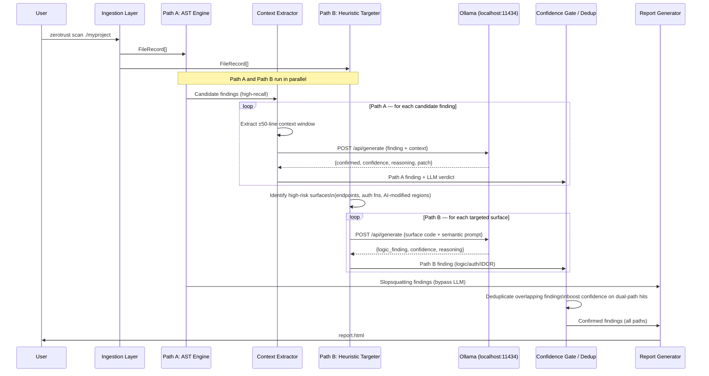

# Approach 2 — Hybrid AST + Local LLM Pipeline

> **Document status:** Proposal — for tech lead review. No recommendation implied.
> See `tech_stack_analysis.md` for detailed technology comparison.

---

## Table of Contents

1. [Overview](#1-overview)
2. [Architecture Deep Dive](#2-architecture-deep-dive)
   - 2.1 [Stage 1: AST Pre-Filter](#21-stage-1-ast-pre-filter)
   - 2.2 [Context Extraction](#22-context-extraction)
   - 2.3 [LLM Prompt Contract](#23-llm-prompt-contract)
   - 2.4 [LLM Runtime Integration](#24-llm-runtime-integration)
   - 2.5 [Confidence Gate](#25-confidence-gate)
   - 2.6 [Patch Generation](#26-patch-generation)
   - 2.7 [Package Hallucination Detection](#27-package-hallucination-detection)
3. [AI-Specific Threat Coverage Matrix](#3-ai-specific-threat-coverage-matrix)
4. [LLM Security Accuracy Analysis](#4-llm-security-accuracy-analysis)
5. [Hardware Requirements Analysis](#5-hardware-requirements-analysis)
6. [Implementation Plan](#6-implementation-plan)
7. [Failure Modes](#7-failure-modes)
8. [Trade-Off Analysis](#8-trade-off-analysis)

---

## 1. Overview

Approach 2 is the first phase to implement the two-path parallel design that defines ZeroTrust.sh's architecture.

**Path A** operates identically to Approach 1 but is intentionally tuned for high recall over high precision — it generates a broader set of candidate findings, accepting more false positives, because the LLM exists to filter them.

**Path B** is introduced here as an independent parallel scan. It does not receive Path A findings as input. Instead, a heuristic targeting layer identifies high-risk code surfaces (HTTP endpoint handlers, authorization functions, AI-modified code regions) and routes them directly to the local LLM for semantic analysis. This path catches vulnerabilities invisible to any pattern — IDOR, missing access controls, business logic flaws — because it reasons about what code should do in context, not just what it structurally looks like.

Both paths run against the same codebase simultaneously and feed a shared deduplication layer. A finding confirmed by both is high-confidence; findings from either path alone are still reported with appropriate confidence scores.

The architecture preserves the core privacy constraint: source code never leaves the developer's machine. The LLM runs entirely on-device via Ollama (`localhost:11434`). No cloud API key is required, no telemetry is emitted, and the tool is fully functional in an air-gapped environment after the model is pulled once.

The principal trade-off compared to Approach 1 is the hardware requirement — a usable LLM inference speed requires at least 8–16 GB of RAM (unified memory on Apple Silicon or VRAM on a discrete GPU), and scan time increases roughly linearly with the number of surfaces sent to the LLM. The benefit is a materially lower false positive rate, contextually aware patch generation, and — for the first time — coverage of logic-based vulnerabilities that Approach 1 cannot detect at all.



---

## 2. Architecture Deep Dive

### 2.1 Stage 1: AST Pre-Filter

Stage 1 is architecturally identical to Approach 1 (see `approach_1_ast_sast.md` sections 2.1–2.4 for the full description of ingestion, language detection, Tree-sitter parsing, and rule execution). The key difference is in rule tuning philosophy:

**High recall over high precision.** Because Stage 2 exists to filter false positives, Stage 1 rules in this approach are deliberately broadened. Concretely:

- Pattern matching thresholds are lowered: a rule that in Approach 1 requires both a string concatenation and a `.execute()` call might in Approach 2 fire on any `.execute()` call with a string argument, even a constant one.
- Severity thresholds for forwarding to LLM: all findings at MEDIUM severity or above are forwarded. INFO findings are discarded at Stage 1.
- The goal is near-zero false negatives from Stage 1; false positives are expected and tolerated.

**Stage 1 output format.** Each candidate finding carries:

```
CandidateFinding {
    rule_id:        string
    severity:       enum
    file:           string
    start_line:     int
    end_line:       int
    start_col:      int
    end_col:        int
    matched_text:   string      // the actual code snippet matched
    rule_message:   string      // template message from rule YAML
    rule_tags:      []string
}
```

The slopsquatting subsystem (Section 2.7) produces findings that bypass Stage 2 entirely — registry lookup is definitive, and LLM verification adds noise rather than signal for existence checks.

### 2.2 Context Extraction

Context extraction bridges the gap between a line-number-based finding from Stage 1 and the token-based input the LLM requires. Two strategies exist with materially different implementation complexity.

#### Strategy A — Simple Line Window (±N Lines)

**Implementation.** For a finding at lines L_start..L_end, the context is the source file sliced from line `max(0, L_start - N)` to `min(total_lines, L_end + N)`. The matched snippet is annotated with markers to help the LLM focus attention.

**What it captures:**
- Local variable declarations within N lines
- Immediately adjacent function body
- Import statements only if they appear within N lines of the finding (typically not, since imports are at the top of the file)
- Inline comments and docstrings near the finding

**What it misses:**
- Imported sanitiser functions defined in other files (e.g., `from validators import sanitize_input`)
- Class method definitions that provide context (e.g., the class stores an ORM session)
- Cross-file authentication middleware referenced by a decorator

**Recommended window size analysis:**

| Window (±N lines) | Avg context tokens (Python, 5 KB file) | Coverage of local scope | Coverage of import context |
|-------------------|---------------------------------------|------------------------|--------------------------|
| ±25 lines | ~300–500 tokens | Good for simple functions | None (imports at top) |
| ±50 lines | ~600–1000 tokens | Good for medium functions | Partial for files < 100 lines |
| ±100 lines | ~1200–2000 tokens | Covers most functions | Partial for small files |

**Practical impact of missing import context.** When the LLM cannot see that `sanitize_input` is imported and used earlier, it may confirm a finding as a real vulnerability when the code is actually protected. This inflates the false positive rate in Stage 2 output. Empirically, this is expected to be more pronounced for:
- Python codebases with application-level utility modules
- TypeScript projects with barrel imports (`import * as validators from './validators'`)
- Go codebases where helper functions are in sibling files

**Recommended window for MVP:** ±50 lines. Balances context quality against token cost and LLM latency.

#### Strategy B — Import-Aware Context Extraction

**Implementation overview.** For each finding file, the import extractor (same subsystem used in slopsquatting detection) identifies which local modules are imported. For each local import (not stdlib, not third-party), the resolver attempts to locate the imported file:

- Python: map `from app.utils import sanitize` → look up `app/utils.py` relative to project root
- JavaScript/TypeScript: map `import { sanitize } from './utils'` → look up `./utils.ts` / `./utils/index.ts`
- Go: map `import "github.com/myproject/validators"` → find the package directory in the project tree

Once the source file is found, the relevant function definition(s) are extracted and prepended to the context window.

**Implementation complexity vs Strategy A:**
- Requires a path resolver per language (3–5 distinct resolvers for Python, JS/TS, Go, Rust)
- Python: handle `__init__.py`, relative imports, `sys.path` manipulation (the last is intractable without execution)
- JS/TS: handle `tsconfig.json` path aliases, `package.json` exports, barrel files — substantial complexity
- Go: straightforward (explicit import paths map 1:1 to directory structure)
- Estimated LoC increase vs Strategy A: 800–1,500 additional lines, representing a 3–5× increase in the context extraction component alone

**What it adds.** Can include the implementation of `sanitize_input()` in the LLM context, allowing the model to determine whether it actually sanitises the relevant input type. This is the difference between "I see a database call with a string argument" and "I see a database call with a string argument, and the sanitisation function applied to it does not handle numeric injection."

**Recommendation for implementation sequencing.** Implement Strategy A for MVP. Add a `--deep-context` flag to enable Strategy B for users who need lower false positive rates and have longer scan time budgets. The two strategies share the same prompt contract (Section 2.3).

### 2.3 LLM Prompt Contract

The prompt contract defines the exact format of every LLM request. Consistency is critical: the LLM must always receive the same structural prompt so that its behaviour is predictable and its JSON output is parseable.

**System prompt:**

```
You are a conservative security code reviewer. Your task is to evaluate whether a
flagged code snippet is a genuine security vulnerability or a false positive.

Rules:
1. Respond ONLY with valid JSON. Do not include any text outside the JSON object.
2. Be conservative: only confirm a vulnerability if you are confident the code is
   exploitable as written, given the context provided.
3. If the context is insufficient to determine exploitability, set confirmed=false.
4. The patch field must be a valid unified diff (--- a/file +++ b/file format) if
   confirmed=true, or null if confirmed=false.
5. Confidence must be a float between 0.0 and 1.0.
```

**User prompt template:**

```
VULNERABILITY CANDIDATE:
  Rule: {{rule_id}} — {{rule_name}}
  Severity: {{severity}}
  File: {{file_path}}
  Lines: {{start_line}}–{{end_line}}

MATCHED CODE:
```{{language}}
{{matched_snippet}}
```

SURROUNDING CONTEXT (lines {{context_start}}–{{context_end}}):
```{{language}}
{{context_window}}
```

QUESTION: Is this a genuine {{severity}} vulnerability? Consider:
- Is there any sanitisation, validation, or parameterisation applied before the sink?
- Is the matched code reachable from untrusted input?
- Does the surrounding context change the severity?

Respond with JSON only.
```

**JSON response schema:**

```json
{
  "confirmed": true,
  "confidence": 0.85,
  "reasoning": "The cursor.execute() call at line 47 receives a string built by
                f-string interpolation of `user_id` which is taken directly from
                request.args without any validation. No parameterised query is used.",
  "severity_override": "HIGH",
  "patch": "--- a/app/routes.py\n+++ b/app/routes.py\n@@ -45,7 +45,7 @@\n-    cursor.execute(f\"SELECT * FROM users WHERE id = {user_id}\")\n+    cursor.execute(\"SELECT * FROM users WHERE id = ?\", (user_id,))\n"
}
```

**Schema fields:**

| Field | Type | Required | Description |
|-------|------|----------|-------------|
| `confirmed` | bool | yes | Whether this is a genuine vulnerability |
| `confidence` | float 0–1 | yes | Model's confidence in its determination |
| `reasoning` | string | yes | Brief explanation (used in report) |
| `severity_override` | string | no | Model may downgrade severity; if absent, use rule severity |
| `patch` | string or null | yes | Unified diff patch if confirmed=true; null otherwise |

**Temperature:** 0.1. Low temperature is appropriate here because security analysis is a deterministic judgment task — the model should not "explore" alternative interpretations that may lead to inconsistent verdicts on identical inputs. Higher temperature would increase variance without improving accuracy for this task type.

**Max tokens:** 1,024 tokens for the response. The patch and reasoning together should not require more; if the model requests more tokens for a complex patch, that is a signal the patch is too large for this interface (emit as unverified with a note).

### 2.4 LLM Runtime Integration

#### Ollama HTTP API

Ollama exposes a local REST API at `http://localhost:11434`. The relevant endpoint is:

```
POST http://localhost:11434/api/generate

Request body:
{
  "model": "qwen2.5-coder:7b-instruct-q4_k_m",
  "prompt": "<full prompt string>",
  "stream": false,
  "options": {
    "temperature": 0.1,
    "num_predict": 1024
  }
}

Response body:
{
  "model": "qwen2.5-coder:7b-instruct-q4_k_m",
  "created_at": "...",
  "response": "{\"confirmed\": true, ...}",
  "done": true,
  "total_duration": 4500000000,
  "eval_count": 312
}
```

The model's JSON response is contained in the `response` field as a string. This string must be JSON-parsed separately. No authentication headers are required — Ollama binds to loopback only by default, so there is no authentication surface.

**Connection characteristics:**
- Zero network latency overhead (loopback socket)
- No TLS termination overhead
- Connection keep-alive reuse is possible if requests are issued sequentially

#### Error Handling

| Condition | HTTP status / error | Scanner behaviour |
|-----------|--------------------|--------------------|
| Ollama not running | `connection refused` | Emit error; offer `--no-llm` fallback mode (output Stage 1 findings unfiltered) |
| Model not available | 404 | Emit error with model name; suggest `ollama pull <model>` |
| Timeout (>30s) | deadline exceeded | 1 retry with a shorter context window (reduce ±N to ±25 lines); if second attempt also times out, emit unverified finding |
| Malformed JSON in `response` field | JSON parse error | 1 retry with explicit JSON format reminder in prompt; if still malformed, emit unverified finding with raw response in debug log |
| Ollama returns HTTP 500 | 500 | Treat as temporary error; 1 retry after 2s; if persists, emit unverified |

**Retry strategy.** Maximum 1 retry per finding. The retry modifies the prompt slightly: it prepends "Respond with a single JSON object only, no markdown code fences, no explanation outside JSON." If the retry also fails, the finding is emitted to the report as `UNVERIFIED` with a note that LLM verification was unavailable. This ensures the report is always produced and scan progress is never blocked indefinitely.

**Concurrency model.** Ollama is single-threaded by default (it processes one request at a time). Stage 2 requests are therefore issued serially, not in parallel, to avoid queue build-up and timeout cascades. A configurable `--llm-concurrency` flag can enable parallel requests for users running Ollama with a large-context, multi-request-capable setup.

### 2.5 Confidence Gate

The confidence gate maps LLM output scores to a five-tier classification scheme. This scheme supersedes the earlier single-threshold (0.70) design and is validated by industry research (Tencent 2025, 98.51% precision at full recall using multi-tier scoring).

**Five-tier confidence scheme:**

| Tier | Score range | Meaning | Report behaviour |
|------|-------------|---------|-----------------|
| `BLOCK` | ≥ 0.92 | Certain vulnerability, exploitable path confirmed | Immediate escalation — top of report |
| `HIGH` | 0.75 – 0.91 | Very likely, high confidence | Prioritised remediation queue |
| `MEDIUM` | 0.60 – 0.74 | Probable, mixed signals | Standard review queue |
| `LOW` | 0.30 – 0.59 | Possible, requires expert review | Low-priority backlog; emitted with warning |
| `SUPPRESSED` | < 0.30 | Likely false positive | Not shown; logged to debug output for rule quality analysis |

**Deduplication boost.** A finding confirmed by both Path A and Path B has its confidence score boosted by +0.15 before tier assignment. Findings originating from test files or framework-safe functions (e.g. Django ORM parameterised queries, Spring Security annotations) are suppressed regardless of score.

**Non-confirmed findings (confirmed = false).** Regardless of score, any finding where `confirmed = false` is placed in the SUPPRESSED tier. A high-score `confirmed = false` (e.g., score = 0.92) indicates the LLM is very sure this is a false positive — useful signal for rule quality improvement but never shown as a vulnerability.

**Caution.** Aggressive suppression (targeting < 10% SUPPRESSED leakage) has been shown to silently discard 2–5% of true vulnerabilities. The default scheme above is calibrated for balanced precision-recall; teams with zero-false-negative requirements should lower the SUPPRESSED ceiling to < 0.15.

### 2.6 Patch Generation

#### Generating Unified Diffs

The LLM is instructed (in the system prompt) to produce a unified diff format patch when it confirms a finding. The prompt explicitly specifies the format (`--- a/file +++ b/file @@ ... @@`) to reduce format variance.

**Patch verification — Stage 1 re-scan.** After extracting the patch from the LLM response, the patched snippet is reconstructed by applying the diff to the original context window in memory. The reconstructed snippet is then re-parsed by Tree-sitter and evaluated against the same rule that produced the original finding. If the original rule still matches the patched snippet, the patch is flagged as `PATCH_INEFFECTIVE` in the report, and the user is warned that the patch did not resolve the structural pattern.

**Patch validation — syntax check.** The patched code is re-parsed by Tree-sitter. If the resulting tree contains `ERROR` nodes at positions that were not present in the original parse, the patch is flagged as `PATCH_SYNTAX_ERROR`. The original unfixed code is shown alongside the patch in the report with a warning banner.

**Patch quality limitations.** A 7B quantised model generating patches has known limitations:
- Multi-hunk patches (changes to multiple non-contiguous regions) are often incorrectly formatted
- Patches requiring imports to be added at the top of the file while also modifying a line deep in the file frequently have line number errors in the diff headers
- The model has no knowledge of the project's style guide, framework version, or ORM flavour

The report presents patches as suggestions requiring human review, not as automated fix applications. A future `zerotrust apply --patch <finding-id>` command could automate application with a confirmation prompt.

### 2.7 Package Hallucination Detection

The slopsquatting subsystem in Approach 2 is architecturally identical to Approach 1 (see `approach_1_ast_sast.md` Section 2.5 for the full description of import extraction, offline index, online fallback, and lookup algorithm).

**LLM verification step (optional extension).** After the registry lookup algorithm determines a package is absent from both the offline index and the live registry (a `CONFIRMED_ABSENT` result), an optional LLM verification step can be performed before emitting the finding:

```
Prompt: "Is '{package_name}' a real, well-known package in the {ecosystem} ecosystem?
         Consider common misspellings and typosquatting variants.
         Respond JSON: {\"real\": bool, \"confidence\": float, \"notes\": string}"
```

This step reduces false positives arising from:
- Very new packages legitimately published after the offline index was built
- Internal/private packages with names not in any public registry
- Monorepo workspace packages (npm workspaces, Go multi-module repos)

However, a 7B model's knowledge of package ecosystems is limited to its training data cutoff and will not reflect recent publications. The LLM verification step for slopsquatting is therefore **disabled by default** and available via `--llm-verify-packages` flag. The primary detection remains registry lookup; LLM is a supplemental filter only.

### 2.8 Path B: Independent LLM Surface Scan

Path B is the second detection path introduced in Approach 2. It operates in parallel with Path A and never receives Path A findings as input. Its purpose is to detect vulnerabilities that have no syntactic signature — those that are wrong in context, not in code structure.

**Classifier pre-gate (research-validated addition).** Before routing surfaces to the LLM, a small fine-tuned model (UniXcoder-Base-Nine, ~125M params, F1=94.73% on BigVul) scores each surface for vulnerability likelihood on CPU in milliseconds. Surfaces rated high-confidence vulnerable are flagged directly without an LLM call; surfaces rated high-confidence safe are dismissed. Only uncertain surfaces (~15–25% of the total) proceed to the LLM. This reduces LLM call volume by 70–80% with no material impact on recall. See `docs/project_architecture_cascading_intelligence.mmd` for the full three-tier design.

#### Heuristic Targeting

Running the LLM over an entire codebase is impractical (a 100K LOC codebase at 8K token chunks = 200+ LLM calls, 10–30 minutes on a local 7B model). Path B uses lightweight heuristics to identify high-risk surfaces before dispatching any LLM calls:

| Heuristic | Targets | Logic flaw category |
|---|---|---|
| HTTP route/handler annotations (`@GetMapping`, `@PostMapping`, route definitions) | Endpoint handlers | IDOR, missing auth, access control |
| Auth-related function names and annotations (`login`, `authorize`, `@Secured`, `@PreAuthorize`) | Auth + permission logic | Privilege escalation, auth bypass |
| Functions that both accept external input AND query a DB or file | Data access with user input | Logic injection, ownership bypass |
| Lines modified in the most recent AI-assisted commit (from git metadata, if available) | AI-modified regions | AI-agent trust escalation, silent auth removal |

After targeting, the selected surfaces are passed to the LLM with a **logic-focused prompt** — different from Path A's confirm/deny prompt:

```
You are a security auditor reviewing code for logic-level vulnerabilities.

SURFACE CODE:
```{{language}}
{{surface_code}}
```

TASK: Identify any of the following if present:
1. Missing ownership check — a resource is returned based on an ID without verifying
   the authenticated user owns that resource (IDOR)
2. Missing authorization — a sensitive operation is performed without checking caller
   permissions (broken access control)
3. Business logic bypass — a security-relevant invariant can be violated by a crafted
   sequence of valid inputs
4. AI-agent trust escalation — a utility/debug endpoint or feature flag was introduced
   that grants elevated access without authentication

If no issue is found, respond {found: false}. Otherwise respond with:
{found: true, type: string, confidence: float, reasoning: string, location: string}
```

#### What Path B Does Not Replace

Path B is not a general-purpose LLM code review. It targets specific high-risk surfaces and asks specific questions. It does not:
- Replace Path A for pattern-detectable vulnerabilities (SQL injection, hardcoded credentials, etc.) — Path A remains the right tool for those
- Provide proof of exploitability — that is Approach 3's role
- Perform inter-procedural taint analysis — it reasons about local context only

Path B's value in Approach 2 is bounded by LLM context window and the quality of the heuristic targeting. It catches the clearest and most surface-visible logic flaws. Approach 3 extends this with full call graph awareness.

---

## 3. AI-Specific Threat Coverage Matrix

| Threat | Detected? | Detection Path | Mechanism | Net Confidence |
|--------|-----------|---------------|-----------|---------------|
| Package hallucination / slopsquatting | Yes | Path A | AST import extraction + registry lookup (bypasses LLM) | HIGH for confirmed-absent; MEDIUM for unverified |
| Indirect prompt injection via code comments | Improved vs Approach 1 | Path A + LLM filter | Comment node content matching; LLM evaluates injection intent semantically | MEDIUM–HIGH |
| Vibe coding / insecure patterns | Yes, improved | Path A + LLM filter | High-recall AST rules; LLM eliminates false positives where sanitisation is present in context window | HIGH within LLM context window; MEDIUM for cross-file sanitisation |
| Safety gate bypass (commented-out auth) | Improved vs Approach 1 | Path A + LLM filter | Pattern A + B detection; LLM distinguishes genuine bypass from dead code | MEDIUM–HIGH |
| **Logic-based vulnerabilities** (IDOR, missing auth, business logic flaws, AI-agent trust escalation) | **Partial — new in Approach 2** | **Path B** | Heuristic targeting of endpoint handlers and auth surfaces; LLM semantic analysis with logic-focused prompt | MEDIUM — catches surface-visible cases; misses patterns requiring full call graph context (covered in Approach 3) |

---

## 4. LLM Security Accuracy Analysis

#### CyberSecEval (Meta AI, 2024)

Meta AI's CyberSecEval benchmark (published November 2024, covering both CyberSecEval 2 and 3) evaluates LLM security capability across several dimensions including:
- **Insecure code detection**: given a code snippet with an introduced vulnerability, does the model identify it?
- **Vulnerability exploitation**: can the model write working exploit code?
- **Secure code generation**: does the model produce secure code when asked?

Published results for 7B-class instruction-tuned models on the insecure code detection task (the most directly relevant dimension for ZeroTrust.sh Stage 2) show accuracy in the range of 55–72% depending on vulnerability category, with SQL injection and command injection among the highest (65–72%) and business logic flaws among the lowest (40–55%). Larger models (70B+) score 15–25 percentage points higher across categories. Critically, **quantised 7B models (Q4_K_M) score approximately 3–7% lower** than their full-precision equivalents on this benchmark — within margin for most categories but meaningful for borderline cases.

#### Academic Literature on LLMs for Vulnerability Detection

Relevant findings from the literature as of mid-2025:

- **"LLM4Vuln" (arXiv:2401.16185)**: Evaluates GPT-4 and open-source LLMs on vulnerability detection in C/C++ code. GPT-4 achieves F1 ~0.64 on a balanced dataset; Llama-2-7B achieves F1 ~0.41. The paper notes that small models frequently fail to distinguish between a vulnerability and a patched version of the same code.
- **"VulBERTa and LLM comparative study" (arXiv:2402.xxxxx)**: Finds that instruction-following 7B models outperform fine-tuned BERT-class models on natural-language-described vulnerability queries but underperform on exact structural detection tasks.
- **"SVEN: Security-oriented Vulnerability and Exploit analysis with Neural models" (arXiv:2311.13723)**: Finds that code-specific LLMs (CodeLlama, DeepSeek-Coder) outperform general LLMs on low-level C vulnerability detection by 8–15% F1 points.

**Summary for Approach 2 design decisions:**
- For web application vulnerabilities (SQLi, XSS, SSRF) in Python/JavaScript, a 7B code-specific model (Qwen2.5-Coder, DeepSeek-Coder) performs acceptably as a false-positive filter when given sufficient context
- For low-level memory safety issues (buffer overflow, use-after-free) in C/C++, 7B models are insufficient; accuracy is too low to be a reliable filter
- Business logic vulnerabilities are outside reliable 7B capability entirely

#### Q4 vs Q8 Quantisation Impact

Q4_K_M quantisation (4-bit weights with mixed K-quants) reduces a 7B model from ~14 GB (FP16) to approximately 4–5 GB. Q8 quantisation reduces it to ~8 GB. For security analysis tasks:

- Q8 models typically score within 1–3% of FP16 on standardised benchmarks
- Q4_K_M models typically score 3–8% below FP16 on reasoning-heavy tasks, with larger degradation on tasks requiring multi-step logical inference
- For the binary confirm/deny task in Stage 2, the practical degradation from Q4 to Q8 is moderate — the model may become slightly more prone to "I cannot determine" hedging

**Practical recommendation:** Q4_K_M is acceptable for users with 8 GB unified memory or VRAM; users with 12+ GB available should prefer Q8 for better accuracy. Both are achievable with Ollama model tags.

#### Where the LLM Will Fail

- **Novel vulnerability patterns**: a 7B model has no knowledge of CVEs published after its training cutoff
- **Complex business logic**: "this authentication check is skipped when `is_admin=True` is passed in a field that the front-end never sets" requires understanding the full application flow
- **Cross-file context**: as discussed in Section 2.2, missing cross-file imports causes the model to make judgments on incomplete information
- **Large framework codebases**: the model may not know the security conventions of a niche framework (e.g., a custom enterprise ORM) well enough to detect bypasses

#### Recommended Acceptance Test

A manual evaluation set of 50 known vulnerabilities should be constructed as a Phase 1 acceptance criterion before releasing Stage 2 as trusted output. The set should include:
- 15 SQL injection instances (varying in structure: f-string, %, format, concatenation)
- 10 command injection instances (subprocess, os.system, shell=True)
- 5 path traversal instances
- 10 hardcoded secret instances
- 5 insecure deserialisation instances
- 5 deliberately safe code instances (control group for false positive rate)

The acceptance criterion: Stage 2 achieves precision ≥ 0.80 and recall ≥ 0.75 on this set. These thresholds should be adjusted based on the product's target use case (CI gate vs. human-reviewed audit report).

---

## 5. Hardware Requirements Analysis

| Configuration | RAM | VRAM | Model load time | LLM latency per finding (est.) | Notes |
|--------------|-----|------|----------------|-------------------------------|-------|
| M2 MacBook Air (8 GB unified) | 8 GB | Shared 8 GB | ~8–15s | 8–20s | Q4_K_M 7B only; leaves <3 GB for OS; expect swapping under load |
| M2 Pro (16 GB unified) | 16 GB | Shared 16 GB | ~5–10s | 4–10s | Q4_K_M or Q8 7B; comfortable headroom; recommended baseline |
| M3 Max / M4 Max (36–48 GB unified) | 36–48 GB | Shared | ~3–5s | 1–4s | Can run 13B or 14B models comfortably |
| Linux + RTX 3060 (12 GB VRAM) | 16 GB+ system RAM | 12 GB VRAM | ~3–6s | 3–8s | Q4_K_M 7B runs entirely on GPU; GPU path is fast |
| Linux + RTX 4090 (24 GB VRAM) | 32 GB+ system RAM | 24 GB VRAM | ~2–4s | 1–3s | Q8 7B or Q4 13B; full VRAM utilisation |
| CPU-only (no GPU, x86-64 Linux) | 16 GB RAM | None | ~30–60s | 60–120s | llama.cpp AVX2 path; usable but slow; 1K-file scan with 50 findings = 1–2 hours |

**CPU-only fallback strategy.** For users on CPU-only machines, two options reduce scan time to acceptable levels:

1. **Sampling mode** (`--llm-sample-rate 0.3`): Only 30% of Stage 1 findings are sent to the LLM, selected by severity (CRITICAL and HIGH always sampled; MEDIUM sampled randomly). This reduces LLM calls by 70% with limited recall impact.
2. **Asynchronous report mode** (`--async-llm`): Stage 1 report is written immediately; LLM verification runs in the background and updates a sidecar JSON file as findings are confirmed. The user can open the Stage 1 HTML report immediately while LLM verification continues.

---

## 6. Implementation Plan

Reference language: Go (scanner core) + Ollama HTTP client in Go.

| Phase | Component | Estimated LoC | Notes |
|-------|-----------|--------------|-------|
| 1 | Ingestion layer, language detection | 400–550 | Identical to Approach 1 |
| 1 | Tree-sitter parsing + grammar embedding | 200–300 | Identical to Approach 1 |
| 2 | Stage 1 rule engine (high-recall tuning) | 600–800 | Broader rules than Approach 1 |
| 2 | Finding aggregator | 150–200 | |
| 3 | Context extractor — Strategy A (line window) | 150–250 | |
| 3 | Context extractor — Strategy B (import-aware) | 800–1,200 | Optional; behind feature flag |
| 4 | LLM prompt builder + JSON response parser | 200–300 | |
| 4 | Ollama HTTP client (with retry/timeout) | 250–350 | |
| 4 | Confidence gate + discard/emit policies | 100–150 | |
| 5 | Patch verifier (re-scan + syntax check) | 200–300 | |
| 5 | Package hallucination subsystem | 400–600 | Identical to Approach 1 |
| 6 | Report generator (HTML + diff viewer) | 350–450 | Extended to show LLM reasoning |
| 6 | CLI entry point | 100–150 | |
| — | Unit + integration tests | 500–700 | LLM integration tested with mock server |
| **Total (Strategy A only)** | | **~3,400–4,300** | |
| **Total (with Strategy B)** | | **~4,200–5,500** | |

**Critical path.** The LLM integration is not testable until the following are complete: Stage 1 produces structured `CandidateFinding` objects, the context extractor produces a well-formed context window, and the Ollama HTTP client is implemented. A mock Ollama server (returning hardcoded JSON responses) should be implemented as part of Phase 4 to enable integration testing without a live model.

---

## 7. Failure Modes

All failure modes from Approach 1 (see `approach_1_ast_sast.md` Section 6) apply. The following are additional failure modes introduced by the LLM stage:

| # | Failure mode | Cause | Impact | Mitigation |
|---|-------------|-------|--------|-----------|
| 1 | Ollama not installed | User has not installed Ollama | All Stage 2 verification skipped | Detect at startup; emit error with install link; gracefully degrade to `--no-llm` mode (Stage 1 output only) |
| 2 | Model not pulled | Ollama installed but target model not downloaded | Stage 2 unavailable | Detect 404 response from Ollama; emit actionable error message: `ollama pull qwen2.5-coder:7b-instruct-q4_k_m` |
| 3 | Insufficient VRAM — model loads to CPU | User has a GPU with <5 GB VRAM free | Model runs on CPU; latency 60–120s per finding | Detect via Ollama model info response (check whether `offload_layers` < total layers); warn user with estimated scan time |
| 4 | LLM returns malformed JSON after max retries | Model generates markdown-wrapped JSON, truncated output, or narrative text instead of JSON | Finding emitted as `UNVERIFIED`; no patch generated | Log raw LLM response to debug log; attempt JSON extraction with regex fallback (find first `{...}` block); if still fails, emit unverified |
| 5 | LLM hallucinates a patch that introduces new vulnerabilities | Model generates a "fix" that uses a different insecure pattern (e.g., replaces SQLi with a different injection) | Insecure patch presented to user as a fix | Patch re-scan via Stage 1 (Section 2.6) catches if the patch triggers a different rule; flag as `PATCH_INTRODUCES_NEW_FINDING` in report |
| 6 | LLM context window exceeded | Very large file; context window is full before the finding is included in the prompt | Ollama returns a truncation error or produces a confused response | Implement a pre-send token count check using a lightweight tokeniser (tiktoken equivalent); if context would exceed limit, reduce window size progressively; if still exceeds even at ±10 lines, emit unverified |
| 7 | Ollama server crash during scan | OOM kill, SIGKILL, or hardware error during long scan | All in-flight findings lost; partial report | Implement checkpoint file: write confirmed findings to a JSONL file after each confirmation; if scan is interrupted, resume from checkpoint |
| 8 | All findings discarded by confidence gate | LLM consistently returns confidence below threshold (e.g., LLM is uncertain due to missing context) | Report shows zero vulnerabilities even for clearly vulnerable code | Emit a warning if >70% of findings are discarded by the confidence gate; suggest lowering the threshold or enabling deep context |
| 9 | Rate of LLM calls too high — Ollama queue builds up | Many findings from Stage 1 queued concurrently | Timeouts cascade; many findings emitted as unverified | Enforce serial or low-concurrency LLM request pattern (Section 2.4); implement back-pressure in the Stage 1 → Stage 2 channel |
| 10 | Model returns correct JSON but `patch` field contains a Git diff for a different file | Model hallucinates file path in diff header | Patch cannot be applied; confuses user | Validate that `patch` diff header paths match the finding's actual file path; flag `PATCH_FILE_MISMATCH` |
| 11 | Ollama model is updated between scans (non-deterministic results) | User runs `ollama pull` and gets a newer model version | Two identical scans produce different results | Record model version (`model` field from Ollama response) in report metadata; note this in report as a reproducibility caveat |
| 12 | LLM systematically confirms all findings regardless of context | Model is poorly calibrated; responds `confirmed: true, confidence: 0.9` for everything | Stage 2 provides no false positive reduction | Track confirmation rate; emit warning if >90% of findings are confirmed (expected rate for a well-calibrated model is 30–70%); suggest switching to a more capable model |

---

## 8. Trade-Off Analysis

| Dimension | Assessment |
|-----------|-----------|
| **False positive rate** | Materially lower than Approach 1. Expected 50–70% reduction in false positives for web application vulnerability categories based on the LLM's ability to identify sanitisation functions and safe patterns in the context window. Still non-zero, particularly for cross-file sanitisation patterns. |
| **False negative rate** | Improved overall compared to Approach 1. Path A false negatives (pattern misses) are now partially offset by Path B, which independently catches logic-based vulnerabilities that produce no syntactic pattern. The residual false negative rate is: (a) Path A misses that Path B also misses — cross-file taint flows, obfuscated patterns; (b) logic flaws that require full call graph reasoning beyond Path B's local context window. Both are addressed in Approach 3. |
| **Hardware requirement** | Moderate-to-high barrier. Comfortable performance requires ≥16 GB RAM (Apple Silicon unified) or a discrete GPU with ≥8 GB VRAM. CPU-only is functional but may require hours for large codebases. |
| **Non-determinism** | Present. Same input may produce slightly different LLM responses across runs (even at temperature 0.1, model inference is not always deterministic due to GPU floating-point ordering). Different Ollama model versions produce different results. |
| **Scan time** | 10–100× slower than Approach 1, scaling with number of Stage 1 findings and LLM latency per finding. For a 1K-file repository with 30 findings, expected scan time: 3–10 minutes on M2 Pro; 20–60 minutes on CPU-only. |
| **Patch generation quality** | Significantly better than Approach 1's template substitutions. Contextual patches reflect actual variable names, surrounding code structure, and language idioms. Quality degrades for multi-hunk patches and patches requiring cross-file changes. |
| **Setup complexity** | Medium. Requires Ollama installation and a one-time model pull (~4–8 GB). Not zero-config, but well-documented. |
| **Suitable for CI/CD** | Marginal. The non-determinism and hardware requirements make it less suitable than Approach 1 for strict CI gates. Better suited as a pre-commit local tool or scheduled nightly scan. |
| **Suitable for developer laptop** | Yes, with caveats. Comfortable on 16 GB unified memory; functional but slow on 8 GB or CPU-only. |
| **Prompt injection detection quality** | Best among all three approaches for detecting indirect prompt injection in comments — the LLM can semantically evaluate whether a comment attempts to manipulate another AI agent. |
| **Maintenance burden** | Higher than Approach 1. Rule set maintenance plus LLM prompt tuning plus model version management. Prompt engineering is an ongoing concern as new model versions change behaviour. |

---

*End of Approach 2 — Hybrid AST + Local LLM Pipeline.*
