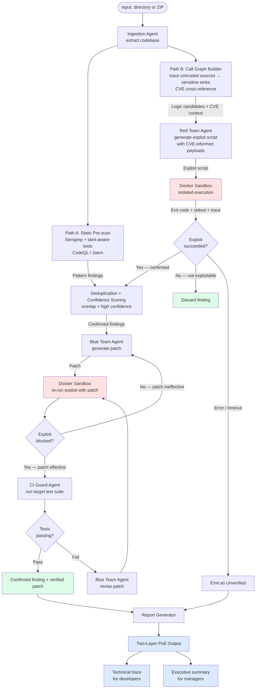
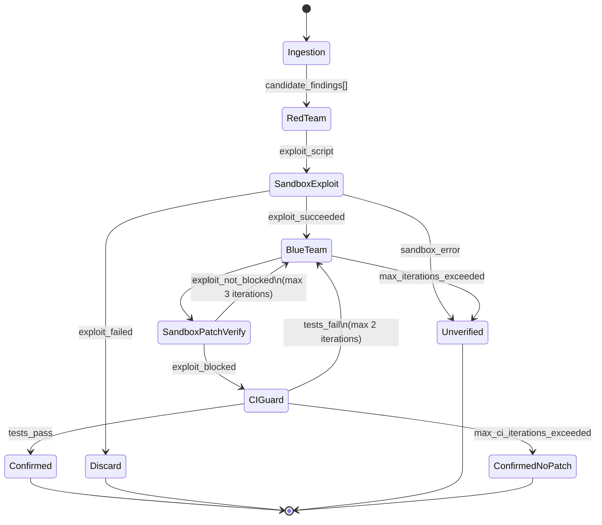

# Approach 3 — Multi-Agent Sandbox Execution Engine

> **Document status:** Proposal — for tech lead review. No recommendation implied.
> See `tech_stack_analysis.md` for detailed technology comparison.

---

## Table of Contents

1. [Overview](#1-overview)
2. [Architecture Deep Dive](#2-architecture-deep-dive)
   - 2.1 [Agent Orchestration Model](#21-agent-orchestration-model)
   - 2.2 [Red Team Agent](#22-red-team-agent)
   - 2.3 [Docker Execution Sandbox](#23-docker-execution-sandbox)
   - 2.4 [Blue Team Agent](#24-blue-team-agent)
   - 2.5 [CI Guard Agent](#25-ci-guard-agent)
   - 2.6 [Two-Layer Proof-of-Exploitability (PoE) Output](#26-two-layer-proof-of-exploitability-poe-output)
   - 2.7 [CVE Cross-Reference Step](#cve-cross-reference-step)
   - 2.8 [Package Hallucination Detection in Approach 3](#28-package-hallucination-detection-in-approach-3)
3. [AI-Specific Threat Coverage Matrix](#3-ai-specific-threat-coverage-matrix)
4. [Infrastructure Requirements](#4-infrastructure-requirements)
5. [Implementation Plan](#5-implementation-plan)
6. [Failure Modes](#6-failure-modes)
7. [Trade-Off Analysis](#7-trade-off-analysis)

---

## 1. Overview

Approach 3 is the full realization of ZeroTrust.sh's two-path design. It extends both paths to their maximum capability and introduces proof-of-exploitability (PoE) as the primary output — confirming that vulnerabilities are real, triggerable, and worth fixing before code ships.

**Path A** expands beyond Semgrep to include taint-aware static analysis tools (CodeQL, Joern) capable of inter-procedural data flow tracking. This closes the pattern-miss gap on indirect vulnerability paths that Approaches 1 and 2 cannot reach.

**Path B** is fully realized through a LangGraph multi-agent system. Rather than the heuristic surface scan of Approach 2, Path B in Approach 3 builds a call graph of the entire codebase, traces data flows from untrusted sources to sensitive sinks, cross-references findings against CVE and exploit databases, and dispatches a Red Team Agent to construct and execute a working exploit in a Docker sandbox. This is the path that catches IDOR, missing access controls, business logic bypasses, and AI-agent trust escalation with proof — not just pattern matches or LLM conjecture.

Both paths feed a shared deduplication layer that merges findings and boosts confidence on overlapping detections. The final output is a two-layer PoE report: a technical trace for developers (exact exploit path, payload, fix) and an executive summary for managers (business risk, severity, what an attacker gains).

The infrastructure cost is substantial: the Red Team Agent requires a 32B+ parameter model, Docker must be installed and running, and a dedicated machine with high RAM and optionally a high-VRAM GPU is expected.

**Important positioning note:** Approach 3 borrows exploit-generation techniques from penetration testing, but it is NOT a pentest tool. The distinction is architectural and purposeful:

| Dimension | Approach 3 (ZeroTrust.sh) | Automated Pentest Tools (Strix AI, XBOW, RidgeGen) |
|---|---|---|
| **Tests** | Isolated Docker clone of source code | Running/deployed application |
| **User** | The developer who wrote the code | Security team / pentester |
| **Requires deployment** | No — spins up from source | Yes — needs live system |
| **Network access** | None (network_mode: none) | Full — probes real endpoints |
| **Purpose of PoE** | Prove a specific code finding is real before the developer commits | Prove a deployed system is exploitable |
| **Scale** | Targeted — only flagged code paths | Broad — full attack surface |

Approach 3 is designed for **pre-release security review** by a developer or tech lead — not for security team engagements, not for testing live systems, not as a substitute for periodic pentesting. It answers: *"Is this specific piece of code I just wrote with an AI agent actually exploitable — before I ship it?"* Pentest tools answer: *"Is my deployed application hackable by an external attacker?"* Both questions matter; they are answered at different SDLC stages by different tools.



---

## 2. Architecture Deep Dive

### 2.1 Agent Orchestration Model

#### LangGraph State Machine

LangGraph (part of the LangChain ecosystem) models multi-agent workflows as typed state graphs — directed graphs where nodes represent agent actions and edges represent conditional transitions based on the updated state. This model is well-suited to the exploit/patch workflow for several reasons:

- **Conditional branching**: the post-exploit-execution decision (exploit succeeded / failed / error) is naturally modelled as a conditional edge in the graph
- **Cycle support**: LangGraph supports cycles, which are needed for the repair loop (Blue Team → sandbox verification → if blocked → CI Guard; if not blocked → Blue Team again)
- **State persistence**: the full scan state (input findings, exploit scripts, execution traces, patches, test results) is maintained in a typed `AgentState` dataclass, making it inspectable and resumable
- **Bounded cycles**: LangGraph supports maximum iteration counts per cycle, preventing infinite repair loops

**LangGraph state machine diagram:**



**Agent roles summary:**

| Agent | Primary responsibility | LLM model size needed | Docker required |
|-------|----------------------|----------------------|----------------|
| Ingestion Agent | Codebase extraction + static pre-scan (Stage 1 from Approach 1/2) | None | No |
| Red Team Agent | Write and dispatch exploit scripts | 32B+ (see Section 2.2) | No (generates code; sandbox executes it) |
| Docker Execution Sandbox | Isolated exploit/test execution runtime | None (not an LLM agent) | Yes |
| Blue Team Agent | Generate code patches for confirmed vulnerabilities | 7B–32B | No |
| CI Guard Agent | Execute target codebase test suite; validate patch | None (orchestrates Docker) | Yes |

### 2.2 Red Team Agent

#### Inputs

The Red Team Agent receives a `CandidateFinding` from the Ingestion Agent's static pre-scan. The finding includes: rule ID, severity, file path, line range, matched code snippet, and a ±100-line context window. It also receives read access to the full project directory (mounted read-only in the execution environment).

#### CVE Cross-Reference Step

Before generating an exploit script, the Red Team Agent queries a local CVE/NVD snapshot (updated at scan setup time) to find known exploits for the same vulnerability class and affected library versions. This serves two purposes:

1. **Payload seeding** — known CVE exploit techniques are included in the exploit prompt as reference, improving generation quality for the Red Team LLM
2. **PoE enrichment** — if a matching CVE is found, the PoE report includes: CVE ID, CVSS score, a plain-language description of what an attacker achieved in the real-world incident, and a link to the NVD entry. This contextualises the finding for the manager-facing report layer.

CVE lookup is performed against a local SQLite index of NVD data (downloaded via `zerotrust update-cve-db`). No network call is made during scanning — the index is consulted offline. If no matching CVE is found, the agent proceeds without CVE context; the PoE report notes "no known CVE match" for that finding.

#### Task: Exploit Script Generation

The agent's task is to write a Python script that, when executed against the target codebase, produces observable evidence that the vulnerability is exploitable. "Observable evidence" is defined operationally:
- For SQLi: the exploit script runs the target application locally, sends a crafted payload, and demonstrates data exfiltration or error-based detection
- For command injection: the exploit script demonstrates arbitrary command execution (e.g., creates a sentinel file)
- For path traversal: the exploit script reads a file outside the intended directory
- For hardcoded secrets: the exploit script demonstrates that the secret can be extracted from the binary/source

#### Why 7B is Insufficient for Exploit Generation

Multi-step exploit code generation is a substantively harder task than vulnerability detection. An exploit script must:
1. Understand the target codebase's dependencies and how to start/invoke it
2. Craft a payload specific to the exact code path found
3. Interact with the running application (HTTP, CLI, API) in a way that triggers the vulnerable code path
4. Observe and report the outcome

Academic evidence: CyberSecEval 3 (Meta AI, 2024) reports that 7B models achieve 15–30% success rates on "write a working exploit for this vulnerability" tasks, compared to 55–70% success rates for 70B+ models. The LLM4Vuln paper (arXiv:2401.16185) similarly finds that small models frequently generate syntactically valid but semantically non-functional exploit code. A 7B model may produce a plausible-looking exploit script that does not actually trigger the vulnerability, resulting in a false negative (finding discarded as non-exploitable when it is in fact exploitable).

**Minimum recommended model for Red Team Agent:** Qwen2.5-Coder-32B-Instruct or Llama-3.1-70B-Instruct (via Ollama). These require 20–40 GB of VRAM or unified memory for acceptable inference speed.

#### Prompt Design for Exploit Generation

```
You are a security research assistant. Your task is to write a Python script
that demonstrates the exploitability of the following vulnerability.

VULNERABILITY:
  Type: {{rule_name}}
  File: {{file_path}}:{{line_range}}
  Code:
  ```{{language}}
  {{matched_snippet}}
  ```

CONTEXT:
  ```{{language}}
  {{context_window}}
  ```

PROJECT STRUCTURE (top-level):
{{directory_listing}}

TASK: Write a self-contained Python script that:
1. Starts the application if required (use subprocess; assume Python/pip/node/go is available)
2. Sends a crafted input that triggers the vulnerability
3. Prints "EXPLOIT_SUCCESS" to stdout if the vulnerability is confirmed
4. Prints "EXPLOIT_FAILED" if the vulnerability could not be triggered
5. Exits with code 0 in both cases (do not crash)

The script will run inside a Docker container with no internet access.
Write only the Python script, no explanation.
```

#### Output

```
ExploitAttempt {
    script:         string      // Python source code
    model_used:     string      // model identifier
    generation_time: float      // seconds
}
```

### 2.3 Docker Execution Sandbox

#### Purpose and Isolation Model

The Docker sandbox provides an isolated execution environment in which the Red Team Agent's exploit script runs against the target codebase. The sandbox enforces three critical properties:
1. **Network isolation**: the exploit cannot exfiltrate data or call back to external services
2. **Filesystem isolation**: the exploit cannot modify files outside the mounted codebase directory
3. **Resource limits**: CPU, memory, and execution time are bounded to prevent runaway processes

#### Container Configuration

```yaml
# Docker run parameters (equivalent)
image: python:3.11-slim          # or node:20-slim, golang:1.22, etc.
network_mode: none               # full network isolation
read_only: false                 # exploit may need to write temp files
volumes:
  - /tmp/zerotrust-codebase:/codebase:ro    # target code read-only
  - /tmp/zerotrust-exploit:/exploit:rw      # exploit script write location
  - /tmp/zerotrust-sentinel:/sentinel:rw    # exploit output directory
security_opt:
  - no-new-privileges:true
  - seccomp:/etc/zerotrust/seccomp.json     # custom seccomp profile
cap_drop:
  - ALL                          # drop all Linux capabilities
cap_add:
  - CHOWN                        # only what's needed to run pip install
  - SETUID
  - SETGID
mem_limit: 512m
cpu_quota: 100000                # 1 CPU
pids_limit: 128
timeout: 60s                     # container killed after 60 seconds
```

#### Network Isolation Details

`network_mode: none` prevents all outbound and inbound network connections. This is critical because:
- A successful exploit should not be able to exfiltrate real data
- The Red Team Agent should not be able to receive callbacks that "prove" exploitation via a DNS-based technique (this removes SSRF/OOB detection from the supported threat model — a known limitation)

#### Security: Preventing Docker Escape

Docker escapes are a known risk class. The following mitigations reduce the attack surface:
- **Drop all capabilities**: most Docker escape techniques (ptrace-based, namespace manipulation) require capabilities that are dropped by default
- **No privileged mode**: never use `--privileged`
- **Custom seccomp profile**: blocks dangerous syscalls (ptrace, unshare, mount, pivot_root). The default Docker seccomp profile blocks ~50 syscalls; a ZeroTrust-specific profile can be more restrictive
- **gVisor alternative**: gVisor (`runsc` runtime) intercepts all syscalls from the container and proxies them through a user-space kernel. This provides kernel-level isolation and eliminates most container escape vectors. Cost: ~20–30% performance overhead
- **Firecracker alternative**: Firecracker microVMs provide hardware-level isolation (separate kernel per container). Startup time is 125ms (vs ~300ms for Docker cold start per Firecracker published benchmarks), but the integration complexity is substantially higher

#### Container Startup Overhead

Container startup latency significantly affects scan speed:
- **Docker cold start** (pulling image + starting container): 2–8 seconds for a slim base image
- **Docker warm start** (image cached, container creation): 300–600ms
- **Exploit execution**: 5–60 seconds depending on application startup time
- **gVisor cold start**: ~500ms after image pull; warm start ~400ms (slightly higher than Docker due to user-space kernel init)

Strategy: pre-warm the base containers at scan start (before the first finding is processed) to minimise per-finding startup overhead.

#### Exploit Result Parsing

The sandbox captures the container's stdout, stderr, and exit code. The result is classified:

| stdout contains | Exit code | Classification |
|----------------|-----------|---------------|
| `EXPLOIT_SUCCESS` | Any | `EXPLOIT_SUCCEEDED` |
| `EXPLOIT_FAILED` | Any | `EXPLOIT_FAILED` |
| (neither) | 0 | `EXPLOIT_INCONCLUSIVE` |
| (neither) | Non-zero | `EXPLOIT_ERROR` |
| (any) | Timeout | `EXPLOIT_TIMEOUT` |

Only `EXPLOIT_SUCCEEDED` proceeds to the Blue Team Agent.

### 2.4 Blue Team Agent

#### Inputs

The Blue Team Agent receives:
- The original `CandidateFinding` from the Ingestion Agent
- The exploit script that succeeded
- The execution trace (stdout/stderr from the exploit run)
- The relevant code context window

#### Task: Patch Generation

The Blue Team Agent's task is to generate a code patch that closes the vulnerability without breaking existing functionality. It has more context than an LLM in Approach 2: the execution trace confirms exactly how the vulnerability was triggered, which narrows the search space for the fix.

**Patch strategies considered:**

1. **Direct fix**: modify the vulnerable code path (parameterise the query, sanitise the input, use a safe API)
2. **Abstraction layer**: introduce a helper function that centralises validation, applied at all relevant call sites
3. **Disable/remove feature**: if the feature is experimental or unused, remove the code path entirely

The agent generates a unified diff patch and a brief explanation. The explanation is included in the report for the human reviewer.

#### Patch Verification Loop

The patch is applied to the codebase in a temporary copy, and the Docker sandbox re-runs the original exploit script against the patched code. If the exploit produces `EXPLOIT_FAILED` or `EXPLOIT_ERROR` (exploit no longer works), the patch is considered effective and proceeds to CI Guard. If `EXPLOIT_SUCCEEDED`, the patch is ineffective and the Blue Team Agent is invoked again with a note: "Your previous patch was ineffective. The exploit still succeeds. Review the patch and try a different approach."

**Maximum repair iterations: 3.** After 3 failed patch attempts, the finding is emitted as `CONFIRMED_UNPATCHED` — the vulnerability is real and confirmed, but no effective patch was generated automatically.

### 2.5 CI Guard Agent

#### Task

The CI Guard Agent attempts to run the target codebase's existing test suite inside the Docker sandbox (with network access re-enabled for the test run, to permit package installation and test fixture setup). If tests pass after the patch is applied, the patch is marked as regression-safe. If tests fail, the Blue Team Agent is reinvoked.

#### Challenges

**Challenge 1: Target codebase may not have tests.** Many AI-generated codebases (the primary target of ZeroTrust.sh) lack a comprehensive test suite or any tests at all. If no test runner is detected (no `pytest.ini`, `package.json` with `test` script, `Makefile` with `test` target, `go test`, etc.), the CI Guard falls back to syntax validation via Tree-sitter re-parse. This is a weaker guarantee but is better than no validation.

**Challenge 2: Non-portable build dependencies.** The codebase may depend on system libraries, private package registries, or environment variables that are not present in the Docker container. The CI Guard agent handles this by:
- Running `pip install -r requirements.txt` or `npm install` or `go mod download` before executing tests
- Capturing install failures and emitting them as warnings (not blocking the patch from being reported)
- For private registries: out of scope; document that CI Guard may fail for codebases with private dependencies

**Challenge 3: Test suite is slow.** For large codebases, the full test suite may take minutes or hours. The CI Guard enforces a timeout of 5 minutes per patch verification run. If tests time out, the patch is marked as `PATCH_TEST_TIMEOUT` and reported with a note.

**Fallback: syntax validation only.** When no test runner is available or tests are not portable:
1. Tree-sitter re-parses the patched file; presence of `ERROR` nodes at new positions flags `PATCH_SYNTAX_ERROR`
2. The patch is marked as `PATCH_UNVERIFIED_BY_TESTS` with a recommendation for manual review

### 2.6 Two-Layer Proof-of-Exploitability (PoE) Output

For each confirmed finding (exploit succeeded + patch verified), Approach 3 produces a two-layer PoE document embedded in the HTML report. The two layers address different audiences with different information needs.

**Layer 1 — Technical Trace (for developers)**

| Field | Content |
|---|---|
| Finding ID | Unique identifier (e.g., `ZT-2026-042`) |
| Vulnerability class | CWE ID + description |
| CVE reference | CVE ID + CVSS score + NVD link (if matched) |
| Exact location | File path, line range, function name |
| Vulnerable code | Highlighted snippet with the exact matched pattern |
| Exploit script | The Python script the Red Team Agent used (sanitised) |
| Execution trace | stdout/stderr from the successful exploit run |
| Attack narrative | Step-by-step: how an attacker would reach and trigger this |
| Verified patch | Unified diff + explanation of the fix |
| Patch confidence | Evidence: exploit re-run returned `EXPLOIT_FAILED` |
| Test result | CI Guard pass/fail status |

**Layer 2 — Executive Summary (for managers/tech leads)**

| Field | Content |
|---|---|
| Severity | Critical / High / Medium with plain-language justification |
| Business risk | What data, functionality, or systems are at risk |
| Attacker gain | What an attacker achieves if this is exploited (account takeover, data leak, RCE, etc.) |
| Real-world precedent | CVE description in non-technical language: "In 2021, attackers used this same pattern to compromise X" |
| Pre-release status | Confirmed exploitable in isolated testing — not theoretical |
| Recommended action | Accept patch / manual review required / escalate |
| Estimated fix effort | Trivial (< 1h) / Low (1h–1 day) / Medium (1–3 days) / High (> 3 days) |

The executive summary is intentionally readable without security knowledge. Its goal is to answer: "Should this block our release?" in under two minutes.

### 2.8 Package Hallucination Detection in Approach 3

The slopsquatting detection mechanism from Approaches 1 and 2 is **not well-suited to the agent-sandbox loop** for a specific reason: if the agent were to dynamically install and execute code from a hallucinated package name, it would be running potentially malicious code inside the sandbox. While the sandbox is isolated, this creates an unnecessary risk surface and the detection value is low compared to the risk.

The recommended approach is to run the Approach 1/2 AST-based slopsquatting detection as a **pre-scan phase** before the agent orchestration loop begins:

1. Run the full Approach 1 import extraction + registry lookup
2. Flag slopsquatting candidates in the report immediately (these bypass the agent loop)
3. Proceed with the agent loop only for vulnerability candidates that do not involve package imports

This hybrid design means Approach 3 always requires the Approach 1 ingestion subsystem as a dependency — it is not a standalone alternative but an extension layer on top of static analysis.

---

## 3. AI-Specific Threat Coverage Matrix

| Threat | Detected? | Detection Path | Mechanism | Confidence | Notes |
|--------|-----------|---------------|-----------|------------|-------|
| Package hallucination / slopsquatting | Yes (via pre-scan) | Path A | AST import extraction + registry lookup (Approach 1/2 subsystem) | HIGH | Handled outside the agent loop; not affected by agent architecture |
| Indirect prompt injection via code comments | Limited | Path A | Static pre-scan only; no exploit-based proof of injection | LOW | Difficult to "execute" prompt injection in a local sandbox — the attack surface (another AI agent) is not present in the sandbox |
| Vibe coding / insecure patterns (SQLi, command injection, path traversal, etc.) | Yes, near-zero FP | Path A → Red Team Agent | Path A flags candidates; Red Team Agent generates and executes working exploit in Docker sandbox | VERY HIGH | Exploit-based confirmation means false positives are near-zero; CVE cross-reference adds real-world context |
| Safety gate bypass (commented-out auth, suppressed annotations) | Partial | Path A + Path B | Static pre-scan detects patterns; Red Team Agent can attempt unauthenticated access to protected endpoints | MEDIUM–HIGH | Requires the codebase to be startable in the container; REST API testing is within scope; complex session-based auth bypass is harder |
| **Logic-based vulnerabilities** (IDOR, missing auth, business logic flaws, AI-agent trust escalation) | **Full — new in Approach 3** | **Path B** | Call graph traversal traces untrusted input → sensitive sink across function boundaries; CVE cross-reference confirms real-world exploitability; Red Team Agent executes exploit with proof | HIGH | Catches what Approach 2 Path B misses: indirect flows, multi-hop auth gaps, and complex ownership checks requiring cross-file reasoning |

---

## 4. Infrastructure Requirements

This approach is explicitly not designed for developer laptop use. The following table documents requirements:

| Component | Minimum specification | Recommended specification |
|-----------|----------------------|--------------------------|
| **Operating system** | Linux (kernel 5.10+) or macOS 13+ | Linux (Ubuntu 22.04 or later) |
| **Docker** | Docker Engine 24+, Docker Desktop acceptable | Docker Engine 24+ with buildkit |
| **RAM (system)** | 32 GB | 64–128 GB |
| **GPU / VRAM** | None required (CPU inference possible, very slow) | NVIDIA RTX 4090 (24 GB VRAM) or A100 (40/80 GB VRAM) |
| **Storage** | 100 GB NVMe SSD (for Docker image cache + LLM model weights) | 500 GB NVMe SSD |
| **CPU** | 8-core modern x86-64 or ARM64 | 16+ core (Threadripper, EPYC, or M3 Max) |
| **LLM for Red Team Agent** | Qwen2.5-Coder-32B-Instruct Q4 (~20 GB) | Qwen2.5-Coder-72B or Llama-3.1-70B Q8 (~70 GB) |
| **LLM for Blue Team Agent** | Any 7B Q4 model (~4 GB) | 14B or 32B model for better patch quality |
| **Network** | Air-gapped is acceptable (Docker images and models must be pre-cached) | High-speed local network if models are served from a separate inference server |

**Typical per-finding infrastructure cost (RTX 4090 system):**
- Container startup: 0.3–0.6s (warm)
- Exploit generation (32B model): 15–60s
- Exploit execution in sandbox: 5–60s
- Patch generation (14B model): 10–30s
- Patch verification in sandbox: 5–60s
- CI Guard test run: 30s–5 minutes
- **Total per confirmed finding: 1–8 minutes**

For a repository with 20 confirmed exploitable vulnerabilities, a full scan takes approximately 20 minutes to 2.5 hours.

**Suitability statement:** This approach is appropriate for:
- Dedicated security review workstations
- CI/CD pipelines with dedicated runners (e.g., a GitHub Actions self-hosted runner with a GPU-equipped machine)
- Security consultancy workflows where scan time is measured in hours, not seconds
- Red-team exercises where proof-of-exploitability is a deliverable requirement

It is **not appropriate** for:
- Developer laptop integration
- Real-time pre-commit checks
- Organisations without GPU infrastructure

---

## 5. Implementation Plan

Reference language: Python (LangGraph, Docker SDK for Python, Ollama Python client). The static pre-scan component can reuse the Go or Rust binary from Approach 1/2 as a subprocess, invoked via JSON output mode.

| Phase | Component | Estimated LoC | Notes |
|-------|-----------|--------------|-------|
| 1 | Static pre-scan integration (call Approach 1/2 binary, parse JSON output) | 200–400 | Subprocess + JSON parsing |
| 2 | LangGraph state machine definition (nodes, edges, state schema) | 400–800 | Core orchestration |
| 2 | Agent state types and transition logic | 300–500 | |
| 3 | Red Team Agent (prompt design, LLM client, script extraction) | 600–1,000 | |
| 3 | Blue Team Agent (prompt design, patch parsing, strategy selection) | 500–800 | |
| 3 | CI Guard Agent (test runner detection, Docker orchestration, result parsing) | 600–1,000 | |
| 4 | Docker execution sandbox (container lifecycle, security config, result parsing) | 800–1,200 | Docker SDK; seccomp profile |
| 4 | Sandbox security profile (seccomp JSON, capability drop list) | 100–200 | Security-critical config |
| 5 | Patch verification loop (apply diff, re-run exploit, iteration counter) | 400–600 | |
| 5 | Slopsquatting pre-scan hook | 100–200 | Calls Approach 1/2 subsystem |
| 6 | Report generator (HTML; extended to show exploit trace + patch + test results) | 600–900 | More complex than Approach 1/2 |
| 6 | CLI entry point + configuration schema | 200–300 | |
| — | Unit + integration tests | 1,000–2,000 | Mock Docker + mock LLM |
| **Total** | | **~5,800–9,700** | Wide range reflects architecture decisions |

**Comparable projects for reference:**
- **AutoCodeRover** (arXiv:2404.05427): 7,000+ lines of Python, uses SWE-bench tasks, employs an agent loop for program repair with test verification. Closest public analogue to the Blue Team + CI Guard pattern.
- **SWE-agent** (Princeton NLP, 2024): ~5,000 lines of Python; agent interacts with a Docker sandbox to locate and fix bugs in real GitHub issues. Demonstrates the viability of Docker-sandboxed agent repair at this scale.
- **VulnFix** (academic, 2023): agent-based vulnerability patching system; reported ~8,000 lines including test harness.

The implementation complexity and lines-of-code estimates above are consistent with these reference points for agent-based code repair systems.

---

## 6. Failure Modes

| # | Failure mode | Cause | Impact | Mitigation |
|---|-------------|-------|--------|-----------|
| 1 | Docker not installed | User environment does not have Docker | Entire approach is non-functional | Check for `docker` binary at startup; exit with installation instructions; cannot gracefully degrade (Docker is load-bearing) |
| 2 | Docker daemon not running | Docker installed but service is stopped | Same as above | Check `docker info` at startup; provide OS-specific start instructions |
| 3 | Target codebase will not build in container | Non-portable build dependencies (private pip registry, system library, platform-specific binary) | Exploit script cannot invoke the application; all exploit attempts produce `EXPLOIT_ERROR` | Detect build failure before exploit dispatch; emit `SCAN_WARNING: codebase not portable to Docker environment`; continue with static analysis output only |
| 4 | Red Team Agent generates invalid exploit code | 32B model generates syntactically valid Python that does not correctly invoke the target application | `EXPLOIT_ERROR` result; finding is discarded as non-exploitable | Track `EXPLOIT_ERROR` rate; if >50% of findings result in errors (not `EXPLOIT_FAILED`), emit a system warning that exploit generation quality may be poor |
| 5 | Exploit times out in sandbox | Application startup is slow (JVM, heavy framework initialisation); exploit script is correct but application is too slow to respond within 60s | `EXPLOIT_TIMEOUT`; finding emitted as `UNVERIFIED` | Configurable timeout per runtime language (JVM gets 120s, Python/Node get 60s); log timeout events for manual review |
| 6 | Blue Team patch breaks test suite | Patch changes behaviour that existing tests depend on | `CI_GUARD_FAIL`; triggers repair loop | Maximum 2 repair iterations before emitting `CONFIRMED_UNPATCHED`; include test failure output in report for manual review |
| 7 | Agent enters infinite repair loop | LangGraph cycle guard is misconfigured or bypassed | Scan never completes; resource exhaustion | Enforce hard iteration limits at the LangGraph level (Section 2.1); add a global scan timeout |
| 8 | LLM context window exhausted by codebase indexing | Large project with many files; context window filled before relevant code is included | Red Team Agent generates exploit for wrong code path | Implement relevance-scored context selection (embed code chunks, retrieve top-k relevant to the finding); do not include the full codebase — include only the relevant files |
| 9 | Container filesystem fills up during exploit execution | Exploit generates large output; test run produces large build artefacts | Container OOM or disk full; `EXPLOIT_ERROR` | Set container tmpfs size limit (512 MB); configure Docker image size limit |
| 10 | gVisor / Firecracker not available | User's OS/kernel does not support the selected isolation technology | Fall back to standard Docker; security guarantees are weaker | Document clearly which isolation level is in use in the report metadata; recommend Linux + gVisor for production use |
| 11 | Docker image pull fails during scan | Base Python/Node image not cached; no internet access | Container cannot start | Pre-cache all required base images at scan setup time; document required images; add `zerotrust pull-images` command |
| 12 | LLM model not pulled for Red Team Agent | 32B model is large (~20 GB); user has not run `ollama pull` | Red Team Agent unavailable | Detect at startup; estimate download size; prompt user to confirm before proceeding with download |
| 13 | Race condition in parallel exploit execution | Multiple exploit containers modify shared state (if parallelism is added) | Corrupted exploit results | Enforce strict serial execution per finding; do not add parallelism without comprehensive isolation between runs |
| 14 | Exploit script exfiltrates data to loopback (internal service) | Exploit makes HTTP call to a service running on the host machine (accessible via Docker host networking) | Data exfiltration not blocked by `network_mode: none` via host service | Ensure host-only network traffic is also blocked; use `network_mode: none` which drops ALL networking including host; verify this in seccomp profile |
| 15 | Blue Team Agent patch requires cross-file changes | Vulnerability requires changes in 3+ files; model generates partial patch | Exploit still works after patch; repair loop triggered | Increase Blue Team Agent context to include related files; document limitation that cross-file patches are less reliable |

---

## 7. Trade-Off Analysis

| Dimension | Assessment |
|-----------|-----------|
| **False positive rate** | Near-zero for vulnerabilities where an exploit can be executed. Only findings with a working exploit are confirmed. The expected false positive rate is < 5% (residual from cases where the exploit "works" for the wrong reason). This is the defining advantage of Approach 3. |
| **False negative rate** | Potentially high for vulnerabilities that are not directly exploitable in a Docker sandbox: configuration-based vulnerabilities, data-at-rest leakage, timing-based side channels, and vulnerabilities requiring external service interaction. The approach also misses vulnerabilities that the Red Team Agent fails to exploit due to model capability limits — these become false negatives. |
| **Scan time** | 1–8 minutes per confirmed finding. A codebase with 20 vulnerabilities may take 20 minutes to several hours. This is 10–1000× slower than Approach 2 and not suitable for any workflow requiring near-real-time feedback. |
| **Infrastructure complexity** | Very high. Docker, a large LLM (32B+), sufficient VRAM, and a dedicated machine are all required. Setup involves Docker image management, model download, seccomp profile configuration, and LangGraph dependency installation. |
| **Patch generation quality** | Highest of all three approaches. The Blue Team Agent knows exactly how the vulnerability was exploited (the execution trace), which gives it significantly more precise information for generating an effective fix. Patches are also verified by re-running the exploit, providing a functional correctness guarantee beyond syntactic analysis. |
| **Suitable for CI/CD** | Not for standard developer CI pipelines (too slow, too resource-intensive). Potentially suitable for a dedicated "security scan" CI stage run on GPU-equipped self-hosted runners on a scheduled basis (e.g., nightly or per-release). |
| **Suitable for developer laptop** | No. Hardware requirements (32B+ model, 32 GB+ RAM, Docker) exceed typical developer laptop specifications. |
| **Prompt injection detection** | Poor. The attack surface for indirect prompt injection (another AI agent reading the code) is not replicated in the Docker sandbox. Static pre-scan pattern matching (carried over from Approach 1/2) provides the only coverage here. |
| **Slopsquatting detection** | Same as Approach 1/2 (handled by pre-scan). No improvement or degradation. |
| **Novel vulnerability coverage** | Highest of all three approaches. If the Red Team LLM is aware of a novel vulnerability pattern (within its training data), it can generate an exploit for it even without a corresponding rule in the static analysis rule set. The approach is less dependent on a maintained rule library. |
| **Research vs production maturity** | This approach is at the frontier of security tooling research. The closest production-grade analogues (Mayhem, Google's OSS-Fuzz with LLM integration) operate in well-funded infrastructure contexts. For a new project, this approach carries significant engineering risk and schedule uncertainty. |
| **Slopsquatting: worst-case behaviour** | If the static pre-scan is skipped and the agent is given a codebase with hallucinated packages, a poorly designed agent might attempt to install those packages (creating a supply chain risk in the sandbox itself). This is why the pre-scan phase is mandatory and the agent loop explicitly excludes package-import findings. |

---

*End of Approach 3 — Multi-Agent Sandbox Execution Engine.*
