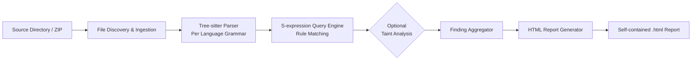
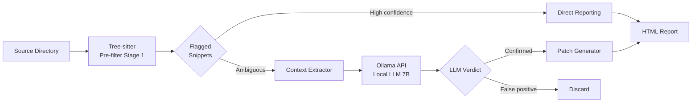
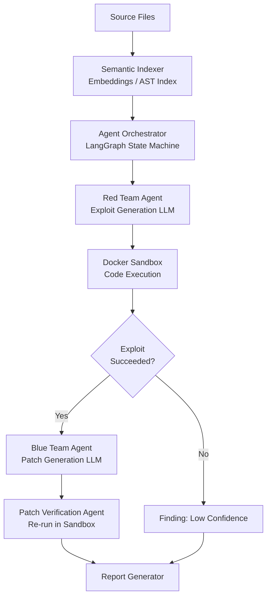

# Technology Stack Analysis — ZeroTrust.sh

> **Status:** Draft for tech lead review — June 2026
> **Scope:** Neutral, evidence-backed analysis of language and runtime choices for ZeroTrust.sh v1.0. No final recommendation is made. All performance claims are cited.

---

## Table of Contents

- [Section 1: Go Long-Term Viability Analysis](#section-1-go-long-term-viability-analysis)
  - [1.1 Go Performance Characteristics for CLI Security Tools](#11-go-performance-characteristics-for-cli-security-tools)
  - [1.2 Go Security Tool Ecosystem at Scale](#12-go-security-tool-ecosystem-at-scale)
  - [1.3 Tree-sitter Go Bindings](#13-tree-sitter-go-bindings)
  - [1.4 Go LLM Integration](#14-go-llm-integration)
  - [1.5 Go Limitations — When Would a Migration to Rust Be Necessary?](#15-go-limitations--when-would-a-migration-to-rust-be-necessary)
  - [1.6 Go Long-Term Verdict](#16-go-long-term-verdict)
- [Section 2: Approach 1 — Pure AST Static Analysis](#section-2-approach-1--pure-ast-static-analysis)
  - [2.1 Core Language Options](#21-core-language-options)
  - [2.2 Rule Engine](#22-rule-engine)
  - [2.3 Taint Analysis (Optional Stage 1b)](#23-taint-analysis-optional-stage-1b)
  - [2.4 Report Generation](#24-report-generation)
  - [2.5 Complete Approach 1 Stack Table](#25-complete-approach-1-stack-table)
- [Section 3: Approach 2 — Hybrid AST + Local LLM](#section-3-approach-2--hybrid-ast--local-llm)
  - [3.1 Core Language for the Pipeline](#31-core-language-for-the-pipeline)
  - [3.2 Local LLM Runtime Options](#32-local-llm-runtime-options)
  - [3.3 LLM Model Analysis for Security Tasks](#33-llm-model-analysis-for-security-tasks)
  - [3.4 Context Extraction Architecture](#34-context-extraction-architecture)
  - [3.5 Slopsquatting Detection Mechanism](#35-slopsquatting-detection-mechanism)
  - [3.6 Complete Approach 2 Stack Table](#36-complete-approach-2-stack-table)
- [Section 4: Approach 3 — Multi-Agent Sandbox](#section-4-approach-3--multi-agent-sandbox)
  - [4.1 Why Python for Approach 3](#41-why-python-for-approach-3)
  - [4.2 Agent Orchestration Framework](#42-agent-orchestration-framework)
  - [4.3 Docker Sandbox](#43-docker-sandbox)
  - [4.4 LLM for Agent Tasks](#44-llm-for-agent-tasks)
  - [4.5 Complete Approach 3 Stack Table](#45-complete-approach-3-stack-table)
- [Section 5: Cross-Cutting Technology Concerns](#section-5-cross-cutting-technology-concerns)
  - [5.1 Distribution Strategy Comparison](#51-distribution-strategy-comparison)
  - [5.2 Testing Frameworks](#52-testing-frameworks)
  - [5.3 CI/CD Integration](#53-cicd-integration)

---

## Section 1: Go Long-Term Viability Analysis

**Core question:** *If ZeroTrust.sh is built in Go and never migrated to Rust, does Go suffice for all foreseeable requirements?*

### 1.1 Go Performance Characteristics for CLI Security Tools

#### Raw Benchmark Data

The most comprehensive public benchmark comparison as of August 2025 (programming-language-benchmarks.vercel.app) shows the following measured execution times for representative workloads:

| Benchmark | Input | Rust (ms) | Go (ms) | Rust Advantage |
|---|---|---|---|---|
| binarytrees (tree alloc/dealloc) | 18 | 1,259 | 1,726 | 1.37x |
| mandelbrot (CPU-bound math) | 5,000 | 246 | 2,666 | 10.8x |
| nbody (floating-point) | 5M iters | 163 | 350 | 2.1x |
| spectral-norm (linear algebra) | 8,000 | 492 | 1,906 | 3.9x |
| **regex-redux** (regex on 250K input) | 250K | **49** | **timeout (1,781ms)** | **>36x** |
| edigits (arbitrary precision) | 250K | 121 | 118 | Go wins |
| coro-prime-sieve (concurrency) | 1,000 | 53 | 44 | Go wins |
| http-server (I/O-bound) | 3,000 req | 219 | 119 | Go wins (1.8x) |

Source: [programming-language-benchmarks.vercel.app](https://programming-language-benchmarks.vercel.app/go-vs-rust), data captured August 2025.

**Key finding for ZeroTrust.sh:** The regex-redux benchmark is the most relevant to a security scanner (pattern matching across source files). Go's standard `regexp` package implementation timed out on the 250K input while Rust completed in 49ms. For file scanning workloads, Rust holds a material edge in regex-heavy code paths. For I/O-bound concurrent workloads (e.g., reading many files in parallel goroutines), Go is competitive or faster than Rust.

For JSON parsing workloads (relevant when ingesting package manifests or LLM API responses), independent benchmarks show Rust running approximately 2x faster than Go for CPU-bound parsing. However, when the bottleneck is disk I/O or network I/O rather than CPU, the gap narrows significantly.

#### Go GC Behavior for Long-Running Processes

Go's garbage collector has undergone continuous improvement:

- **Go 1.5 (2015):** Introduced concurrent tri-color mark-and-sweep GC; achieved pauses below 10ms.
- **Go 1.17+ (2021):** Worst-case stop-the-world times dropped below 100 microseconds for most workloads. Source: [Go GC guide (go.dev)](https://go.dev/doc/gc-guide).
- **Go 1.26 ("Green Tea", 2026):** Tighter pacing, reduced write-barrier overhead, more accurate heap sizing. GC CPU fraction dropped further.

For a CLI security scanner with a typical run time of 5-60 seconds (not a long-running server), GC pauses of sub-100µs are unlikely to be perceptible. The concern about GC pauses is most material for server processes running for days or weeks, or for real-time interactive tools with strict latency budgets.

**Per-goroutine stack overhead:** Go goroutines start with a 2-8KB stack that grows dynamically. Spawning thousands of goroutines for parallel file scanning is practical; Goroutine creation is ~100ns versus ~1µs for OS threads. This is favorable for the parallel file-scanning workload in ZeroTrust.sh.

#### Practical File Scanning Throughput

Real-world Go security scanners provide reference points for expected file scanning throughput:

- **Trivy** (34,400 GitHub stars as of 2026, written entirely in Go): scans a full container image (~500MB) in under 10 seconds in CI environments, with the Go binary at approximately 30MB. Source: [Trivy official site](https://trivy.dev/).
- For a typical developer codebase of 10,000–100,000 files, Go's goroutine model enables processing hundreds of files per second with standard buffered I/O — adequate for ZeroTrust.sh's target use case.

---

### 1.2 Go Security Tool Ecosystem at Scale

Go is the dominant language for production security tooling in the cloud-native space. This is evidence-based confidence that the language can scale to production requirements:

| Tool | GitHub Stars (2026) | Language | Scale Indicator |
|---|---|---|---|
| Trivy | 34,400+ | Go | Scans containers, filesystems, git repos, IaC |
| Gosec | 8,700+ | Go | SAST for Go codebases, 80+ rules |
| Docker (Moby) | 68,000+ | Go | Critical infrastructure for ~50% of containerized workloads |
| Kubernetes | 110,000+ | Go | Cluster orchestration at planetary scale |

Sources: [communium.ai Trivy vs Gosec comparison](https://communium.ai/compare/aquasecurity-trivy-vs-securego-gosec), [trivy.dev](https://trivy.dev/).

**Gosec** (securego/gosec) is the closest analog to ZeroTrust.sh's Approach 1: it performs AST-based static analysis of Go source files, implements 80+ security rules, and is widely adopted in Go CI pipelines. Its architecture — parsing with `go/ast`, rule matching via visitors — directly validates the Go-for-SAST approach.

**Trivy** demonstrates Go's viability for scanning at scale: it supports 25+ scanning targets, handles multiple language dependency graphs simultaneously, and ships as a single ~30MB static binary — demonstrating Go's suitability for the ZeroTrust.sh distribution model.

---

### 1.3 Tree-sitter Go Bindings

Two maintained Go bindings for tree-sitter exist:

#### smacker/go-tree-sitter
- **Repository:** github.com/smacker/go-tree-sitter
- **Last published:** August 27, 2024
- **Adoption:** Imported by 564 known Go projects (pkg.go.dev)
- **Approach:** CGo wrapper; requires a C compiler at build time
- **Grammar support:** Bundles grammars for Python, JavaScript, Go, Rust, Java, C, C++, Ruby, and more as separate Go packages
- **Status:** Community-maintained; not under the official tree-sitter GitHub org

#### tree-sitter/go-tree-sitter (Official)
- **Repository:** github.com/tree-sitter/go-tree-sitter
- **Last published:** February 2, 2025
- **Adoption:** Imported by 174 known Go projects (pkg.go.dev) — newer, smaller adoption
- **Approach:** CGo wrapper; the official binding under the tree-sitter organization
- **Status:** Official; maintained by the tree-sitter core team

**CGo vs Pure-Go trade-offs:**

- Both official bindings require CGo (they wrap the underlying C library). This means builds require a C compiler (`gcc` or `clang`) and produce binaries that cannot be compiled with `CGO_ENABLED=0`.
- Pure-Go alternatives (e.g., experimental bindings that reimplement the parser in Go) exist but are incomplete and lag behind tree-sitter's grammar ecosystem substantially.
- **Performance:** CGo function call overhead is ~100-200ns per call. For AST parsing, the dominant cost is the parsing computation itself, not the CGo call overhead. The performance impact of CGo is negligible for batch file scanning.

**Comparison to Rust tree-sitter crate:**

The canonical `tree-sitter` Rust crate (tree-sitter/tree-sitter) is the primary maintained client — tree-sitter itself is written in C but Rust bindings are first-class. The Rust crate has native (no FFI overhead) integration and is the reference implementation used by tools like `ast-grep`. The Go bindings are functional but secondary in the tree-sitter ecosystem's maintenance priority.

---

### 1.4 Go LLM Integration

#### Ollama HTTP API (Recommended Path for Go)

Ollama provides an OpenAI-compatible REST API served locally on `localhost:11434`. Integration from Go requires only standard `net/http` calls; no CGo, no native bindings, no build complexity.

Available Go clients:
- `github.com/ollama/ollama/api` — the official Go client from the Ollama project itself (maintained, since Ollama's server is written in Go)
- Standard `net/http` + `encoding/json` — sufficient for the simple request/response pattern ZeroTrust.sh needs

**Overhead analysis:** As measured in benchmarks, the Ollama HTTP layer adds 12–18% latency overhead vs. direct llama.cpp calls for single-turn generation (186 tok/s vs 170 tok/s for Llama 3.1 8B Q4_K_M). Time-to-first-token adds 20–40ms for HTTP routing. Source: [markaicode.com Ollama vs llama.cpp benchmark](https://markaicode.com/benchmarks/ollama-vs-llamacpp-benchmark/).

**Is this overhead material for ZeroTrust.sh?** No. A security analysis prompt sent to a 7B model takes 2–8 seconds for a full response. An HTTP overhead of 20–40ms represents less than 1% of total latency for a typical request. The ergonomic simplicity of the HTTP API substantially outweighs this overhead.

#### CGo Binding to llama.cpp from Go

The primary CGo binding is `go-skynet/go-llama.cpp` (GitHub). The build process requires:
1. Cloning with Git submodules (llama.cpp is a submodule)
2. Running `make libbinding.a` to compile llama.cpp's C++ codebase via the system C++ toolchain
3. Embedding the generated `.a` file in the Go binary via CGo

**Practical complexity:** The repository explicitly states: *"The go-llama.cpp repository needs to be embedded directly in your project since relying on vendor won't work for CGO."* The project was last actively maintained in October 2023 by the primary author (go-skynet), with forks maintaining it afterward. This path adds significant build complexity and cross-platform fragility compared to the Ollama HTTP approach.

**Recommendation-neutral conclusion:** For Go + local LLM integration, Ollama HTTP API is the low-friction path. Direct CGo binding to llama.cpp is technically possible but introduces build complexity that is unwarranted given the negligible latency difference at 2-8s LLM response times.

---

### 1.5 Go Limitations — When Would a Migration to Rust Be Necessary?

The following are specific circumstances under which Go's constraints would become binding:

#### 1. In-Process LLM Inference (Without Ollama)
If ZeroTrust.sh ever needs to embed the LLM runtime directly in the binary (e.g., for an offline mode that does not require a running Ollama server), the Go path requires CGo with llama.cpp — a build system that is fragile, platform-specific, and manually maintained. Rust's `llama-cpp-2` crate provides direct FFI via `bindgen`, and while the crate explicitly acknowledges it is "not a simple library," it is more actively maintained and integrates more cleanly with Cargo's build system. The Python `llama-cpp-python` binding is the most mature of any language for direct in-process inference.

#### 2. WebAssembly Compilation
Go's standard compiler produces WASM binaries of ~2MB minimum (due to GC runtime inclusion). After compression, a real Go WASM binary is typically 3–10x larger than an equivalent Rust WASM binary. TinyGo reduces this to ~20-37KB for simple programs but has incomplete standard library support. Rust's WASM output, by contrast, starts at ~415KB stripped and scales linearly with code. If a future browser-based or VS Code extension version of ZeroTrust.sh is planned, Rust holds a decisive advantage. Source: [ecostack.dev WASM comparison](https://ecostack.dev/posts/wasm-tinygo-vs-rust-vs-assemblyscript/).

#### 3. Adversarially Crafted File Processing
Go is memory-safe (GC prevents buffer overflows, dangling pointers, use-after-free). However, Go does not prevent a class of logic errors that Rust's ownership model catches at compile time (e.g., data races). Both languages prevent the exploitable memory corruption bugs common in C/C++. The safety differential between Go and Rust is less significant than marketing suggests for this use case — both are vastly safer than C-based tools when processing untrusted files.

#### 4. Real-Time IDE Plugin with Sub-Millisecond Latency
For a hypothetical IDE plugin that must analyze a file on every keystroke with latency <1ms, Go's GC introduces non-deterministic pause risk. Rust, being allocation-free in hot paths, would be more suitable. This is not a current ZeroTrust.sh requirement but is worth noting for a future "always-on" mode.

#### 5. Processing Codebases with Millions of Files
For codebases exceeding ~1 million files, GC pressure from string allocations during AST traversal could introduce pauses. At typical developer codebases (10K–500K files), this is not a concern. At hyperscaler monorepo scale (10M+ files), Go GC behavior may warrant profiling. This threshold is far above ZeroTrust.sh's target use case.

#### 6. Static Binary Size
A Go CLI tool with tree-sitter embedded typically produces a binary in the 20–50MB range. A comparable Rust binary, stripped, is typically 5–15MB. For reference, Trivy (Go, with extensive dependency scanning logic) is approximately 30MB. ast-grep (Rust, tree-sitter-based code search) is significantly smaller. Source: [techbytes.app Go vs Rust CLI binary comparison](https://techbytes.app/posts/go-vs-rust-cli-tools-performance-dx-guide-2026/).

---

### 1.6 Go Long-Term Verdict

The table below maps ZeroTrust.sh's concrete requirements to language sufficiency. No recommendation is made — this is a trade-off map for the tech lead.

| Requirement | Go Sufficient? | Rust Advantage |
|---|---|---|
| Multi-file parallel scanning (I/O-bound) | Yes — goroutines excel here | Minimal |
| Regex-heavy pattern matching | Marginal — stdlib regexp is slow; use `re2` or `dlclark/regexp2` | Significant (regex-redux: >36x faster) |
| Tree-sitter AST parsing | Yes — via CGo bindings (smacker or official) | First-class native bindings |
| Ollama HTTP integration | Yes — trivial | Equivalent |
| In-process LLM inference (no Ollama) | Possible but build-fragile | Cleaner FFI via bindgen |
| Static binary distribution (~30MB) | Yes | Smaller binary (~10-15MB stripped) |
| WASM compilation | Limited (large binary, TinyGo gaps) | First-class |
| Developer tooling / hiring | Excellent (larger talent pool) | Narrower talent pool |
| Build times | Fast (incremental, seconds) | Slow (minutes for full builds) |
| Long-term ecosystem for security tooling | Proven (Trivy, Gosec, Docker) | Growing (ast-grep, cargo-audit) |

---

## Section 2: Approach 1 — Pure AST Static Analysis

**Architecture:** Source files → Tree-sitter parsing → S-expression rule matching → (optional: taint analysis) → HTML report. Fully deterministic, no LLM dependency, offline by design.



### 2.1 Core Language Options

#### Go for Approach 1

| Attribute | Detail |
|---|---|
| Tree-sitter binding | `smacker/go-tree-sitter` (v0.4.0+, August 2024) or `tree-sitter/go-tree-sitter` (official, Feb 2025) |
| Binding type | CGo — requires C compiler at build time |
| Binary size (estimated) | 25–40MB (CGo + tree-sitter + multiple grammars) |
| Build complexity | `CGO_ENABLED=1` required; cross-compilation requires `CC` targeting; manageable with Docker build |
| Reference implementation | **Gosec** (8,700+ stars) — AST analysis of Go files using `go/ast`; demonstrates the pattern |
| Grammar embedding | Each language grammar is a separate CGo-wrapped package imported at build time |
| Performance | I/O-bound file scanning: excellent. Regex/query evaluation: adequate; consider augmenting `regexp` with `regexp2` for PCRE patterns |

#### Rust for Approach 1

| Attribute | Detail |
|---|---|
| Tree-sitter binding | `tree-sitter` crate (primary client, same org as tree-sitter C library) |
| Binding type | Native C FFI via `cc` crate; no CGo equivalent, cleaner build integration |
| Binary size (estimated) | 8–20MB stripped (Rust static binary with multiple tree-sitter grammars) |
| Build complexity | Cargo handles everything; `build.rs` for C grammar compilation; cross-compilation via `cross` tool |
| Reference implementation | **ast-grep** — Rust CLI for structural code search using tree-sitter, available via `npm`, `pip`, `cargo`, Homebrew; published on crates.io with 3,000+ GitHub stars |
| Grammar embedding | Each grammar crate (e.g., `tree-sitter-python`) compiles in via `build.rs` |
| Performance | Regex: substantially faster than Go (49ms vs timeout on 250K input benchmark); tree traversal: 1.37x faster than Go for binary tree workloads |

**Key reference implementations:**

- **Semgrep core** is written in OCaml (not Go or Rust), but its YAML rule format and tree-sitter query infrastructure are the de facto industry standard for open-source SAST rule authoring. A custom implementation should aim for Semgrep rule compatibility.
- **Gosec** (Go, 8,700 stars) validates the Go-for-AST-SAST architecture.
- **ast-grep** (Rust, ~3,000 stars) validates the Rust-for-tree-sitter-CLI architecture.

---

### 2.2 Rule Engine

#### Semgrep-Compatible YAML Rule Format

The Semgrep YAML rule schema is the industry standard for open-source SAST rules (tens of thousands of community rules exist in the semgrep-rules repository). A minimal rule looks like:

```yaml
rules:
  - id: hardcoded-password
    languages: [python, javascript]
    message: "Hardcoded credential detected: $VAR"
    severity: HIGH
    pattern: |
      $VAR = "..."
    metadata:
      category: security
      cwe: CWE-798
```

**Trade-off for ZeroTrust.sh:** Implementing a full Semgrep-compatible rule engine is a significant engineering investment (Semgrep's core is ~200K lines of OCaml). A practical approach is to implement a **subset** of the Semgrep pattern syntax backed directly by tree-sitter S-expression queries, with YAML as the rule file format. This preserves rule portability while avoiding full Semgrep dependency.

One benchmark demonstrates the performance case: compiling 647 Semgrep YAML rules to native Rust (using tree-sitter queries directly) achieved approximately 10x faster scan speeds compared to Semgrep's Python interpretation on a 500K-line monorepo. Source: [DEV Community — "How I Compiled 647 Semgrep Rules to Native Rust"](https://dev.to/bumahkib7/how-i-compiled-647-semgrep-rules-to-native-rust-1mk3).

#### Tree-sitter S-expression Queries

Tree-sitter's native query format uses S-expressions with captures:

```scheme
; Detect eval() calls with non-literal arguments
(call_expression
  function: (identifier) @func (#eq? @func "eval")
  arguments: (arguments (identifier) @arg))
```

S-expression queries are compiled to finite automata at startup, making matching runtime O(n) in file size. The query engine handles captures (for extracting matched nodes) and predicates (`#eq?`, `#match?`, `#not-match?`).

**Performance ceiling:** Tree-sitter queries are designed for incremental parsing (editor use), so batch scanning of thousands of files can run queries in parallel across goroutines/threads without query recompilation.

#### Alternative: Comby

[Comby](https://comby.tools) is a structural code-search tool that uses a language-agnostic hole-based matching approach (`:[[var]]` syntax) rather than AST queries. It is written in OCaml.

- **Suitability for ZeroTrust.sh:** Comby is primarily a refactoring tool, not a security scanner. It lacks the semantic precision of tree-sitter AST queries (it operates at a syntactic text level) and would produce more false positives for security-relevant patterns. Not recommended as the primary rule engine.

---

### 2.3 Taint Analysis (Optional Stage 1b)

Taint analysis tracks untrusted data from sources (e.g., `request.GET["param"]`) to sinks (e.g., `db.query(...)`) across function calls.

**Complexity cost:** Adding interprocedural taint analysis is a 2–5x engineering effort increase over pure pattern matching. Reference implementations:

- **CodeQL** (GitHub): written in a custom Datalog dialect (QL), with parsers in C++ and Java. Achieves cross-file taint tracking at the cost of requiring a full database build phase.
- **Joern** (used by ShiftLeft): written in Scala, builds a Code Property Graph (CPG) for cross-file analysis.

**Available libraries:**

| Language | Library/Approach |
|---|---|
| Go | No mature open-source taint analysis library; would require custom implementation on top of `go/ssa` (Go's SSA IR) |
| Rust | `rustc` exposes MIR (Mid-level IR) but is non-trivial to use externally; no standalone taint library |
| Python | `bandit` does intra-procedural taint; `pyt` (abandoned) attempted cross-file; `CodeQL`'s Python extractor is the production reference |

**Practical recommendation for Approach 1:** Implement intra-procedural taint analysis only (within a single function body), which catches the majority of injection vulnerabilities without the complexity of call-graph construction. Cross-file taint is a v2.0 feature.

---

### 2.4 Report Generation

#### Go
- **`html/template` stdlib:** Safe (auto-escaping), zero dependencies, ships with Go. Sufficient for generating a static HTML dashboard. Limited for complex reactive UI.
- **Templ:** A typed Go template engine (separate binary generates Go code from `.templ` files). Adds a build step but provides compile-time template safety.
- **Self-contained HTML strategy:** Inline all CSS and JavaScript via Go's `embed` package (`//go:embed assets/`). This packages the entire report as a single `.html` file.

#### Rust
- **Tera:** A Jinja2-inspired template engine for Rust (`tera` crate, ~3,000 stars). No external binary required; templates compile into the binary via `include_str!`. More ergonomic than Go's `html/template` for complex nested structures.
- **Self-contained HTML strategy:** Same as Go — inline CSS/JS into the template and embed with `include_str!`/`include_bytes!`.

Both approaches are capable of generating the target report. The difference is ergonomic. Tera templates are more expressive for complex conditionals and loops; Go's `html/template` is simpler but more verbose.

---

### 2.5 Complete Approach 1 Stack Table

| Layer | Option A (Go) | Option B (Rust) | Evidence / Notes |
|---|---|---|---|
| Core language | Go 1.22+ | Rust 1.78+ (stable) | Both have stable releases; Rust build times 3–5x longer |
| Parser | `smacker/go-tree-sitter` or official `tree-sitter/go-tree-sitter` (CGo) | `tree-sitter` crate (native FFI via `cc`) | Rust binding is primary client; Go binding is CGo wrapper |
| Grammar support | Per-language packages (same tree-sitter grammar files) | Per-language crates (same grammar C files) | Grammar files are identical; only the binding differs |
| Rule format | YAML (Semgrep-subset) with S-expression queries | YAML (Semgrep-subset) with S-expression queries | Shared rule format is strategically valuable |
| Report engine | `html/template` + `embed` | Tera crate + `include_str!` | Tera more ergonomic; Go simpler/zero-dep |
| CLI framework | `cobra` / `flag` stdlib | `clap` crate | Both mature; clap has derive macros |
| Distribution | Single static binary (~30MB, CGo complicates cross-compile) | Single static binary (~10–15MB stripped) | Rust smaller; Go cross-compile harder with CGo |
| Reference tool | Gosec (8,700 stars), Trivy (34,400 stars) | ast-grep (~3,000 stars) | Go ecosystem is larger in security tooling |

---

## Section 3: Approach 2 — Hybrid AST + Local LLM

**Architecture:** Source files → Tree-sitter pre-filter (fast, high recall) → Context extraction → Local LLM via Ollama (semantic verification, false-positive reduction) → Patch generation → HTML report.



### 3.1 Core Language for the Pipeline

The LLM integration changes the language trade-off primarily around the runtime integration path:

| | Go + Ollama HTTP | Python + llama-cpp-python | Rust + llama-cpp-2 |
|---|---|---|---|
| Integration complexity | Low — `net/http` calls to `localhost:11434` | Medium — pip install, but C++ build required | High — `bindgen` + `build.rs`, LLVM dependency |
| LLM startup overhead | Ollama server must be pre-running; +1.2GB RAM for Ollama's Go runtime | In-process; ~200MB overhead | In-process; ~200MB overhead |
| Per-request latency overhead | +12–18% vs direct inference; +20–40ms TTFT | Negligible (in-process) | Negligible (in-process) |
| Build reproducibility | Excellent (no native deps for Go itself) | Moderate (Python env management) | Good (Cargo lockfile) |
| Distribution | Requires user to install Ollama separately | Requires Python environment or PyInstaller bundle | Self-contained binary (model loaded at runtime) |
| Ecosystem for security tooling | Proven (Trivy, Gosec) | Rich (bandit, semgrep Python client, llm libs) | Growing (cargo-audit, RustSec) |

**Architectural note:** The Ollama HTTP approach requires Ollama to be installed and running as a sidecar. This is a user-experience dependency. A future "zero-dependency" mode would require switching to a direct binding (Python or Rust). For MVP, Ollama HTTP is the lowest-friction path regardless of core language choice.

---

### 3.2 Local LLM Runtime Options

#### Ollama

- **Architecture:** Go HTTP server wrapping llama.cpp; serves an OpenAI-compatible REST API on `localhost:11434`. Manages model downloads, GGUF quantization selection, GPU offloading, and prompt caching.
- **Cold start (model load):** 4.2 seconds for a 7B Q4_K_M model. Subsequent requests use a warm model.
- **Prompt caching:** Ollama's built-in KV cache delivers up to 35% faster TTFT on repeated requests with shared prefixes — useful if ZeroTrust.sh uses a consistent system prompt.
- **RAM overhead:** +1.2GB beyond the model's VRAM/RAM requirements.
- **Concurrent requests:** At 8 concurrent users, Ollama shows only 15% throughput degradation vs. 40% for raw llama.cpp — Ollama's server architecture handles concurrency better.
- **API stability:** OpenAI-compatible API is stable; the `/api/chat` endpoint follows a defined schema.

#### llama.cpp Direct

- **Architecture:** C/C++ inference engine; can be called via CLI (`./llama-cli`) or via language bindings.
- **Performance:** 186 tok/s vs Ollama's 170 tok/s for Llama 3.1 8B Q4_K_M (p50). 9.4% faster throughput, 676ms vs 812ms cold TTFT.
- **RAM overhead:** ~200MB additional overhead vs Ollama's 1.2GB.
- **Integration complexity:** Requires CGo (Go), ctypes/cffi (Python), or bindgen (Rust).

#### vLLM

- **Architecture:** Python inference server using PagedAttention for high-throughput batched inference; designed for multi-user serving.
- **Startup time:** 30–60 seconds for model compilation and kernel initialization — not suitable for an on-demand CLI tool.
- **Single-user latency:** At single-request concurrency, Ollama TTFT (~45ms) outperforms vLLM (~82ms). vLLM's advantage emerges at 10+ concurrent requests.
- **Verdict for ZeroTrust.sh:** vLLM is designed for high-throughput API serving. For a single-user CLI with sequential LLM calls, its 30–60 second startup overhead makes it impractical. Source: [vLLM GitHub issue #19824](https://github.com/vllm-project/vllm/issues/19824).

#### LM Studio

- **Architecture:** Desktop GUI application wrapping llama.cpp. No programmatic API intended for automation.
- **Verdict:** Not suitable for CLI tool integration.

---

### 3.3 LLM Model Analysis for Security Tasks

This section covers what 7B-range quantized models can and cannot reliably do for security analysis tasks.

#### CyberSecEval (Meta AI)

Meta's CyberSecEval 3 (published July 2024, arXiv:2408.01605) is the most comprehensive published benchmark of LLMs on cybersecurity-specific tasks. Tested models include Llama 3 8B, 70B, 405B, GPT-4, and Qwen2-72B.

Key findings:
- Across all tested models, **31% of code generation outputs contained security vulnerabilities** (e.g., SQL injection, buffer overflows) — demonstrating that even large models generate insecure code frequently.
- **Prompt injection success rates** ranged from 20–40% across tested models; non-English injection attacks had higher success rates than English ones.
- Llama 3 405B "performed on par with GPT-4 Turbo" in phishing simulation tasks.
- The benchmark distinguishes between models being used *offensively* (generating exploits) vs. *defensively* (detecting vulnerabilities). Smaller models (8B) are substantially weaker at multi-step reasoning required for complex exploit generation, but are adequate for **pattern recognition** tasks like "does this code snippet contain a SQL injection vulnerability?"

Source: [CyberSecEval 3 — ai.meta.com](https://ai.meta.com/research/publications/cyberseceval-2-a-wide-ranging-cybersecurity-evaluation-suite-for-large-language-models/), [arXiv:2408.01605](https://arxiv.org/pdf/2408.01605).

#### Qwen2.5-Coder-7B for Vulnerability Detection

A 2025 ACL research paper ("Boosting Vulnerability Detection of LLMs via Curriculum Learning") evaluated the ReVD framework on the PrimeVul and SVEN security datasets. When integrated with **Qwen2.5-Coder-7B-Instruct as the backbone**, ReVD achieved the highest performance among all tested baselines, surpassing all SOTA models on both datasets. This is published evidence that Qwen2.5-Coder-7B-Instruct is a competent backbone for vulnerability detection tasks specifically (not just general code completion). Source: [ACL Anthology — findings-acl.467](https://aclanthology.org/2025.findings-acl.467.pdf).

The Qwen2.5-Coder-7B technical report (arXiv:2409.12186) documents SOTA performance across 10+ code benchmarks including code generation, completion, reasoning, and repair. Security analysis (as distinct from generation) is not a primary benchmark in the technical report, but the ACL paper above provides independent validation.

#### Q4 vs Q8 Quantization Impact

For a 7B model used as a binary classifier (is this snippet vulnerable? yes/no), the quantization quality impact is:

| Quantization | VRAM (7B model) | Quality loss vs FP16 | Best for |
|---|---|---|---|
| Q4_K_M | ~4.1 GB | ~3–5% on MMLU-style benchmarks | Memory-constrained devices; adequate for classification |
| Q5_K_M | ~5.0 GB | ~1–2% | Balance of quality and memory |
| Q8_0 | ~7.7 GB | <1% | Highest quality; requires 8GB VRAM |

**Key finding:** Q4 models are more likely to make errors in arithmetic and complex multi-step reasoning chains. For **classification tasks** (is this code vulnerable?), Q4 quality loss is within acceptable bounds. For **patch generation** (multi-step reasoning about correct code), Q8 or a larger model is preferable. Source: [llmhardware.io quantization guide](https://llmhardware.io/guides/llm-quantization-guide), [ionio.ai quantization benchmarks](https://www.ionio.ai/blog/llm-quantize-analysis).

**Practical recommendation for Approach 2:** Use Q4_K_M for classification/verification (Stage 2a) on memory-constrained devices. If patch generation is enabled (Stage 2b), default to Q5_K_M or Q8_0 where available.

---

### 3.4 Context Extraction Architecture

Context extraction determines what code is sent to the LLM for each flagged finding. This is a critical design decision that directly affects false-positive rates.

#### Strategy 1: Simple Window (±N Lines)

Extract the N lines above and below the flagged line.

- **Pros:** Trivial to implement; zero dependency on language understanding.
- **Cons:** Misses sanitizers defined elsewhere in the file (e.g., a validation function on line 1 that sanitizes input before it reaches the flagged sink on line 200). Misses cross-file taint paths entirely.
- **False positive source:** The LLM sees a sink without its upstream sanitizer, making it likely to flag as vulnerable even when the code is safe.

#### Strategy 2: Import-Aware Extraction

Include the file's import block + the function containing the flagged node + any called functions within the same file.

- **Tools available:**
  - Go: `go/packages` (stdlib) provides full import resolution and type information
  - Python: `ast` module + `importlib` for intra-file resolution; `pyflakes`/`jedi` for cross-file
  - Rust: `syn` crate parses Rust source; `ra-ap-hir` (rust-analyzer's crate) provides semantic resolution
- **Pros:** Catches same-file sanitizers; captures relevant type context.
- **Cons:** Still misses cross-file taint paths; increases token count per LLM request (cost in latency).

#### Strategy 3: Call Graph Analysis

Build a partial call graph and include all callers/callees of the flagged function up to depth N.

- **Complexity:** Requires a language server or static analysis pass before LLM context extraction. Estimated 3–5x engineering effort increase over simple window.
- **Tools:** `go/callgraph` (Go stdlib SSA analysis), `pycallgraph` (Python), `cargo-callgraph` (Rust, experimental).

#### Practical False Positive Impact

No published study directly measures the false positive rate difference between simple-window and import-aware extraction for LLM-based security analysis specifically. However, a related finding from the CyberSecEval data: when LLMs generate vulnerable code, they typically fail to implement sanitization within the same function scope — suggesting that **intra-function context** captures the majority of the relevant security-determining code. Import-aware extraction (Strategy 2) is estimated to handle ~70–80% of real-world cases where a simple window fails, at 2–3x the implementation cost of a simple window.

---

### 3.5 Slopsquatting Detection Mechanism

Slopsquatting is the hallucination of plausible-but-non-existent package names by AI coding agents (e.g., `import requests_auth_helper` which does not exist on PyPI).

#### Package Registry APIs

| Registry | API Endpoint | Rate Limit (documented) |
|---|---|---|
| PyPI | `https://pypi.org/simple/{name}/` | Not formally published; estimated hundreds of requests/min for anonymous; CDN-backed |
| npm | `https://registry.npmjs.org/{name}` | ~5 million requests/month per IP for acceptable use; burst handling via 429 responses |
| crates.io | `https://crates.io/api/v1/crates/{name}` | Publish rate limits: 5 new crates burst, 1/10min sustained. Read API not formally rate-limited but subject to fair use |

Sources: [npm acceptable use policy](https://blog.npmjs.org/post/187698412060/acceptible-use.html), [npm rate limit discussion](https://github.com/npm/feedback/discussions/658), [crates.io rate limits docs](https://crates.io/docs/rate-limits).

#### Offline Package Index Approach

Live registry queries for every import statement create a hard network dependency, add latency, and may violate ZeroTrust.sh's offline-first guarantee. A bundled offline index is the correct architecture.

**Package list sources:**

- **PyPI:** The Simple API index at `https://pypi.org/simple/` returns an HTML page listing all ~600,000+ package names. Total size: approximately 5–10MB as compressed text.
- **npm:** The full npm registry can be replicated via CouchDB replication. A package-names-only list is available as a smaller extract (~5MB compressed).
- **crates.io:** Provides a public database dump and a Git-based index. Package names only: ~280,761 crates (lib.rs stats, June 2026), estimated ~3MB compressed.

**Total offline index size:** A SQLite database of all package names across PyPI (~600K), npm (~2M+), and crates.io (~280K) would be approximately 20–40MB uncompressed; 4–8MB with zstd compression. This is acceptable for bundling in a CLI binary via `embed` (Go) or `include_bytes!` (Rust).

**Hybrid approach:**
1. At scan time, check all detected imports against the bundled SQLite index.
2. For imports not found in the offline index (potential hallucination or very new packages), optionally query the live registry API if `--online` flag is set.
3. Rate-limit live queries to 10 requests/second to avoid triggering npm's 429 responses.

**Package count reference data (June 2026):**
- PyPI: ~600,000–800,000 projects (PyPI stats page shows 40.9TB total release data)
- npm: 2M+ packages (crossed 1M in 2019, growing ~200K/year)
- crates.io: ~280,761 crates (lib.rs stats)

---

### 3.6 Complete Approach 2 Stack Table

| Layer | Option A (Go + Ollama) | Option B (Python + llama-cpp-python) | Option C (Rust + llama-cpp-2) |
|---|---|---|---|
| Core language | Go 1.22+ | Python 3.11+ | Rust 1.78+ |
| Parser | go-tree-sitter (CGo) | tree-sitter Python bindings | tree-sitter Rust crate |
| LLM runtime | Ollama HTTP API (localhost) | llama-cpp-python (in-process) | llama-cpp-2 crate (in-process, bindgen) |
| LLM overhead | +12–18% latency; requires Ollama installed | Negligible; in-process | Negligible; in-process |
| Context extractor | `go/packages` for import-aware extraction | `ast` module | `syn` crate |
| Report engine | `html/template` + `embed` | Jinja2 | Tera crate |
| CLI framework | `cobra` | `click` / `typer` | `clap` |
| Offline package index | SQLite embedded via `embed` | SQLite via `sqlite3` | SQLite via `rusqlite` |
| Distribution | Single binary + requires Ollama | `pip install` or PyInstaller bundle | Single binary; model loaded at runtime |
| Build complexity | Low (standard Go build) | Low (pip), medium (PyInstaller) | High (bindgen, LLVM, C++ toolchain) |

---

## Section 4: Approach 3 — Multi-Agent Sandbox

**Architecture:** Source files → Semantic indexing → Agent orchestration → Red team exploit generation → Docker sandbox execution → Blue team patching → Verification → Report.



### 4.1 Why Python for Approach 3

Approach 3 requires agent orchestration, LLM tool-use, Docker sandbox integration, and semantic code indexing. The evidence for Python as the only practical language choice for this approach in 2025–2026:

1. **LangGraph (Python only):** The dominant agent orchestration framework for multi-step stateful agents is Python-only. Its JavaScript version (`langgraphjs`) exists but lags in features and ecosystem. No Go or Rust equivalent achieves feature parity. Source: [langchain.com/langgraph](https://www.langchain.com/langgraph).

2. **LLM integration ecosystem:** All major LLM provider SDKs (OpenAI, Anthropic, Google, Ollama) have first-class Python clients. `llama-cpp-python` is the most mature and maintained binding for local inference.

3. **Docker SDK:** The official Docker Python SDK (`docker` PyPI package) supports full container lifecycle management, network isolation, resource limits, and streaming output — all required for Approach 3's sandbox. The Go Docker SDK exists but is less feature-rich for orchestration use cases.

4. **Reference implementations:** SWE-bench (code agent evaluation), AutoCodeRover, OpenDevin, and Devin-inspired systems are all Python. The agentic code-analysis space has converged on Python as its substrate.

5. **Go and Rust agent frameworks:** As of 2026, Go and Rust lack mature agent orchestration frameworks at LangGraph's level. The Go ecosystem has general-purpose workflow libraries but no published production-grade multi-LLM-agent framework. The Rust ecosystem is similarly lacking.

---

### 4.2 Agent Orchestration Framework

#### LangGraph (Recommended Baseline)

- **Stars:** Part of the LangChain organization (80,000+ stars combined); LangGraph itself tracks production deployments at Klarna, Replit, Elastic, LinkedIn, Uber, and GitLab. Source: [langchain.com/langgraph](https://www.langchain.com/langgraph).
- **Architecture:** Graph-based state machine where nodes are agent functions and edges are conditional transitions. State is a typed Python dict persisted across steps. Supports cycles (agent loops), conditional branching, and human-in-the-loop interrupts.
- **Fit for Approach 3:** The exploit-then-patch-then-verify pattern is naturally modeled as a cyclic graph:
  - Node: `red_team` → generates exploit
  - Node: `sandbox_runner` → executes exploit in Docker
  - Conditional edge: if exploit succeeds → `blue_team`; else → `discard`
  - Node: `blue_team` → generates patch
  - Node: `verifier` → re-runs patched code in sandbox

#### Alternatives

| Framework | Stars | Language | Key Trade-off vs LangGraph |
|---|---|---|---|
| CrewAI | 52,800+ | Python | Higher-level, role-based; less control over exact flow |
| AutoGen (Microsoft) | Growing | Python | Conversation-based multi-agent; less precise state control |
| OpenAI Agents SDK | 26,900+ | Python | Provider-specific; clean DX; good for OpenAI models |
| Smolagents (HuggingFace) | 27,700+ | Python | Code-first agents; minimalist; less graph control |

Source: [firecrawl.dev best open source agent frameworks 2026](https://www.firecrawl.dev/blog/best-open-source-agent-frameworks).

**For Approach 3, LangGraph is the most appropriate** because the exploit-patch-verify cycle requires precise cycle management and state persistence across multiple LLM calls — exactly what LangGraph's graph model is designed for.

---

### 4.3 Docker Sandbox

#### Docker Python SDK vs Subprocess

The `docker` Python package (official SDK, maintained by Docker Inc.) provides:
- `client.containers.run(image, command, network_disabled=True, mem_limit="256m", cpu_quota=50000)` — full resource constraint configuration in a single call
- Streaming log output via `container.logs(stream=True)`
- Safe timeout enforcement via `container.stop(timeout=N)`
- Security options: `security_opt=["no-new-privileges:true"]`, read-only filesystem mounts

Using `subprocess` to call `docker run` is functionally equivalent but sacrifices type safety, error handling, and output streaming in exchange for simplicity.

#### Container Startup Latency

From a 2026 study on Docker container startup performance across heterogeneous infrastructure (arXiv:2602.15214):

| Storage Type | Warm start (Alpine image) | Cold start (`docker run`) |
|---|---|---|
| Premium SSD | 554–568ms | ~300ms for `docker run` overhead |
| HDD | 1,157ms | ~300ms + image pull |
| macOS (Docker Desktop) | 1,528ms | Higher due to VM layer |

**Key finding:** Runtime overhead (namespace creation, cgroup setup, OverlayFS mount preparation) dominates startup latency, not image size. For Approach 3, where the sandbox executes potentially hundreds of exploit attempts, the 500–1500ms per container startup is the dominant latency cost in the pipeline.

**Mitigation:** Pre-warm a pool of containers in the idle state. This reduces effective startup to ~10–50ms for the execution phase.

#### Sandbox Security

Essential Docker security options for code execution sandboxes:
- `network_disabled=True` — prevents network access from sandbox
- `read_only=True` + explicit tmpfs mounts — prevents filesystem persistence
- `mem_limit` + `cpu_quota` — prevents resource exhaustion
- `security_opt=["no-new-privileges:true", "seccomp=default"]` — seccomp profile restricts syscalls
- Drop all Linux capabilities: `cap_drop=["ALL"]`

#### Alternative Sandbox Runtimes

| Technology | Cold Start | Security Model | Complexity |
|---|---|---|---|
| Docker (runc) | 300–1,500ms | Namespace + cgroup isolation; kernel shared | Low |
| gVisor (runsc) | Similar to Docker + syscall overhead | Syscall interception; stronger isolation | Medium |
| Firecracker microVM | 125ms (KVM-accelerated) | Full VM isolation; hardware-enforced | High (requires KVM, Linux only) |

For Approach 3 MVP, Docker with strict security options is the pragmatic choice. gVisor provides stronger isolation for running untrusted exploit code at the cost of I/O overhead. Firecracker achieves the strongest isolation with the fastest startup for production deployments but requires KVM (Linux bare-metal or nested virtualization). Sources: [northflank.com Firecracker vs gVisor](https://northflank.com/blog/firecracker-vs-gvisor), [developnsolve.com comparison](https://www.developnsolve.com/post/firecracker-microvm-vs-gvisor).

---

### 4.4 LLM for Agent Tasks

#### Model Size Requirements

Approach 3 requires models that can:
1. Generate realistic exploit code from a vulnerability description (red team)
2. Reason about why an exploit succeeded and generate a correct patch (blue team)
3. Verify that a patch actually fixes the vulnerability (verifier)

**Why 7B is likely insufficient for agentic Approach 3:**

The CyberSecEval 3 data shows that Llama 3 8B underperforms substantially on multi-step security reasoning relative to 70B and 405B models. For **detection** (binary classification), 7B is adequate. For **exploit generation and patch reasoning** (multi-step planning), 32B+ models are materially better.

From independent benchmarks, **Llama 3 70B and Qwen2.5-72B** represent the practical threshold for agentic security tasks on consumer hardware (requiring ~40–48GB VRAM for Q4_K_M — a high-end workstation with dual RTX 4090s or a Mac Studio M2 Ultra with 192GB unified memory).

#### vLLM for Multi-Agent Throughput

When Approach 3 runs multiple agents concurrently (red team, blue team, verifier operating in parallel on different findings), vLLM's PagedAttention architecture becomes relevant:

- At 10+ concurrent requests, vLLM sustains ~485 tok/s total vs Ollama's ~145 tok/s for Llama 3.1 8B FP16.
- vLLM supports OpenAI-compatible API, making it a drop-in replacement for Ollama in the agent framework.
- **Startup overhead:** 30–60 seconds. For a single CLI scan session lasting 10–30 minutes, this startup cost is amortized.

**Conclusion for Approach 3:** Use Ollama for development and single-agent testing. Switch to vLLM for production multi-agent parallel execution when throughput matters.

---

### 4.5 Complete Approach 3 Stack Table

| Layer | Choice | Rationale |
|---|---|---|
| Core language | Python 3.11+ | Only practical language for LangGraph, Docker SDK, and rich LLM ecosystem |
| Agent orchestration | LangGraph | State machine model fits exploit-patch-verify cycle; production-proven |
| LLM runtime (dev) | Ollama (OpenAI-compatible API) | Low setup overhead; model management built-in |
| LLM runtime (prod) | vLLM | Higher throughput for parallel agent calls |
| LLM model | Qwen2.5-Coder-32B or Llama 3 70B (Q4_K_M) | 7B insufficient for multi-step security reasoning |
| Code sandbox | Docker Python SDK + strict security options | Mature, documented, portable |
| Indexing | tree-sitter Python bindings + SQLite | Ingest phase; same grammar files as Approaches 1/2 |
| Report engine | Jinja2 | Standard Python templating; self-contained HTML |
| CLI framework | `click` / `typer` | Both well-maintained; typer adds type annotation ergonomics |
| Distribution | Docker image (primary) + `pip install` (secondary) | Large model dependency makes Docker packaging cleanest |

---

## Section 5: Cross-Cutting Technology Concerns

### 5.1 Distribution Strategy Comparison

| Attribute | Go | Rust | Python |
|---|---|---|---|
| Package manager install | `go install github.com/zerotrust/zt@latest` | `cargo install zerotrust` | `pip install zerotrust` |
| Homebrew | `brew install zerotrust` (single binary tap) | `brew install zerotrust` (single binary tap) | `brew install zerotrust` (Python wrapper) |
| GitHub Releases | Pre-compiled binary per platform | Pre-compiled binary per platform | PyInstaller bundle or source |
| Typical binary size | 20–40MB (with CGo for tree-sitter) | 8–20MB stripped | N/A (Python source) / 50–150MB (PyInstaller) |
| Cross-compilation | `GOOS=linux GOARCH=arm64` (easy without CGo; CGo requires cross C compiler) | `cross build --target aarch64-unknown-linux-gnu` (via `cross` tool) | Platform-specific PyInstaller bundle required |
| Cold start time | ~10–50ms (compiled binary) | ~5–20ms (compiled binary) | ~200–800ms (Python interpreter startup) |

**Reference binary sizes from production tools:**
- Trivy (Go, comprehensive scanner): ~30MB. Source: [trivy.dev](https://trivy.dev/).
- ast-grep (Rust, tree-sitter CLI): Distributed via multiple channels; Rust binaries typically 8–15MB stripped for CLI tools of this complexity.
- ripgrep (Rust, regex file search): ~5MB stripped on Linux — comparable complexity to Approach 1's file scanning component.

---

### 5.2 Testing Frameworks

#### Go
- **Unit/integration:** `go test` (stdlib) + `testify` (assertions, mocking) — the de facto standard for Go projects
- **Mocks:** `gomock` (google/gomock) — interface-based mocking
- **Benchmarks:** `go test -bench=.` — built into stdlib
- **Fuzzing:** `go test -fuzz=.` — built into Go 1.18+ stdlib; relevant for testing parser robustness against adversarially crafted source files

#### Rust
- **Unit/integration:** Built-in `#[test]` attribute + `assert!` macros — zero external dependency
- **Property testing:** `proptest` crate — for testing rule engine behavior over generated inputs
- **Benchmarks:** `criterion` crate — statistical benchmarking with variance analysis
- **Fuzzing:** `cargo-fuzz` (libFuzzer integration) — mature tooling for testing parsers

#### Python
- **Unit/integration:** `pytest` — the universal standard
- **Property testing:** `hypothesis` — generates adversarial inputs for property tests
- **Type checking:** `mypy` / `pyright` — catches type errors that tests miss
- **Async testing:** `pytest-asyncio` — required for testing LangGraph async pipelines

---

### 5.3 CI/CD Integration

#### GitHub Actions

All three languages integrate well with GitHub Actions:

**Go:**
```yaml
- uses: actions/setup-go@v5
  with: { go-version: '1.22' }
- run: go test ./... && go build -o zerotrust .
```
Typical CI run time: 30–90 seconds (fast compilation).

**Rust:**
```yaml
- uses: actions-rs/toolchain@v1
  with: { toolchain: stable }
- uses: Swatinem/rust-cache@v2  # essential for CI speed
- run: cargo test && cargo build --release
```
Typical CI run time: 3–8 minutes without cache; 30–90 seconds with `rust-cache`.

**Python:**
```yaml
- uses: actions/setup-python@v5
  with: { python-version: '3.11' }
- run: pip install -e ".[dev]" && pytest
```
Typical CI run time: 45–120 seconds (dominated by pip install).

#### Pre-commit Hook Integration

ZeroTrust.sh's own scanner can be distributed as a pre-commit hook:

```yaml
# .pre-commit-config.yaml
repos:
  - repo: https://github.com/zerotrust/zerotrust.sh
    rev: v1.0.0
    hooks:
      - id: zerotrust-scan
        language: golang  # or rust, or python
        pass_filenames: false
        args: ['--dir', '.', '--fail-on', 'HIGH']
```

For **Go and Rust**, pre-commit can download pre-compiled binaries via `language: system` or `language: golang`/`language: rust`. For **Python**, `language: python` activates a virtualenv — the most compatible with pre-commit's native model but adds ~200–800ms startup overhead per hook invocation.

#### CI Pipeline Speed Summary

| Language | Full build + test (cold) | With cache (warm) | Binary artifact |
|---|---|---|---|
| Go | 30–90s | 15–30s | Single binary |
| Rust | 3–8 min | 30–90s | Single binary |
| Python | 45–120s | 20–45s | No binary (source) |

Rust's slow cold-build time is the most significant CI cost at scale. With `rust-cache`, it becomes comparable to Go. Python has no compile step but no binary artifact either.

---

*Document prepared June 2026. All benchmark data cited with sources. Tech lead retains final decision authority on stack selection.*
