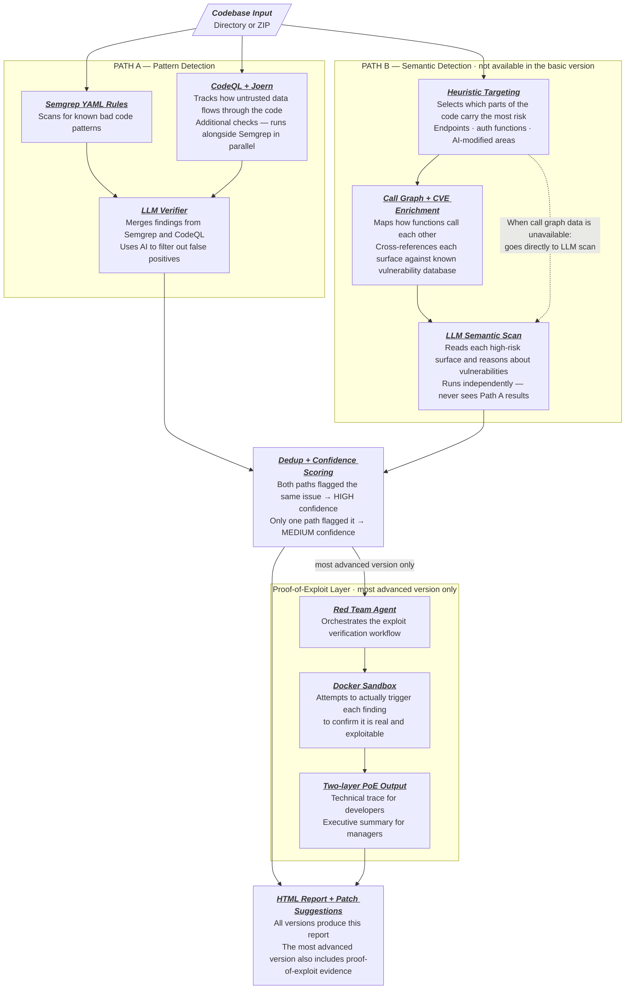
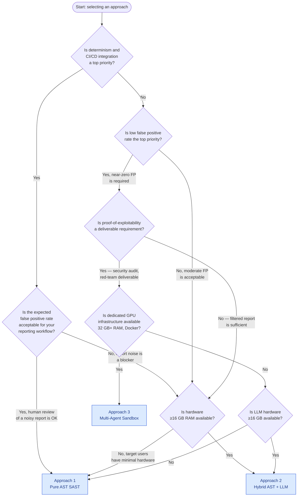

# ZeroTrust.sh — Architectural Approach Proposals Overview

> **Document status:** Synthesis overview for tech lead review. No recommendation implied.
> See `tech_stack_analysis.md` for detailed technology comparison.

This document synthesises the three architectural proposals for ZeroTrust.sh into a single reference for the tech lead's decision. Each proposal is self-contained — read the individual documents for full detail. This overview provides a comparison matrix, a decision framework, and a list of open questions that should inform the selection.

---

## Table of Contents

1. [Document Map](#1-document-map)
   - 1a. [Research-Validated Architecture Evolution](#1a-research-validated-architecture-evolution)
   - 1b. [Two-Path Design (Architectural Principle)](#1b-two-path-design-architectural-principle)
2. [Approach Comparison Matrix](#2-approach-comparison-matrix)
3. [Decision Framework](#3-decision-framework)
4. [Key Open Questions for the Tech Lead](#4-key-open-questions-for-the-tech-lead)
5. [Threat Coverage Summary](#5-threat-coverage-summary)
6. [Dependency Overlap](#6-dependency-overlap)

---

## 1. Document Map

| Document                                                 | Approach                 | Core mechanism                                                                                                                |
| -------------------------------------------------------- | ------------------------ | ----------------------------------------------------------------------------------------------------------------------------- |
| [`approach_1_ast_sast.md`](approach_1_ast_sast.md)       | Pure AST Static Analysis | Tree-sitter CST + YAML rule engine; fully deterministic; no LLM                                                               |
| [`approach_2_hybrid_llm.md`](approach_2_hybrid_llm.md)   | Hybrid AST + Local LLM   | Stage 1 AST pre-filter (high recall) → Stage 2 local LLM verification and patch generation                                    |
| [`approach_3_multi_agent.md`](approach_3_multi_agent.md) | Multi-Agent Sandbox      | LangGraph orchestration: Red Team Agent generates and executes exploits in Docker; Blue Team Agent patches; CI Guard verifies |

Files prefixed `LEGACY_` are earlier flat-format documents kept for reference. Do not edit legacy files; create new documents instead.

---

## 1a. Research-Validated Architecture Evolution

A research audit of 40+ papers (2023–2026) and a competitive survey of 14 tools produced an evolved design: the **Cascading Intelligence Pipeline** (`docs/project_architecture_cascading_intelligence.mmd`). It extends the two-path principle with three additions validated by current literature:

| Addition | Validated by | Impact |
|---|---|---|
| **Differential Indexer** (ingestion layer) | Incremental analysis literature | ~80–95% cost reduction on repeat scans in agent loops |
| **Code Vulnerability Classifier — CodeT5+** (Path B Tier 2) | F1=94.73% on BigVul; VulGNN (Zhu et al. 2026) | Eliminates ~70–80% of LLM surface area before any API call |
| **5-tier confidence scoring** (BLOCK/HIGH/MEDIUM/LOW/SUPPRESSED) | Tencent 2025 — 98.51% precision | Replaces binary HIGH/MEDIUM scheme; enables suppression-aware reporting |

This design is an evolution of Approaches 2 and 3 — not a replacement. The three approaches remain the implementation phases; the Cascading Intelligence Pipeline describes the target steady-state architecture that Approach 3 should converge toward.

**Competitive position:** ZeroTrust.sh is the only surveyed tool combining local execution + local LLM + AI-agent-specific threat detection + three-tier cost gating. Closest architectural peer is IRIS (ICLR 2025) — more mature but cloud-only and general-purpose.

---

## 1b. Two-Path Design (Architectural Principle)

All three approaches implement a shared architectural principle established after the initial comparison: **two parallel detection paths** that are independent, not sequential.

**Path A — Pattern Detection:** Fast, deterministic AST/rule-based scanning for vulnerabilities with a syntactic signature. Approach 1 establishes this path; Approaches 2 and 3 expand it with broader rule sets and additional static tools.

**Path B — Semantic/Logic Detection:** Heuristic-targeted LLM scanning for vulnerabilities invisible to pattern matching — IDOR, missing authorization guards, business logic flaws, AI-agent trust escalation. Path B is introduced in Approach 2 (partial: LLM scans targeted high-risk surfaces independently of Path A findings) and fully realized in Approach 3 (call graph traversal, CVE cross-referencing, sandbox exploit execution).

The two paths run in parallel against the same codebase input. **Path A never gates Path B.** A vulnerability missed by Path A remains visible to Path B. Both paths feed a shared deduplication and confidence scoring layer — a finding confirmed by both paths is treated as high-confidence signal. This design directly addresses the fundamental coverage gap in a pure SAST pipeline.



---

## 2. Approach Comparison Matrix

| Dimension                                  | Approach 1: Pure AST                                                                                                                                      | Approach 2: Hybrid LLM                                                                                                                                        | Approach 3: Multi-Agent Sandbox                                                                                                                                                            |
| ------------------------------------------ | --------------------------------------------------------------------------------------------------------------------------------------------------------- | ------------------------------------------------------------------------------------------------------------------------------------------------------------- | ------------------------------------------------------------------------------------------------------------------------------------------------------------------------------------------ |
| **Core mechanism**                         | Tree-sitter CST queries + YAML rules                                                                                                                      | AST pre-filter → local LLM verification                                                                                                                       | Static pre-scan → LLM exploit gen → Docker execution → LLM patch gen → test verification                                                                                                   |
| **LLM dependency**                         | None                                                                                                                                                      | Required (7B model via Ollama)                                                                                                                                | Required (32B+ for Red Team; 7B+ for Blue Team)                                                                                                                                            |
| **False positive rate**                    | High (20–40%; consistent with Semgrep community ruleset benchmarks)                                                                                       | Moderate (estimated 50–70% reduction vs Approach 1 within LLM context window)                                                                                 | Near-zero for confirmed-exploitable vulnerabilities (residual < 5%)                                                                                                                        |
| **False negative rate**                    | Moderate (misses semantic/contextual vulnerabilities)                                                                                                     | Slightly elevated vs Approach 1 due to confidence gate filtering; cross-file context gaps                                                                     | High for non-executable vulnerabilities (config issues, data-at-rest, timing side channels)                                                                                                |
| **Hardware requirement**                   | Minimal — any modern CPU, ≥2 GB RAM                                                                                                                       | Moderate — ≥16 GB unified RAM (Apple Silicon) or ≥8 GB VRAM (discrete GPU)                                                                                    | Heavy — ≥32 GB RAM, Docker, 32B+ LLM (≥20 GB VRAM recommended)                                                                                                                             |
| **Scan time (1K-file repo, ~30 findings)** | < 10 seconds                                                                                                                                              | 3–15 minutes (M2 Pro); 30–90 minutes (CPU-only)                                                                                                               | 30 minutes–3 hours                                                                                                                                                                         |
| **Setup complexity**                       | Low — single binary, zero config                                                                                                                          | Medium — requires Ollama install + model pull (~4–8 GB)                                                                                                       | Very high — Docker, large model, LangGraph, seccomp config                                                                                                                                 |
| **Deterministic?**                         | Yes — identical input → identical output                                                                                                                  | No — LLM inference is non-deterministic even at temperature 0.1; model version changes affect results                                                         | No — LLM inference non-determinism + exploit execution timing variance                                                                                                                     |
| **Package hallucination detection**        | Full — offline index + live API fallback                                                                                                                  | Full — same mechanism as Approach 1; optional LLM cross-check flag                                                                                            | Full — handled by mandatory Approach 1/2 pre-scan; not in agent loop                                                                                                                       |
| **Safety gate bypass detection**           | Partial — Pattern A (comment proximity) + Pattern B (suppression annotations); no call-graph analysis                                                     | Improved — LLM provides semantic judgment on whether commented code is a genuine bypass                                                                       | Partial — static pre-scan only; agent loop can attempt unauthenticated API access if codebase is startable                                                                                 |
| **Prompt injection detection**             | Weak — structural comment pattern matching only                                                                                                           | Best of three — LLM provides semantic evaluation of comment content for injection intent                                                                      | Weak — static pre-scan only; injection attack surface (another AI agent) is not present in Docker sandbox                                                                                  |
| **Patch generation quality**               | Low — static template substitution, not contextual                                                                                                        | Moderate — contextual patches using variable names and surrounding code; limited by context window                                                            | Highest — Blue Team Agent knows exact exploit path; patch verified by re-running exploit                                                                                                   |
| **Patch correctness verification**         | None — template patches are not verified                                                                                                                  | Stage 1 re-scan + Tree-sitter syntax check                                                                                                                    | Exploit re-execution in Docker sandbox + test suite run                                                                                                                                    |
| **Suitable for CI/CD?**                    | Yes — fast, deterministic, zero external dependencies                                                                                                     | Marginal — hardware requirements and non-determinism are friction points                                                                                      | No for standard CI; possible for scheduled GPU-equipped runners                                                                                                                            |
| **Suitable for developer laptop?**         | Yes — runs anywhere                                                                                                                                       | Yes on 16 GB+ hardware; marginal on 8 GB; no on CPU-only for practical use                                                                                    | No                                                                                                                                                                                         |
| **Implementation complexity (LoC)**        | ~2,650–3,300 (Go, with tests)                                                                                                                             | ~3,400–5,500 (Go, with tests; upper bound includes import-aware context)                                                                                      | ~5,800–9,700 (Python; excludes Approach 1/2 static analysis binary)                                                                                                                        |
| **Primary failure risk**                   | High false positive rate; rule maintenance burden                                                                                                         | LLM non-determinism; hardware inaccessibility for some users; prompt maintenance                                                                              | Codebase not portable to Docker; Red Team Agent quality floor; very long scan times                                                                                                        |
| **Open source community potential**        | High — YAML rules are diffable, human-readable, easy to contribute                                                                                        | Medium — requires LLM runtime setup which raises contributor barrier                                                                                          | Low — GPU infrastructure requirement limits community testing                                                                                                                              |
| **Existing products using this approach**  | Semgrep, ast-grep, Bandit, Gosec, CodeQL, SpotBugs                                                                                                        | GitHub Copilot Autofix (cloud), Qodana AI (cloud), Snyk Code DeepCode (cloud) — no mature *local* LLM equivalent exists yet                                   | AutoCodeRover, SWE-agent, Devin (all cloud/research) — no production local equivalent                                                                                                      |
| **Used in production**                     | **Semgrep** — Meta, Dropbox, Slack; **CodeQL** — Microsoft, Google (via GitHub Advanced Security); **SonarQube** — standard across most large enterprises | **Snyk Code** — enterprise scale; **GitHub Copilot Autofix** — built into GitHub Advanced Security since 2024; **no local equivalent in production anywhere** | No public production equivalent — closest are internal red-team automation tools at Google, Meta, and Microsoft (not publicly available); SWE-agent and AutoCodeRover remain research-only |

---

## 3. Decision Framework

The following flowchart guides the decision based on the team's prioritised requirements. It is not a recommendation — it maps requirements to approaches neutrally.



**Reading this chart.** Follow the branches matching the team's highest-priority requirements. Multiple branches may lead to the same approach — this indicates convergent support for that choice. When two branches lead to different approaches, the tie-breaking factor is typically hardware availability.

---

## 4. Key Open Questions for the Tech Lead

The following questions should be answered before committing to an approach. They are stated as questions only — no answer is implied.

**On the target user and their environment:**

- What is the primary target user's hardware profile? Developer laptop (8–16 GB) or dedicated workstation/cloud VM?
- Is the tool intended for individual developers running it ad-hoc, or for integration into team CI/CD pipelines?
- What operating systems must be supported on day one? (macOS + Linux are assumed; Windows support has implications for Docker and binary distribution.)
- Are the target users expected to have Docker installed? If not, how acceptable is a Docker installation requirement as a setup step?

**On acceptable accuracy thresholds:**

- What false positive rate is acceptable in the HTML report? (10 false positives per scan vs 2 vs 0 are very different UX outcomes.)
- Is a false negative (missed vulnerability) worse than a false positive (noise) for the target workflow?
- Is a probabilistic/confidence-scored report acceptable, or is a deterministic verdict (present/absent) required for compliance use cases?

**On patch generation:**

- Is automatic patch generation a core feature or a nice-to-have for the initial release?
- If patches are generated, is a "suggestion for review" sufficient, or must patches be functionally verified before being presented?
- Are users expected to apply patches automatically or review them manually?

**On scan speed:**

- What is the maximum acceptable scan time for a 10K-file repository? (Seconds? Minutes? The answer eliminates Approach 3 for interactive use and may influence the LLM model size choice for Approach 2.)
- Is a watch-mode / incremental scan (re-scan only changed files) a near-term requirement? (Favours Approach 1's determinism and Tree-sitter's incremental parsing capability.)

**On the AI-specific threats:**

- Which of the four target threats is highest priority to detect correctly: slopsquatting, prompt injection, insecure patterns, or safety gate bypass?
- Is indirect prompt injection detection (Threat 2) a key differentiator from existing tools, or is it a secondary concern?
- Does the product need to detect prompt injection in LLM tool-call payloads and system prompts embedded in code, or only in comments?

**On the development timeline and team:**

- What is the target date for a usable MVP?
- Is the core implementation team familiar with Tree-sitter's query language, LangGraph, or Docker SDK? (Familiarity significantly changes LoC estimates.)
- Is there capacity for ongoing rule maintenance (Approach 1 and 2), prompt engineering (Approach 2), or agent tuning (Approach 3)?

**On distribution and commercialisation:**

- Is the open-source community rule crowdsourcing strategy (mentioned in the project brief) still the plan? (Approach 1's YAML rules are maximally contributor-friendly; Approach 2's LLM prompts are less so; Approach 3 has a very high barrier to community contribution.)
- Is the optional enterprise cloud compliance dashboard still planned? (If so, deterministic output from Approach 1 is easier to aggregate and report on than probabilistic LLM verdicts from Approach 2/3.)

---

## 5. Threat Coverage Summary

This table summarises each approach's coverage of the four primary ZeroTrust.sh target threats at a high level. Refer to the individual documents' AI-Specific Threat Coverage Matrix sections for full detail.

| Threat                                    | Approach 1                             | Approach 2                              | Approach 3                              |
| ----------------------------------------- | -------------------------------------- | --------------------------------------- | --------------------------------------- |
| **Slopsquatting / package hallucination** | Full (registry lookup)                 | Full + optional LLM cross-check         | Full (via pre-scan)                     |
| **Indirect prompt injection in comments** | Weak (structural pattern only)         | Moderate–strong (LLM semantic analysis) | Weak (static pre-scan only)             |
| **Vibe coding / insecure patterns**       | Moderate (rule library dependent)      | Good (LLM filters false positives)      | Very high for exploitable patterns      |
| **Safety gate bypass**                    | Partial (Pattern A + B; no call-graph) | Improved (LLM semantic judgment)        | Partial (pre-scan + API access attempt) |
| **Logic-based vulnerabilities** (IDOR, missing auth, business logic flaws, AI-agent trust escalation) | **Not detected** — no syntactic pattern exists | **Partial** (Path B introduced: LLM independently scans endpoint handlers and auth surfaces) | **Full** (Path B realized: call graph traversal, CVE cross-referencing, sandbox proof-of-exploitability) |

---

## 6. Dependency Overlap

Approach 3 is not a standalone alternative — it depends on the static analysis components from Approach 1/2 for its mandatory pre-scan phase. The dependency hierarchy is:

```
Approach 1 (Path A only)
    └── Complete standalone implementation
    └── Path A: Semgrep YAML rules (Python + Java)
    └── Path B: not present

Approach 2 (Path A + Path B partial)
    └── Includes all of Approach 1's components
    └── Path A: Semgrep + ast-grep + Joern CPG Engine (Universal CPG · taint analysis)
    └── Path B (introduced): LLM client, heuristic targeting of high-risk surfaces,
             independent surface scan running in parallel with Path A
    └── Adds: confidence gate, patch verifier, HTML report generator
    └── NOTE: Path B does NOT receive Path A findings as input — both paths
             run against the same codebase independently

Approach 3 (Path A + Path B full)
    └── Requires Approach 1 OR 2 components for Path A
    └── Path A: Semgrep + ast-grep + Joern CPG Engine + Fraunhofer-AISEC/cpg (Approach 3+)
    └── Path B (fully realized): LangGraph orchestration, call graph traversal,
             CVE cross-referencing, Red Team Agent, Docker sandbox exploit execution,
             Blue Team Agent, CI Guard Agent, two-layer PoE documentation
    └── Both paths produce findings independently; output is merged and deduplicated
    └── Is not independently deployable (requires Path A pre-scan)
```

A phased delivery pattern is possible: implement Approach 1 first (Path A), then introduce Path B in Approach 2 as an opt-in stage, then fully realize Path B in Approach 3 for users with appropriate infrastructure. This is a factual note about component reuse — not a statement about which approach to select.

---

*End of proposals overview.*

*Individual proposal documents:*

- *[approach_1_ast_sast.md](approach_1_ast_sast.md) — Approach 1: Pure AST Static Analysis Engine*
- *[approach_2_hybrid_llm.md](approach_2_hybrid_llm.md) — Approach 2: Hybrid AST + Local LLM Pipeline*
- *[approach_3_multi_agent.md](approach_3_multi_agent.md) — Approach 3: Multi-Agent Sandbox Execution Engine*
